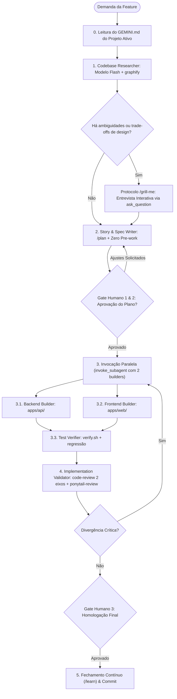

# Fábrica de Software Global (Feature Factory)

Orquestrador universal para desenvolvimento de software no modelo de **Fábrica de Software**. Totalmente **desacoplado de tecnologia ou linguagem**, adaptando-se a qualquer projeto ao consultar o `GEMINI.md` (ou `AGENTS.md`) local e integrando o catálogo de **skills especializadas** instaladas no sistema.

Organiza o ciclo de vida de qualquer demanda em camadas estritas de **pesquisa**, **especificação**, **construção sequencial** e **validação independente**, intercaladas por pontos de aprovação e alinhamento humano.

---

## 1. Princípios de Governança Universal

1. **Adesão às Regras Locais**: O orquestrador nunca assume tecnologias por conta própria. A stack, padrões de pastas e comandos de teste são extraídos dinamicamente do `GEMINI.md` (ou `AGENTS.md`) do projeto ativo.
2. **Potencialização por Skills Especializadas**: Cada fase da fábrica incorpora playbooks nativos (`graphify`, `/plan`, `/grill-me`, `tdd`, `solid`, `ponytail`, `shadcn`, `code-review`) para garantir excelência técnica em cada etapa.
3. **Resolução Proativa de Decisões (`/grill-me`)**: Nenhuma suposição crítica de design, UX ou regra de negócio é feita sem antes entrevistar o usuário de forma estruturada.
4. **Restrição Estrita de Ferramentas**:
   - Agentes de pesquisa e auditoria têm permissão **exclusiva de leitura** (`view_file`, `grep_search`, `find_by_name`, `list_dir`).
   - Modificações de código são permitidas apenas aos builders.
5. **Seleção de Modelos Otimizada**:
   - `flash` / `flash_lite`: Pesquisa inicial, varredura de código, mapeamento de dependências e leitura leve.
   - `flash` (High Effort / Thinking) ou `inherit`: Planejamento, especificações, implementação de código (TDD) e validação de qualidade, combinando máxima velocidade de execução com raciocínio profundo (*high effort thinking*).
6. **Paralelismo Inteligente por Workspace**:
   - Devido ao desacoplamento estrito (*Zero Shared Package*), builders que atuam em diretórios completamente isolados (`apps/api` e `apps/web`) **PODEM e DEVEM ser disparados em paralelo** na mesma chamada de `invoke_subagent`, reduzindo o tempo de entrega pela metade.
   - Serialização é reservada apenas para modificações em arquivos compartilhados da raiz (`docker-compose.yml`, `package.json` raiz) e para a validação final da suíte (`test-verifier`).
7. **Estratégia de Workspace & Git Worktrees**:
   - **Padrão Sequencial/Paralelo (`Workspace: inherit`)**: Usado no dia a dia da fábrica para que cada builder receba o código da etapa anterior sem atrito ou necessidade de merge.
   - **Spikes & Provas de Conceito (`Workspace: branch`)**: Tarefas experimentais arriscadas criam automaticamente um Git Worktree temporário isolado, destruído com zero resíduo caso a abordagem seja descartada.
   - **Fluxo de Branches de Feature**: O desenvolvimento ocorre em branch de feature (`feat/<nome-da-fase>`), preservando a `master` sempre verde. O merge ocorre após o Gate 3 e a aprovação no `./scripts/verify.sh`.
8. **Zero Pre-work no Planejamento (Padrão Boost)**:
   - O Orquestrador planeja usando o Grafo de Conhecimento (`graphify query`) e redige a especificação técnica em até 2 minutos, sem inspecionar dezenas de arquivos manualmente antes da delegação.

---

## 2. A Cadeia de 7 Agentes & Matriz de Skills

| Papel | Tipo / Agente | Modelo | Permissão | Skills Integradas | Responsabilidade |
| :--- | :--- | :--- | :--- | :--- | :--- |
| **1. `codebase-researcher`** | `research` | `flash` | Leitura | **`graphify`**, **`research`** | Mapeia o grafo de dependências, pontos de impacto e interfaces afetadas sem alterar código. |
| **2. `story-writer`** | Orquestrador | `flash` (High Effort) | Leitura | **`domain-modeling`**, **`/grill-me`** | Converte a solicitação em User Stories claras. Aciona entrevista interativa para alinhar dúvidas de regras e requisitos. |
| **3. `spec-writer`** | Orquestrador | `flash` (High Effort) | Docs | **`/plan`**, **`codebase-design`**, **`/grill-me`** | Resolve trade-offs técnicos via `/grill-me`, desenha módulos profundos (*deep modules*), costuras (*seams*) de teste e salva em `docs/plans/<slug>.md`. |
| **4. `backend-builder`** | `self` | `flash` (High Effort) | Escrita | **`tdd`**, **`solid`**, **`ponytail`**, **`codebase-design`** | Constrói regras de negócio, dados e APIs com ciclo estrito Red → Green, aplicando SOLID e Clean Architecture balanceados com YAGNI radical. |
| **5. `frontend-builder`** | `self` | `flash` (High Effort) | Escrita | **`shadcn`**, **`frontend-design`**, **`modern-web-guidance`** | Constrói telas e componentes com hierarquia visual intencional, Tailwind e padrões modernos de frontend sem acoplar backend. |
| **6. `test-verifier`** | `self` | `flash` (High Effort) | Escrita / Cmd | **`tdd`**, **`chrome-devtools`**, **`a11y-debugging`** | Executa suítes de teste, adiciona testes de aceitação e verifica acessibilidade/performance onde aplicável. |
| **7. `implementation-validator`** | `code-review` | `flash` (High Effort) | Leitura | **`code-review`**, **`solid`**, **`ponytail-review`**, **`efficient-swe-workflow`** | Audita o diff final em dois eixos (Spec vs. Padrões do `GEMINI.md` e SOLID), caçando code smells e complexidade desnecessária. |

---

## 3. Fluxo de Execução Passo a Passo



---

### Fase 0: Inicialização de Contexto
Antes de disparar qualquer subagente:
1. Localize e leia o arquivo `GEMINI.md` ou `AGENTS.md` na raiz do projeto.
2. Identifique a stack, os comandos oficiais de teste/build e os links para `docs/spec/`.

---

### Fase 1: Mapeamento e Pesquisa (`codebase-researcher`)
- **Skills Ativas**: `graphify`, `research`.
- **Procedimento**:
  - Dispare o subagente com modelo leve (`flash`) e ferramentas restritas a leitura.
  - Utilize o **`graphify`** para mapear pontos de entrada afetados, interfaces que restringem a mudança e testes existentes que comprovam o resultado.
  - Não realize nenhuma alteração de arquivos.

---

### 🎙️ Protocolo de Entrevista Interativa (`/grill-me`)
Se durante a pesquisa ou levantamento surgirem requisitos ambíguos, bifurcações arquiteturais, trade-offs técnicos ou dúvidas sobre UX/comportamento:
- **Ative o `/grill-me`**:
  1. Conduza uma entrevista interativa com o usuário utilizando a ferramenta `ask_question`.
  2. Faça **uma pergunta por vez**, caminhando de forma metódica pelos ramos da árvore de decisão.
  3. Para cada pergunta, apresente alternativas objetivas prefixando a melhor opção técnica com **`(Recommended)`**.
  4. Se uma dúvida puder ser respondida inspecionando o código ou os testes existentes, pesquise o código em vez de perguntar ao usuário.
  5. Prossiga para a redação da especificação somente após todas as decisões estarem alinhadas.

---

### Fase 2: Elaboração da História & Especificação (`story-writer` & `spec-writer`)
- **Skills Ativas**: `/plan`, `domain-modeling`, `codebase-design`, `/grill-me` (opcional `prototype`).
- **Procedimento**:
  - Utilize o **`domain-modeling`** para assegurar que entidades, estados e nomes respeitem o modelo do domínio.
  - Utilize o **`codebase-design`** para planejar módulos profundos (*deep modules*) e definir explicitamente as costuras (*seams*) públicas onde os testes serão conectados.
  - Utilize o **`/plan`** para formalizar o documento técnico consolidando as decisões do `/grill-me`, incluir diagramas Mermaid de fluxo e persistir em `docs/plans/<feature-slug>.md`.
  - **Pre-Mortem Multi-Perspectiva (Padrão `/boost`)**: Antes de fechar a especificação, avalie o plano sob 3 lentes:
    1. *Lente de Produto/Regra*: O `/grill-me` resolveu todas as ambiguidades com o usuário?
    2. *Lente de Resiliência/Concorrência*: Como o sistema se comporta sob rajadas (ex: 50 presentes/s)? O BullMQ FIFO e os timers lidam de forma determinística?
    3. *Lente de Simplicidade (`ponytail`)*: Há abstrações desnecessárias? Podemos resolver com tipos e funções puras?
  - Sincronize com o artefato de planejamento interativo do Antigravity (`implementation_plan.md`).

---

### 🛑 Gate Humano 1 & 2: Alinhamento de Requisitos e Arquitetura
- **PARE**. Apresente a especificação detalhada ao usuário.
- Não inicie nenhuma codificação até receber aprovação explícita ou solicitação de ajustes.

---

### Fase 3: Construção Paralela por Workspace (Builders)
Graças ao desacoplamento estrito (*Zero Shared Package*), `backend-builder` (`apps/api/`) e `frontend-builder` (`apps/web/`) são disparados **simultaneamente em paralelo** na mesma chamada de `invoke_subagent`.

#### 📝 Template Canônico de Despacho (Padrão Boost)
Todo subagente DEVE receber um prompt estruturado contendo:
```markdown
**Task**: [Instrução do usuário verbatim]

**Additional Context**:
- Repositório: <caminho> | Branch: <branch>
- Especificação: docs/plans/<slug>.md e implementation_plan.md
- Invariantes: GEMINI.md (Zero Shared Package, Strict TS, CLI pnpm)
- Skills Ativas: Siga as diretrizes de [tdd, solid, ponytail, shadcn]

**Escopo a Implementar**:
1. Arquivos, portas e contratos específicos do workspace.
2. Protocolos de qualidade (TDD Red-Green, Zod nas bordas).
3. Comandos de teste (pnpm --filter <app> test, ./scripts/verify.sh).
```

#### 3.1. `backend-builder` (Modelo: `flash` com High Effort / `inherit`)
- **Skills Ativas**: `tdd`, `solid`, `ponytail`, `codebase-design`.
- **Diretrizes**:
  - **`tdd`**: Escreva testes apenas nas costuras pré-acordadas. Siga o ciclo *Red → Green*: um teste que falha por vez, seguido da menor implementação que passa.
  - **`solid`**: Aplique inversão de dependência (DIP/Hexagonal Ports & SPIs), responsabilidade única (SRP) e segregação de interfaces (ISP). Valide entradas com Zod nas bordas e utilize tipagem estrita sem vazamento de infraestrutura para o domínio.
  - **`ponytail`**: Aplique o princípio da menor solução viável (YAGNI). Prefira recursos padrão da linguagem antes de bibliotecas externas; evite classes de suporte especulativas e abstrações prematuras.
  - **Dependências via CLI**: Sempre instale novos pacotes via CLI (`pnpm --filter api add [-D] <pacote>`). Nunca edite o `package.json` manualmente.

#### 3.2. `frontend-builder` (Modelo: `flash` com High Effort / `inherit`)
- **Skills Ativas**: `shadcn`, `frontend-design`, `modern-web-guidance`.
- **Diretrizes**:
  - **`shadcn`**: Reutilize primitivos acessíveis e componentes existentes.
  - **`frontend-design`**: Aplique estética visual e tipografia distintas e intencionais.
  - **`modern-web-guidance`**: Siga boas práticas de performance, CSS moderno e preserve o isolamento total dos tipos do backend (contratos de consumo locais).
  - **Dependências via CLI**: Sempre instale novos pacotes ou componentes via CLI (`pnpm --filter web add [-D] <pacote>` ou `pnpm --filter web dlx shadcn@latest add <componente>`). Nunca edite o `package.json` manualmente.

#### 3.3. `test-verifier` (Modelo: `flash` com High Effort / `inherit`)
- **Skills Ativas**: `tdd`, `chrome-devtools`, `a11y-debugging`.
- **Diretrizes**:
  - Execute a suite oficial de testes (`pnpm test` ou equivalente).
  - Adicione testes de aceitação ponta a ponta cobrindo a User Story.
  - Realize validação de acessibilidade e ausência de regressões.

---

### Fase 4: Validação Independente (`implementation-validator`)
- **Skills Ativas**: `code-review`, `solid`, `ponytail-review`, `efficient-swe-workflow`.
- **Procedimento**:
  - Dispare o subagente independente de revisão (apenas leitura, modelo `flash` com High Effort / `inherit`):
    - **Eixo 1 (Spec)**: Avalia se os critérios de aceite foram cumpridos à risca e se houve *scope creep*.
    - **Eixo 2 (Standards & SOLID)**: Avalia se o código respeita o `GEMINI.md`, tipagem estrita, princípios SOLID e o catálogo de code smells (Bloaters, Couplers, Primitive Obsession).
    - **Auditoria de Complexidade (`ponytail-review`)**: Identifica abstrações mortas, duplicações e flexibilidade especulativa no diff.
  - **Loop de Auto-Correção Autônomo (Padrão `/boost`)**: Se o validador ou os testes apontarem divergências, testes quebrados ou code smells críticos, o orquestrador não interrompe o usuário; ele re-injeta o diff e o log de erro no builder responsável para auto-correção iterativa até o `./scripts/verify.sh` passar 100%.

---

### 🛑 Gate Humano 3: Homologação Final
- Apresente o resumo das alterações, status dos testes e o relatório de validação no `walkthrough.md`.
- Aguarde o aval do usuário para finalizar e commitar a alteração.

---

### 🔄 Fase 5: Fechamento de Ciclo & Aprendizado Contínuo (`/learn`)
- Ao concluir a homologação e realizar o commit:
  - Dispare o protocolo do **`/learn`** para avaliar o que foi aprendido nesta entrega:
    - Novas armadilhas técnicas superadas.
    - Decisões arquiteturais ou de UX que devem virar regras perpétuas em `GEMINI.md`.
    - Ajustes de playbooks e skills especializadas.
  - Elabore a proposta de aprendizado em `learning_proposal.md` para validação humana, garantindo que o conhecimento nunca se perca entre sessões.
