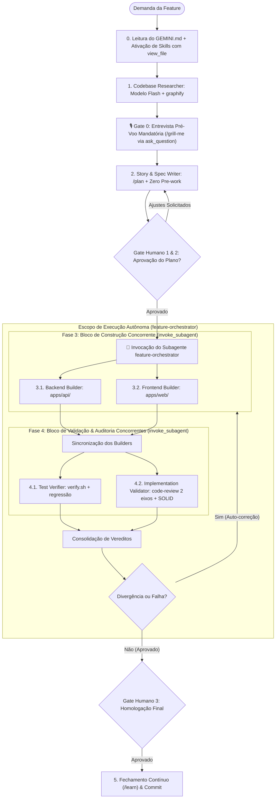

# Fábrica de Software Global (Feature Factory)

Orquestrador universal para desenvolvimento de software no modelo de **Fábrica de Software**. Totalmente **desacoplado de tecnologia ou linguagem**, adaptando-se a qualquer projeto ao consultar o `GEMINI.md` (ou `AGENTS.md`) local e integrando o catálogo de **skills especializadas** instaladas no sistema.

Organiza o ciclo de vida de qualquer demanda em camadas estritas de **pesquisa**, **especificação**, **construção sequencial** e **validação independente**, intercaladas por pontos de aprovação e alinhamento humano.

---

## 1. Princípios de Governança Universal

1. **Adesão às Regras Locais**: O orquestrador nunca assume tecnologias por conta própria. A stack, padrões de pastas e comandos de teste são extraídos dinamicamente do `GEMINI.md` (ou `AGENTS.md`) do projeto ativo.
2. **Potencialização por Skills Especializadas**: Cada fase da fábrica incorpora playbooks nativos (`graphify`, `/plan`, `/grill-me`, `tdd`, `solid`, `ponytail`, `shadcn`, `code-review`) para garantir excelência técnica em cada etapa.
3. **Resolução Proativa de Decisões (`/grill-me`)**: Nenhuma suposição crítica de design, UX ou regra de negócio é feita sem antes entrevistar o usuário de forma estruturada.
4. **Restrição Estrita de Ferramentas**:
   - Agentes de pesquisa e auditoria têm permissão **exclusiva de leitura** (`view_file`, `grep_search`, `find_by_name`, `list_dir`).
   - Modificações de código são permitidas apenas aos builders.
5. **Seleção de Modelos Otimizada**:
   - `flash` / `flash_lite`: Pesquisa inicial, varredura de código, mapeamento de dependências e leitura leve.
   - `flash` (High Effort / Thinking) ou `inherit`: Planejamento, especificações, implementação de código (TDD) e validação de qualidade, combinando máxima velocidade de execução com raciocínio profundo (*high effort thinking*).
6. **Paralelismo Duplo Inteligente (Construção e Validação)**:
   - **Bloco 1 (Construção Paralela)**: Devido ao desacoplamento estrito (*Zero Shared Package*), builders que atuam em diretórios isolados (`apps/api` e `apps/web`) **PODEM e DEVEM ser disparados em paralelo** na mesma chamada de `invoke_subagent`.
   - **Bloco 2 (Validação & Auditoria Paralelas)**: Concluída a construção, `test-verifier` (execução do pipeline `./scripts/verify.sh`) e `implementation-validator` (auditoria do diff contra Spec e SOLID) **são disparados simultaneamente** em uma única chamada de `invoke_subagent`. O validador é estritamente read-only e o verificador executa testes em bash, eliminando qualquer contenção de arquivos e reduzindo o tempo de verificação pela metade.
   - Serialização é reservada apenas para modificações em arquivos compartilhados da raiz (`docker-compose.yml`, `package.json` raiz).
7. **Estratégia de Workspace & Git Worktrees**:
   - **Padrão Sequencial/Paralelo (`Workspace: inherit`)**: Usado no dia a dia da fábrica para que cada builder receba o código da etapa anterior sem atrito ou necessidade de merge.
   - **Spikes & Provas de Conceito (`Workspace: branch`)**: Tarefas experimentais arriscadas criam automaticamente um Git Worktree temporário isolado, destruído com zero resíduo caso a abordagem seja descartada.
   - **Fluxo de Branches de Feature**: O desenvolvimento ocorre em branch de feature (`feat/<nome-da-fase>`), preservando a `master` sempre verde. O merge ocorre após o Gate 3 e a aprovação no `./scripts/verify.sh`.
8. **Zero Pre-work no Planejamento (Padrão Boost)**:
   - O Orquestrador planeja usando o Grafo de Conhecimento (`graphify query`) e redige a especificação técnica em até 2 minutos, sem inspecionar dezenas de arquivos manualmente antes da delegação.

---

## 2. A Cadeia de 7 Agentes & Matriz de Skills

| Papel | Tipo / Agente | Modelo | Permissão | Skills Integradas | Responsabilidade |
| :--- | :--- | :--- | :--- | :--- | :--- |
| **1. `codebase-researcher`** | `research` | `flash` | Leitura | **`graphify`**, **`research`** | Mapeia o grafo de dependências, pontos de impacto e interfaces afetadas sem alterar código. |
| **2. `story-writer`** | Orquestrador | `flash` (High Effort) | Leitura | **`domain-modeling`**, **`/grill-me`** | Converte a solicitação em User Stories claras. Aciona entrevista interativa para alinhar dúvidas de regras e requisitos. |
| **3. `spec-writer`** | Orquestrador | `flash` (High Effort) | Docs | **`/plan`**, **`codebase-design`**, **`/grill-me`** | Resolve trade-offs técnicos via `/grill-me`, desenha módulos profundos (*deep modules*), costuras (*seams*) de teste e salva em `docs/plans/<slug>.md`. |
| **4. `backend-builder`** | `self` | `flash` (High Effort) | Escrita | **`tdd`**, **`solid`**, **`ponytail`**, **`codebase-design`** | Constrói regras de negócio, dados e APIs com ciclo estrito Red → Green, aplicando SOLID e Clean Architecture balanceados com YAGNI radical. |
| **5. `frontend-builder`** | `self` | `flash` (High Effort) | Escrita | **`shadcn`**, **`frontend-design`**, **`modern-web-guidance`** | Constrói telas e componentes com hierarquia visual intencional, Tailwind e padrões modernos de frontend sem acoplar backend. |
| **6. `test-verifier`** | `self` | `flash` (High Effort) | Escrita / Cmd | **`tdd`**, **`chrome-devtools`**, **`a11y-debugging`** | Executa suítes de teste, adiciona testes de aceitação e verifica acessibilidade/performance onde aplicável. |
| **7. `implementation-validator`** | `code-review` | `flash` (High Effort) | Leitura | **`code-review`**, **`solid`**, **`ponytail-review`**, **`efficient-swe-workflow`** | Audita o diff final em dois eixos (Spec vs. Padrões do `GEMINI.md` e SOLID), caçando code smells e complexidade desnecessária. |

---

## 3. Fluxo de Execução Passo a Passo



---

### Fase 0: Inicialização de Contexto & Ativação de Skills do Chat Canvas
Antes de qualquer interação:
1. Localize e leia o arquivo `GEMINI.md` ou `AGENTS.md` na raiz do projeto.
2. **Ativação Obrigatória (Passo 0)**: O Chat Canvas DEVE carregar suas skills executando `view_file` em:
   - `file:///home/luis/repositories/tiktok-gamer-lives/.agents/skills/feature-factory/SKILL.md`
   - `file:///home/luis/.gemini/config/skills/plan/SKILL.md`
   - `file:///home/luis/.gemini/config/skills/domain-modeling/SKILL.md`

---

### Fase 1: Mapeamento Rápido (`codebase-researcher`)
- **Skills Ativas**: `graphify`, `research`.
- **Procedimento**:
  - Consulta o Grafo de Conhecimento (`graphify query`) para mapear pontos de entrada e blast radius em menos de 1 minuto sem varredura manual de arquivos.

---

### 🎙️ Gate 0: Entrevista Pré-Voo Mandatória (`/grill-me` via `ask_question`)
**Obrigatório em todas as fases/features não triviais** antes de escrever o plano técnico:
1. O agente do Chat Canvas formula de 2 a 3 perguntas interativas usando a ferramenta `ask_question`.
2. As perguntas cobrem:
   - Casos de borda e regras de negócio essenciais (ex: overflow de pontuação, filas de eventos em pausa/intervalo).
   - Trade-offs arquiteturais e estratégia de dados/mocks.
   - Critérios de aceite específicos do usuário.
3. Para cada pergunta, apresente alternativas objetivas com a melhor opção técnica prefixada com **`(Recommended)`**.
4. Somente após a submissão das respostas do usuário no modal de `ask_question` é permitido avançar para a Fase 2.

---

### Fase 2: Story & Spec Writer (`/plan` + Zero Pre-work)
- **Skills Ativas**: `plan`, `domain-modeling`, `codebase-design`.
- **Procedimento**:
  - O Chat Canvas redige o plano em `docs/plans/<slug>.md` e `implementation_plan.md` em menos de 2 minutos consolidando as respostas do Gate 0.
  - Solicita feedback e aguarda aprovação explícita no **Gate Humano 1 & 2**.

---

### 🛑 Gate Humano 1 & 2: Alinhamento de Requisitos e Arquitetura
- **PARE**. Apresente a especificação detalhada ao usuário.
- Não inicie nenhuma codificação até receber aprovação explícita ou solicitação de ajustes.

---

### Fase 3: Despacho do Subagente Orquestrador (`feature-orchestrator`)
Aprovado o plano, o Chat Canvas invoca o subagente:
- **Role**: `"Feature Factory Orchestrator"`
- **TypeName**: `"feature-orchestrator"` (ou `"self"`)
- **Prompt**: Contém o plano aprovado verbatim, links para os documentos autoritativos e a ordem de comandar a esteira.

O `feature-orchestrator` executa o **Passo 0 de Skills** (`view_file` em `feature-factory/SKILL.md`, `codebase-design/SKILL.md`, `solid/SKILL.md`) e despacha os dois blocos em paralelo:

#### 📝 Template Canônico de Despacho (Padrão Boost)
Todo subagente DEVE receber um prompt estruturado contendo:
```markdown
**Task**: [Instrução do usuário verbatim]

**Passo 0: Ativação Obrigatória de Skills (MANDATÓRIO)**:
Antes de executar qualquer comando ou criar/modificar arquivos, você DEVE carregar seus playbooks invocando `view_file` nos caminhos canônicos:
- file:///home/luis/.../SKILL.md
- file:///home/luis/.../SKILL.md

**Additional Context**:
- Repositório: <caminho> | Branch: <branch>
- Especificação: docs/plans/<slug>.md e implementation_plan.md
- Invariantes: GEMINI.md (Zero Shared Package, Strict TS, CLI pnpm)

**Escopo a Implementar**:
1. Arquivos, portas e contratos específicos do workspace.
2. Protocolos de qualidade (TDD Red-Green, Zod nas bordas).
3. Comandos de teste (pnpm --filter <app> test, ./scripts/verify.sh).
```

#### 3.1. `backend-builder` (Modelo: `flash` com High Effort / `inherit`)
- **Passo 0 Obrigatório**: Executar `view_file` em:
  - `file:///home/luis/.gemini/config/skills/tdd/SKILL.md`
  - `file:///home/luis/repositories/tiktok-gamer-lives/.agents/skills/solid/SKILL.md`
  - `file:///home/luis/.gemini/config/plugins/ponytail/skills/ponytail/SKILL.md`
- **Diretrizes**:
  - **`tdd`**: Escreva testes apenas nas costuras pré-acordadas. Siga o ciclo *Red → Green*: um teste que falha por vez, seguido da menor implementação que passa.
  - **`solid`**: Aplique inversão de dependência (DIP/Hexagonal Ports & SPIs), responsabilidade única (SRP) e segregação de interfaces (ISP). Valide entradas com Zod nas bordas e utilize tipagem estrita sem vazamento de infraestrutura para o domínio.
  - **`ponytail`**: Aplique o princípio da menor solução viável (YAGNI). Prefira recursos padrão da linguagem antes de bibliotecas externas; evite classes de suporte especulativas e abstrações prematuras.
  - **Dependências via CLI**: Sempre instale novos pacotes via CLI (`pnpm --filter api add [-D] <pacote>`). Nunca edite o `package.json` manualmente.

#### 3.2. `frontend-builder` (Modelo: `flash` com High Effort / `inherit`)
- **Passo 0 Obrigatório**: Executar `view_file` em:
  - `file:///home/luis/.gemini/config/skills/shadcn/SKILL.md`
  - `file:///home/luis/.gemini/config/skills/frontend-design/SKILL.md`
  - `file:///home/luis/.gemini/config/plugins/modern-web-guidance-plugin/skills/modern-web-guidance/SKILL.md`
- **Diretrizes**:
  - **`shadcn`**: Reutilize primitivos acessíveis e componentes existentes.
  - **`frontend-design`**: Aplique estética visual e tipografia distintas e intencionais.
  - **`modern-web-guidance`**: Siga boas práticas de performance, CSS moderno e preserve o isolamento total dos tipos do backend (contratos de consumo locais).
  - **Dependências via CLI**: Sempre instale novos pacotes ou componentes via CLI (`pnpm --filter web add [-D] <pacote>` ou `pnpm --filter web dlx shadcn@latest add <componente>`). Nunca edite o `package.json` manualmente.

---

### Fase 4: Bloco de Validação & Auditoria Concorrentes (`test-verifier` || `implementation-validator`)
Concluída a construção, ambos os subagentes são disparados **simultaneamente no mesmo `invoke_subagent`**:

#### 4.1. `test-verifier` (Modelo: `flash` com High Effort / `inherit`)
- **Passo 0 Obrigatório**: Executar `view_file` em:
  - `file:///home/luis/.gemini/config/skills/tdd/SKILL.md`
  - `file:///home/luis/.gemini/config/plugins/chrome-devtools-plugin/skills/a11y-debugging/SKILL.md`
- **Diretrizes**:
  - Execute a suíte oficial do pipeline (`./scripts/verify.sh`).
  - Verifique typecheck, ESLint, thresholds de cobertura (90% backend, 85% frontend) e testes de regressão.
  - Onde aplicável, valide acessibilidade (a11y) e renderização no navegador.

#### 4.2. `implementation-validator` (Modelo: `flash` com High Effort / `inherit`)
- **Passo 0 Obrigatório**: Executar `view_file` em:
  - `file:///home/luis/.gemini/config/skills/code-review/SKILL.md`
  - `file:///home/luis/repositories/tiktok-gamer-lives/.agents/skills/solid/SKILL.md`
  - `file:///home/luis/.gemini/config/plugins/ponytail/skills/ponytail-review/SKILL.md`
  - `file:///home/luis/.gemini/config/skills/efficient-swe-workflow/SKILL.md`
- **Diretrizes (Leitura Pura)**:
  - **Eixo 1 (Spec)**: Avalia se os critérios de aceite foram cumpridos à risca e se houve *scope creep*.
  - **Eixo 2 (Standards & SOLID)**: Avalia se o código respeita o `GEMINI.md`, tipagem estrita, princípios SOLID e o catálogo de code smells (Bloaters, Couplers, Primitive Obsession).
  - **Auditoria de Complexidade (`ponytail-review`)**: Identifica abstrações mortas, duplicações e flexibilidade especulativa no diff.

#### 🔄 Loop Autônomo de Auto-Correção (Padrão `/boost`)
Se o validador ou os testes apontarem divergências, falha de cobertura ou code smells críticos, o orquestrador recebe ambos os relatórios consolidados em uma única rodada e re-injeta o diagnóstico nos builders responsáveis até o `./scripts/verify.sh` passar 100%.

---

### 🛑 Gate Humano 3: Homologação Final
- Apresente o resumo das alterações, status dos testes e o relatório de validação no `walkthrough.md`.
- Aguarde o aval do usuário para finalizar e commitar a alteração.

---

### 🔄 Fase 5: Fechamento de Ciclo & Aprendizado Contínuo (`/learn`)
- Ao concluir a homologação e realizar o commit:
  - Dispare o protocolo do **`/learn`** para avaliar o que foi aprendido nesta entrega:
    - Novas armadilhas técnicas superadas.
    - Decisões arquiteturais ou de UX que devem virar regras perpétuas em `GEMINI.md`.
    - Ajustes de playbooks e skills especializadas.
  - Elabore a proposta de aprendizado em `learning_proposal.md` para validação humana, garantindo que o conhecimento nunca se perca entre sessões.
