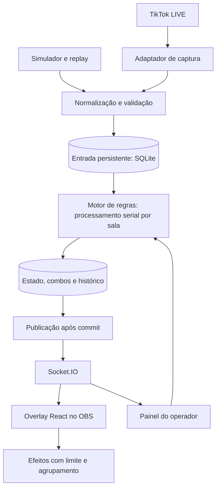

# Pesquisa de viabilidade — plataforma de jogos para lives

Data de referência: **29 de setembro de 2026**, America/Bahia.

Base: PRD fornecido pelo usuário e documentação/código dos próprios projetos. Este documento propõe uma implementação; nenhum aplicativo, benchmark ou conexão com uma live foi executado nesta pesquisa. As metas de desempenho abaixo são critérios a validar, não resultados obtidos.

## 1. Decisão recomendada

**O projeto é tecnicamente viável como aplicativo local para um canal e um jogo.** Começaria com uma batalha de duas torres, painel de operação e uma página transparente para o OBS. Minha recomendação é validar primeiro a captura real de eventos e construir a lógica com um simulador, para poder desenvolver e testar sem depender de uma transmissão ativa.

A principal incerteza externa é a captura do TikTok. O `tiktok-live-connector` se apresenta como integração não oficial por engenharia reversa, e o próprio mantenedor avisa que não é uma API pronta para produção. Documenta leitura por username e dependência de um serviço externo de assinatura, Euler Stream. Portanto, a experiência pode pedir só o `@username`, mas a operação continua dependendo de serviços externos. [README da versão consultada](https://github.com/zerodytrash/TikTok-Live-Connector/blob/v2.5.0/README.md)

A separação proposta entre backend e frontend é adequada. Eu acrescentaria três decisões: **backend como autoridade do placar; registro persistente dos eventos pontuáveis; animações desacopladas da pontuação.** Uma fila apenas em memória e eventos como `LADO_A_PONTO` não bastam para recuperar uma partida após reiniciar o servidor ou recarregar o OBS.

## 2. Stack e limites do primeiro produto

| Camada | Escolha recomendada | Papel |
| --- | --- | --- |
| Backend | Node.js + TypeScript, processo persistente | Capturar eventos, executar regras, manter timers e servir Socket.IO |
| Organização | Módulos pequenos; NestJS opcional | NestJS faz sentido se a equipe já o conhece; não é necessário só por haver WebSockets |
| Frontend | Next.js App Router + React | Rotas `/dashboard` e `/overlay` |
| Interface | Tailwind; shadcn/ui no painel | Configuração, indicadores, ações manuais e acessibilidade |
| Animação | CSS inicialmente; Motion se necessário | Torres, alertas e transições com número limitado de elementos |
| Transporte | Socket.IO | Estado do jogo, status de conexão e efeitos transitórios |
| Persistência | SQLite + Drizzle | Eventos, combos, rodadas, regras e ranking |
| Testes | Vitest + replay de eventos + ensaio no OBS | Verificar regras, recuperação e desempenho real |
| Execução | Dois processos; Docker Compose para empacotar | Backend e web, com volume persistente para o banco |

São escolhas de projeto. A documentação confirma suporte do NestJS a gateways Socket.IO, de Drizzle a SQLite e transações, e de Next.js a componentes interativos com `use client`. Essas capacidades não garantem uma taxa de eventos ou FPS específica. [NestJS](https://docs.nestjs.com/websockets/gateways), [Drizzle/SQLite](https://orm.drizzle.team/docs/sqlite/get-started-sqlite), [Drizzle/transações](https://orm.drizzle.team/docs/transactions), [Next.js](https://nextjs.org/docs/app/api-reference/directives/use-client)

Começar com um canal, um processo responsável pela partida e uma configuração de regras. Redis, PostgreSQL, múltiplos servidores, cobrança e catálogo de jogos entram quando houver necessidade demonstrada. Um painel com várias lives simultâneas exige isolamento por canal e um único responsável por atualizar cada partida.

## 3. Arquitetura e fluxo de uma interação



Proposta de processamento:

1. O adaptador recebe o evento e preserva IDs como strings, dados de combo, horário de recepção e identidade da sala.
2. Valida o formato e registra uma entrada durável com uma chave de idempotência adequada ao tipo de mensagem. Mensagens inválidas ficam identificadas para diagnóstico.
3. Um consumidor por sala lê entradas pendentes em ordem. Comandos de pausa e transições disparadas por timers também entram nessa sequência durável. Dentro de uma transação, verifica duplicata/contagem de combo, atribui a rodada, calcula a ação, altera o placar, registra eventual vitória e marca a entrada como aplicada.
4. Depois do commit, publica o novo estado. Em caso de falha entre commit e publicação, o próximo snapshot recupera a tela.
5. O frontend aproxima a representação visual do estado recebido e agenda efeitos. A conclusão de uma animação nunca decide quantos pontos existem.

Após reinício, o backend restaura estado e entradas pendentes. Para esse MVP, uma tabela de entrada com status e um consumidor local evita a necessidade inicial de um serviço de filas separado. Transações curtas e limites de lote precisam ser medidos no driver e disco escolhidos.

O contrato de confiabilidade deve ser: **cada evento válido confirmado no armazenamento local é aplicado uma única vez, desde que tenha identidade suficiente para deduplicação e que o armazenamento cumpra a durabilidade configurada**. Não cobre eventos que o TikTok deixou de entregar, recebimento antes do commit, falha física do armazenamento ou lacunas de conexão com a origem.

## 4. Integração com o TikTok

A pesquisa tomou como referência a release GitHub **v2.5.0**. O manifesto dessa tag declara ESM, Node `>=20` e licença **AGPL-3.0-only**. Isso é o requisito declarado do pacote, não uma recomendação para adotar uma versão antiga de Node. O dist-tag `latest` do npm não foi confirmado nesta consulta; antes de implementar, fixar uma versão publicada, conferir dependências e manter lockfile. A licença também precisa entrar na decisão de distribuição/comercialização; este relatório apenas registra o que o pacote declara. [Release](https://github.com/zerodytrash/TikTok-Live-Connector/releases/tag/v2.5.0), [Manifesto da tag](https://github.com/zerodytrash/TikTok-Live-Connector/blob/v2.5.0/package.json)

A API documentada usa `TikTokLiveConnection` e `WebcastEvent`. Os eventos incluem comentários, presentes, curtidas e seguidores. Não misturar exemplos antigos de payload com os da versão fixada. [Tipos de eventos](https://github.com/zerodytrash/TikTok-Live-Connector/blob/v2.5.0/src/types/events.ts), [Implementação da conexão](https://github.com/zerodytrash/TikTok-Live-Connector/blob/v2.5.0/src/lib/client/index.ts)

**Prova de conceito proposta:** conectar a uma live de teste, verificar eventos reais de chat e presentes, registrar amostras reduzidas, testar encerramento da live e interromper a rede. Confirmar quais IDs e campos de combo existem antes de definir a chave de deduplicação. Separar captura de leitura de qualquer recurso de envio de mensagens.

O aplicativo deve administrar reconexões: apenas uma tentativa em andamento, atraso progressivo com variação, respeito a limites da origem e distinção entre live encerrada, canal offline e erro temporário. Preservar a sessão quando a mesma sala voltar; uma nova sala inicia outra sessão. O código consultado expõe desconexão e métodos de conexão, sem um supervisor de reconexão que resolva essa política pelo aplicativo. [Implementação do cliente](https://github.com/zerodytrash/TikTok-Live-Connector/blob/v2.5.0/src/lib/client/index.ts)

O cliente também pode emitir dados iniciais ao conectar. Definir uma fronteira de início da sessão e deduplicar o lote recebido nas reconexões, para não pontuar histórico como contribuição nova. Isso não equivale a recuperar integralmente o intervalo desconectado. [Processamento inicial no cliente](https://github.com/zerodytrash/TikTok-Live-Connector/blob/v2.5.0/src/lib/client/index.ts)

Manter a integração atrás de um adaptador permite substituir o fornecedor sem alterar as regras. O catálogo público de desenvolvedores consultado não demonstrou uma API oficial equivalente para este fluxo completo de presentes em tempo real; isso não prova que não existam programas privados ou de parceiros. [Catálogo TikTok for Developers](https://developers.tiktok.com/)

## 5. Presentes, combos e regras que faltam no PRD

Presentes em sequência exigem cuidado: o conector documenta contagens cumulativas e uma atualização de término do combo. Somar cada `repeatCount` recebido pode cobrar pontos várias vezes pelo mesmo conjunto. [Evento gift](https://github.com/zerodytrash/TikTok-Live-Connector/blob/v2.5.0/README.md#gift)

**Algoritmo proposto**, depois de identificar de forma confiável a sequência:

```text
incremento = máximo(0, contagem_recebida - maior_contagem_aplicada)
pontos = incremento × pontos_por_unidade_da_regra
```

Exemplo próprio: contagens `1 → 2 → 3 → 3 final` de um presente que vale 10 pontos produzem `10 + 10 + 10 + 0 = 30`, e não 90. Salvar o maior valor aplicado e os pontos na mesma transação. Uma mensagem antiga com contagem menor não reduz esse valor. Um novo combo do mesmo usuário/presente precisa de outra identidade; não usar somente `userId + giftId` para sempre. Se o payload não distinguir sequências com confiança, registrar a limitação e rever o adaptador antes de afirmar contagem exata.

Essa abordagem incremental dá retorno imediato. Contabilizar apenas no término do combo simplifica alguns casos, mas atrasa o feedback e depende da chegada da mensagem final.

Regras sugeridas para fechar o MVP:

| Situação | Decisão proposta |
| --- | --- |
| Comentário `A` ou `B` | Define torcida; concede bônus com cooldown por usuário |
| Comando para aparecer na torcida | Usa a preferência atual, com limite de avatares e expiração |
| Presente conhecido | `giftId → lado/ação/pontos por unidade`; mostrar a regra na tela |
| Presente desconhecido | Registrar e agradecer; não inventar pontuação ou alvo |
| Seguidor sem lado escolhido | Agradecer sem pontos de time; regra explícita |
| Curtidas | Bônus coletivo a partir dos incrementos disponíveis; não depender de atribuição individual perfeita |
| Presente durante celebração | Registrar e reservar para a próxima rodada, com indicação visível |
| Combo atravessando rodadas | Atribuir cada incremento uma única vez na aplicação serial, pela fase resultante dos eventos anteriores; persistir a rodada e preservar o horário de recepção para auditoria |
| Meta e cronômetro | Verificação pelo backend, com prioridade e desempate documentados |
| Meteoro | Redução limitada a zero; contribuição do doador registrada separadamente do dano |
| Troca de regras | Aplicar na próxima rodada, mantendo a versão anterior para auditoria |

Os valores `+50`, `+150` ou `+5.000` são decisões de balanceamento. Separar pontos do jogo, quantidade de presentes e metadados de valor da plataforma; nenhum deles deve ser apresentado automaticamente como receita em reais.

O conector também avisa que eventos individuais de curtida podem faltar em lives grandes. Recomendo uma linha de base por sessão e bônus coletivos tolerantes a essa limitação. [Evento like](https://github.com/zerodytrash/TikTok-Live-Connector/blob/v2.5.0/README.md#like)

## 6. Estado, filas e recuperação da tela

Proposta de estados independentes:

```text
Conexão: OFFLINE → CONNECTING → CONNECTED → RECONNECTING
Partida: WAITING → RUNNING → FINISHED → COOLDOWN → RUNNING
```

A ociosidade de 20 segundos é uma condição temporária dentro de `RUNNING`. A contagem regressiva de 5 segundos pertence a `COOLDOWN`. Em queda da origem, suspender a progressão temporal da partida e o desafio de ociosidade; em queda apenas do overlay, manter o backend ativo. Eventos já aceitos continuam recuperáveis. Definir a ordem dos eventos de pausa e pontuação no mesmo consumidor.

Timers devem verificar fase, `roundId` e prazo antes de agir. Guardar duração restante quando pausar. Ao reiniciar o processo, restaurar a partida pausada para evitar vitórias disparadas por um prazo vencido durante a indisponibilidade. Node não garante que um callback de timer execute exatamente no instante solicitado. [Timers do Node.js](https://nodejs.org/api/timers.html#settimeoutcallback-delay-args)

**Fila lógica:** mantém a ordem das ações pontuáveis sem aguardar efeitos. **Fila visual:** possui tamanho máximo, duração e agrupamento por contribuição. Cálculo de dimensionamento: uma animação sequencial de 500 ms atende apenas 2 eventos/s; diante de 200 eventos/s, acumularia 198 eventos/s.

Sugestão inicial: publicar snapshots compactos 10–20 vezes por segundo enquanto houver mudanças e deixar o navegador interpolar as animações. Cada snapshot leva `sessionId`, `roundId`, `stateVersion`, placares, vitórias, fase e status. É um ponto de partida para medição, não capacidade comprovada. Eventos de encerramento merecem publicação imediata após commit. Além disso, reenviar um snapshot completo periodicamente, por exemplo a cada segundo, mesmo sem alterações: isso recupera a última atualização caso sua publicação tenha falhado sem desconectar o cliente. Essa recuperação tem seu próprio prazo e não garante 300 ms durante falhas.

O Socket.IO preserva a ordem dos eventos entregues, mas usa entrega *at most once* por padrão. Persistência e replay exigem lógica adicional. A recuperação de conexão é opcional e pode falhar. [Garantias de entrega](https://socket.io/docs/v4/delivery-guarantees/), [Recuperação](https://socket.io/docs/v4/connection-state-recovery/)

Para simplificar o MVP, enviar estado completo ao conectar/reconectar e descartar snapshots antigos. Uma versão intermediária perdida não impede aplicar um snapshot completo mais novo. Se futuramente forem usados deltas, uma lacuna exige ressincronização. Efeitos transitórios podem expirar; placar e ranking devem convergir para os dados persistidos.

Se o banco ficar lento, limitar filas em memória e acompanhar pendências em disco. Se o armazenamento falhar, apresentar estado degradado e pausar a partida; uma fila em RAM não deve mascarar a ausência de persistência. Não há capacidade infinita de absorver eventos de uma origem que não aceita ser desacelerada.

## 7. Persistência e histórico

Modelo inicial proposto:

| Registro | Conteúdo essencial |
| --- | --- |
| `live_sessions` | Canal, sala da plataforma, início/fim e estado de conexão |
| `rounds` | Fase, pontuação, prazo/duração restante, vencedor e versão das regras |
| `interactions` | Entrada normalizada, identidade da origem, sequência local, situação pendente/aplicada e ação resultante |
| `gift_streaks` | Identidade do combo, maior contagem processada e encerramento |
| `gift_rules` | ID do presente, alvo, ação, pontos e versão |
| `viewer_preferences` | Lado escolhido e controle de frequência por usuário |

Derivar vitórias de rodadas finalizadas, ou atualizar o agregado na mesma transação com restrição de unicidade por rodada. Calcular ranking semanal a partir das contribuições persistidas, usando identificador estável do usuário. Definir o que o ranking mede: presentes, contribuição no jogo ou valor informado pela plataforma. Delimitar a semana no fuso do canal.

SQLite admite um único escritor por vez. WAL permite leitura e escrita concorrentes, mas depende de armazenamento local ao host. Drizzle organiza acesso e migrations; não altera esses limites. [SQLite/transações](https://www.sqlite.org/lang_transaction.html), [SQLite/WAL](https://www.sqlite.org/wal.html)

Recomendação: WAL, transações curtas e `synchronous=FULL` inicialmente para o registro de presentes. Medir o custo de commit antes de otimizar. Com WAL e `NORMAL`, uma queda de energia pode perder transações confirmadas; a configuração de durabilidade importa. Fazer backups consistentes com o mecanismo do banco, não apenas copiar um `.db` aberto ignorando o WAL. [PRAGMA synchronous](https://www.sqlite.org/pragma.html#pragma_synchronous), [WAL e persistência](https://www.sqlite.org/wal.html)

Usar volume persistente no contêiner, retenção para logs de diagnóstico e cache limitado de avatares. A 200 eventos/s sustentados por 12 horas seriam **8,64 milhões de eventos**; isso é um cenário de dimensionamento, não previsão de audiência. Guardar indefinidamente todos os payloads brutos exige uma decisão de capacidade própria.

## 8. Overlay e operação no OBS

O OBS oferece Browser Source com URL, dimensões, FPS configurável e fundo transparente. Também pode descarregar ou recarregar a página ao alternar cenas, conforme as opções da fonte. Isso reforça a necessidade de restaurar o estado do backend ao carregar a página. [Documentação oficial do OBS](https://obsproject.com/kb/browser-source)

Configuração proposta:

1. Backend em `127.0.0.1:3001` e aplicação web em `127.0.0.1:3000`.
2. Operador abre `/dashboard`, configura canal, presentes e rodada.
3. OBS usa Browser Source apontando para `http://127.0.0.1:3000/overlay`, em 1080 × 1920 e 60 FPS.
4. Aplicação define `html`, `body` e raiz do overlay transparentes, sem margens ou rolagem.
5. Ajustar zonas seguras olhando a transmissão real no celular; o PRD não fornece margens universais verificadas.

Manter uma quantidade fixa de segmentos visíveis nas torres, com escala/progresso indicando a pontuação. Não criar um elemento DOM para cada ponto. Animar preferencialmente `transform` e `opacity`, limitando partículas, sombras grandes e animações simultâneas. Essas propriedades evitam custos de layout associados a várias outras animações CSS. [Guia de desempenho de animações](https://web.dev/articles/animations-guide)

Validar áudio, transparência, recarga, troca de cena e consumo conjunto com a codificação de vídeo. A URL local coloca o jogo dentro do OBS; o acesso da conta para transmitir no TikTok deve ser validado separadamente. O uso do conector não concede esse acesso. A documentação do TikTok condiciona LIVE à elegibilidade da conta. [Ajuda oficial de LIVE](https://support.tiktok.com/en/live-gifts-wallet/tiktok-live/issues-with-tiktok-live?lang=en)

Docker Compose permite descrever serviços, redes e volumes. No empacotamento local, publicar portas somente no loopback do host; dentro dos contêineres, configurar os serviços para a interface necessária ao encaminhamento. O navegador do OBS usa o endereço publicado no host, não um hostname interno como `backend`. [Modelo de aplicação do Compose](https://docs.docker.com/compose/intro/compose-application-model/)

O painel deve incluir conectar/desconectar, pausar, retomar, simular evento, editar regras para a próxima rodada, volume, diagnóstico e exportação de histórico. Restringir comandos administrativos; o overlay deve receber estado, sem permissão para fabricar pontuação. Renderizar nomes e comentários como texto e manter credenciais de fornecedores exclusivamente no backend.

## 9. Ajustes nos critérios de aceite

Os critérios abaixo são propostas mensuráveis para substituir promessas amplas do PRD:

| Requisito | Critério proposto |
| --- | --- |
| 300 ms | p95 entre recepção no backend e primeira alteração visual local ≤300 ms, no hardware e carga definidos; registrar p99 também |
| Latência percebida pelo espectador | Medir separadamente TikTok → captura e codificação/distribuição de vídeo → celular; sem garantia de 300 ms nesse percurso completo |
| 200 eventos/s | Testar rajada de 60 s com mistura definida, incluindo presentes; comparar estado final com resultado esperado e medir atraso máximo da fila |
| Sem perda | Nenhum evento pontuável confirmado localmente é omitido ou aplicado duas vezes no replay; documentar limites anteriores ao commit |
| 60 FPS | Medir o overlay no OBS durante efeitos e codificação, em máquina de referência; registrar quedas e tempos de quadro |
| 12 horas | Ensaio contínuo com rodadas, rajadas e falhas; memória, timers, filas e conexões não crescem sem limite |
| Reconexão | Recarregar o overlay e interromper a rede; estado persistido converge sem reset indevido |
| Rodada | Vitória registrada uma vez; timers antigos não encerram nem reiniciam a rodada seguinte |

Vitest oferece relógio controlado para testar contagens regressivas e ociosidade. Isso não substitui o ensaio de 12 horas ou a medição de FPS. [Vitest/timers](https://vitest.dev/guide/mocking/timers)

Casos essenciais: duplicata; combo crescente/repetido/fora de ordem; duas sequências do mesmo presente; presente no limite da rodada; empate; atraso de timer; desconexão; reinício depois do commit e antes da publicação; regra alterada entre rodadas; banco indisponível; nova sala do mesmo canal. Testes de integração devem usar o banco e driver reais.

## 10. Sequência de implementação

| Etapa | Entrega verificável | Condição para avançar |
| --- | --- | --- |
| 1. Captura | Pequeno processo que lê eventos e grava amostras | Campos, combos, limites do provedor e reconexão observados em live real |
| 2. Motor + simulador | Regras puras, rodadas, fila e persistência | Replay conhecido gera o mesmo placar, sem duplicatas |
| 3. Overlay + painel | Duas torres, placar, presentes básicos e configuração | Funciona no OBS e recupera estado ao recarregar |
| 4. Integração | Adaptador real alimenta o mesmo motor do simulador | Teste de sessão real, encerramento e rede interrompida |
| 5. Estabilidade | Carga, ensaio de 12 h, métricas e empacotamento | Critérios registrados no equipamento de referência |
| 6. Expansão | Ranking semanal, novos efeitos e outros jogos | Núcleo já validado; regras de cada jogo isoladas |

Estrutura sugerida, ainda não criada:

```text
apps/
  backend/src/
    capture/       # Adaptadores TikTok e simulador
    game/          # Regras, estados e relógio
    persistence/   # Schema, migrations e transações
    realtime/      # Socket.IO e snapshots
  web/app/
    dashboard/
    overlay/
packages/
  contracts/       # Eventos normalizados e estado enviado à tela
tests/
  fixtures/        # Amostras minimizadas e cenários de replay
compose.yaml
```

Não há orçamento ou prazo validado nesta pesquisa. Os maiores fatores de variação são captura real, volume de efeitos/arte, hardware de transmissão e decisão entre uso local e serviço para vários criadores. A primeira decisão prática é aprovar a captura e a contabilização de combos antes de investir no acabamento visual.

## 11. Escopo de produto que ainda precisa de validação

O PRD reúne automação das rodadas, operação AFK e monetização passiva. As regras oficiais consultadas responsabilizam o criador pelas ferramentas de terceiros e orientam monitoramento ativo. Também classificam como inelegíveis para o feed Para Você lives que pressionem ou enganem pessoas para enviar presentes, e ações repetitivas/prolongadas sem objetivo claro ou interação direta. [Regras oficiais de LIVE](https://www.tiktok.com/community-guidelines/en/accounts-features/)

Minha recomendação é tratar o MVP como uma ferramenta de live acompanhada, com pausa manual, moderação e efeitos associados a regras claras. Um desafio de pontuação em dobro deve efetivamente alterar a regra e informar sua duração. A evidência não estabelece proibição universal de automação; ela impede assumir que automatizar rodadas valida a promessa de operar AFK com receita garantida.

Não aplicar automaticamente políticas de TikTok Shop a este jogo. A página específica de monetização de LIVE não entregou conteúdo suficiente para leitura integral nesta pesquisa; não foi usada para concluir restrições adicionais. [Página específica de monetização](https://www.tiktok.com/live/creators/en-US/rules_and_guidance/live_monetization_guidelines)

Para a prova de conceito, usar times e ativos próprios reduz dependências enquanto a mecânica é validada. O PRD descreve uma referência Ronaldo/Messi, mas nenhuma imagem foi disponibilizada para inspeção visual nesta pesquisa.

**Resultado da pesquisa:** a stack proposta atende ao desenho do MVP. O caminho recomendado começa por captura e regras verificáveis, passa pelo overlay no OBS e só então amplia automação, efeitos e múltiplos jogos. A integração não oficial e a correção na contabilização de presentes são os pontos que mais condicionam a viabilidade operacional.
