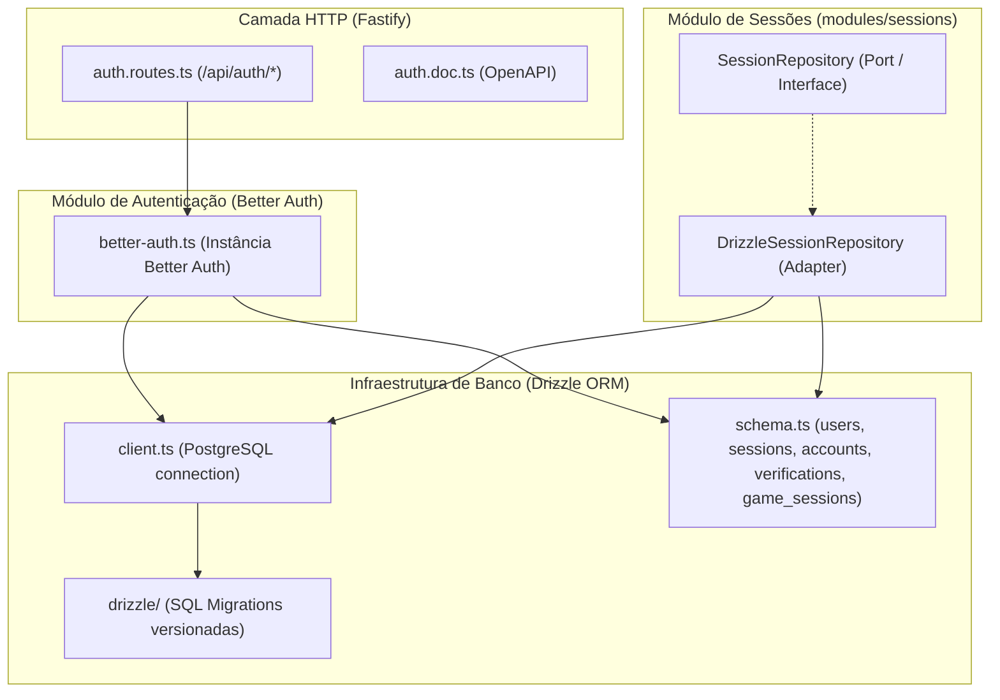

# Plano de Implementação — Fase 3: Persistência (PostgreSQL + Drizzle) & Better Auth

> **Status**: Pronto para Aprovação (Gate Humano 1 & 2)  
> **Referência Principal**: [AGENTS.md](../../AGENTS.md) | [mvp-walking-skeleton.md](mvp-walking-skeleton.md)  
> **Decisões Alinhadas no Gate 0**:
> 1. Autenticação local por email e senha via Better Auth (`emailAndPassword.enabled: true`) sem provedores OAuth externos no MVP.
> 2. Migrações SQL versionadas via Drizzle Kit (`apps/api/drizzle/`), com comando `pnpm --filter api db:migrate` e migrador programático para testes.
> 3. Escopo focado: Schema de autenticação Better Auth (`user`, `session`, `account`, `verification`) + tabela `game_sessions`, com repositório `SessionRepository` desacoplado e testes de integração com Postgres.

---

## 1. Visão Geral e Arquitetura

Esta fase estabelece a fundação de persistência relacional e controle de acesso da API, preparando o terreno para o ciclo de sessões (Fase 4 e Fase 5) e protegendo rotas administrativas do streamer.

A arquitetura respeita estritamente o modelo hexagonal:
- **Domínio / Aplicação**: Contratos de repositório (`SessionRepository`) residem em `application/repositories/`, sem conhecimento de SQL, Drizzle ou Fastify.
- **Infraestrutura**: Cliente Drizzle em `common/infrastructure/database/drizzle/client.ts`, schemas em `schema.ts`, implementações de repositório em `infrastructure/database/drizzle/` e adaptador Better Auth em `modules/auth/infrastructure/`.
- **HTTP / Borda**: Plugin e rotas Fastify em `modules/auth/infrastructure/http/routes/auth.routes.ts` delegando requisições `/api/auth/*` ao handler do Better Auth.

---

## 2. Decisões Técnicas & Dependências

1. **Dependências de Produção** (`apps/api`):
   - `drizzle-orm`: ORM relacional TypeScript-first.
   - `postgres`: Driver PostgreSQL rápido, moderno e puro ESM (`postgres.js`).
   - `better-auth`: Autenticação completa para Node.js com suporte nativo ao Drizzle adapter.

2. **Dependências de Desenvolvimento** (`apps/api`):
   - `drizzle-kit`: CLI para geração e verificação de migrações SQL.

3. **Configuração de Ambiente** (`env.ts`):
   - Inclusão de `BETTER_AUTH_SECRET` (string com default seguro para desenvolvimento).
   - Inclusão de `BETTER_AUTH_URL` (default `http://localhost:3001`).

4. **Isolamento de Contratos**:
   - `SessionRepository` define métodos puros: `create(session)`, `findById(id)`, `findByStatus(status)`, `updateStatus(id, status, endedAt?)`.
   - Nenhuma dependência do Drizzle vaza para a camada de aplicação.

---

## 3. Arquivos a Criar e Modificar

### 3.1. Configuração e Dependências
- `apps/api/package.json` [MODIFY]: Adicionar scripts `db:generate` e `db:migrate` (via CLI pnpm).
- `apps/api/drizzle.config.ts` [NEW]: Configuração do Drizzle Kit apontando para `schema.ts`, output em `drizzle/` e `dialect: 'postgresql'`.
- `apps/api/src/common/config/env.ts` [MODIFY]: Variáveis `BETTER_AUTH_SECRET` e `BETTER_AUTH_URL`.

### 3.2. Infraestrutura Drizzle & Banco de Dados
- `apps/api/src/common/infrastructure/database/drizzle/schema.ts` [NEW]:
  - Tabelas Better Auth: `user`, `session`, `account`, `verification`.
  - Tabela de domínio: `game_sessions` (`id`, `game_id`, `operator_id`, `status`, `title`, `config`, `started_at`, `ended_at`, `created_at`, `updated_at`).
- `apps/api/src/common/infrastructure/database/drizzle/client.ts` [NEW]: Conexão PostgreSQL singleton com pool exportando `db` e `sqlClient`.
- `apps/api/src/common/infrastructure/database/drizzle/migrate.ts` [NEW]: Runner programático de migrações (`migrate(db, { migrationsFolder })`) para script CLI e testes de integração.
- `apps/api/drizzle/` [NEW]: Diretório gerado pelo `drizzle-kit generate` contendo arquivos SQL determinísticos.

### 3.3. Módulo de Sessões (`modules/sessions`)
- `apps/api/src/modules/sessions/domain/session.types.ts` [NEW]: Tipos e enums (`SessionStatus`: `'CONFIGURING' | 'RUNNING' | 'PAUSED' | 'ENDED'`).
- `apps/api/src/modules/sessions/application/repositories/session.repository.ts` [NEW]: Interface `SessionRepository`.
- `apps/api/src/modules/sessions/infrastructure/database/drizzle/drizzle-session.repository.ts` [NEW]: Implementação da interface usando Drizzle ORM.

### 3.4. Módulo de Autenticação (`modules/auth`)
- `apps/api/src/modules/auth/infrastructure/better-auth.ts` [NEW]: Inicialização do Better Auth com Drizzle adapter e provedor `emailAndPassword`.
- `apps/api/src/modules/auth/infrastructure/http/routes/auth.routes.ts` [NEW]: Rota catch-all Fastify `/api/auth/*` convertendo headers e body para Fetch `Request` e delegando ao `auth.handler`.
- `apps/api/src/modules/auth/infrastructure/http/routes/docs/auth.doc.ts` [NEW]: Esquema Swagger/OpenAPI para documentar o endpoint de autenticação.
- `apps/api/src/app.ts` [MODIFY]: Registro do `authRoutes`.

### 3.5. Testes Unitários e de Integração
- `apps/api/src/common/infrastructure/database/drizzle/__tests__/schema.test.ts` [NEW]: Validação dos schemas, chaves e defaults do Drizzle.
- `apps/api/src/modules/sessions/infrastructure/database/drizzle/__tests__/session-repository.integration.test.ts` [NEW]: Teste de integração do repositório no PostgreSQL real.
- `apps/api/src/modules/auth/infrastructure/http/__tests__/auth.integration.test.ts` [NEW]: Teste de integração Fastify + Better Auth (cadastro de usuário, login por email/senha e validação de sessão).

---

## 4. Plano de Execução & Orquestração

1. **Instalação das dependências** via `pnpm --filter api add ...`.
2. **Criação da infraestrutura Drizzle**:
   - `drizzle.config.ts`, `schema.ts`, `client.ts`, `migrate.ts`.
   - Geração da migração inicial com `drizzle-kit generate`.
3. **Módulo de Sessões**:
   - Tipos de domínio, porta `SessionRepository` e adaptador Drizzle.
4. **Módulo de Autenticação**:
   - Configuração do Better Auth e rotas Fastify.
   - Integração com `app.ts`.
5. **Verificação Automatizada**:
   - Subir Docker Postgres (`docker compose up -d postgres`).
   - Aplicar migrações (`pnpm --filter api db:migrate`).
   - Executar testes (`pnpm --filter api test`).
   - Executar suíte completa `./scripts/verify.sh --api`.

---

## 5. Critérios de Aceite da Fase 3

- [ ] Migrações SQL do Drizzle geradas e aplicáveis sem erros contra PostgreSQL 17.
- [ ] Better Auth configurado e respondendo em `/api/auth/*`.
- [ ] Cadastro (`signUp.email`) e login (`signIn.email`) funcionando via endpoint HTTP.
- [ ] `DrizzleSessionRepository` implementa todas as operações de persistência e consulta de sessão.
- [ ] 100% dos testes passando no Vitest com cobertura dentro dos thresholds estritos (>=90%).
- [ ] Typecheck estrito e linter passando sem warnings ou erros.
