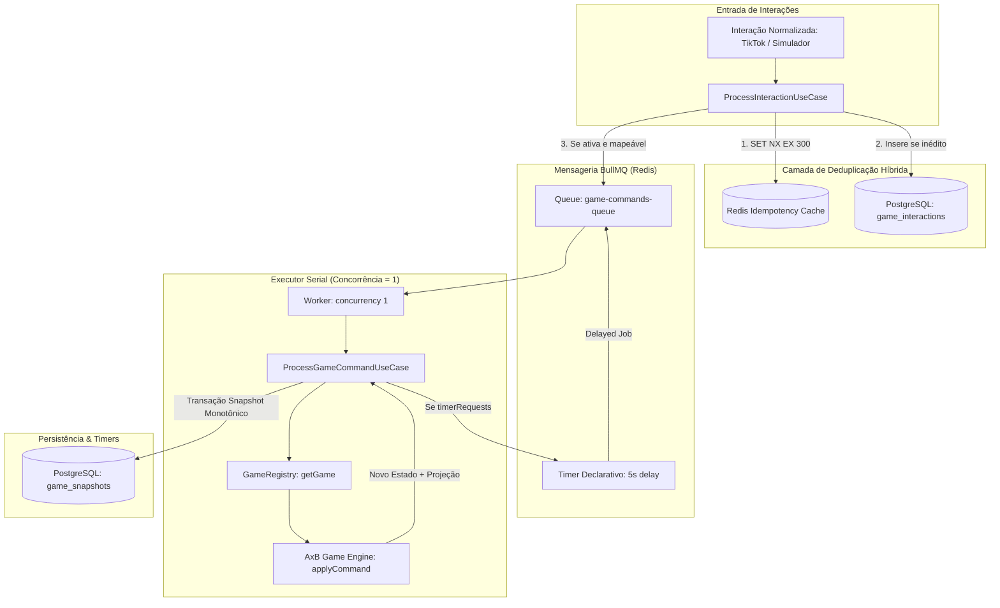

# Plano de Implementação — Fase 4: Ingress Worker & Fila Serial BullMQ

> **Status**: Proposto (Aguardando Aprovação Gate 1 & 2)  
> **Branch**: `feat/phase-4-ingress-bullmq`  
> **Referências**: [AGENTS.md](../../AGENTS.md) | [docs/spec/architecture.md](../spec/architecture.md) | [docs/plans/mvp-walking-skeleton.md](mvp-walking-skeleton.md)

---

## 1. Visão Geral & Objetivos

A Fase 4 constrói a espinha dorsal de concorrência e mensageria assíncrona do Host da plataforma de lives interativas. O objetivo é receber interações em rajadas (comentários, likes, presentes) e orquestrá-las através do BullMQ com Redis e PostgreSQL, garantindo:
1. **Deduplicação Idempotente Híbrida**: Cache ultra-rápido no Redis (`SET NX EX 300`) somado à persistência de integridade relacional no PostgreSQL com chave única.
2. **Execução Serial FIFO Concorrência 1**: A fila `game-commands-queue` é processada estritamente com `concurrency: 1`, eliminando qualquer possibilidade de *race conditions*, conflitos de versão ou pulo de estado no motor do jogo.
3. **Persistência Monotônica de Snapshots**: A cada comando processado pela engine pura (SPI), o novo estado opaco e a respectiva projeção para o overlay são salvos monotonicamente com sequence incremental no PostgreSQL.
4. **Timers Declarativos**: Disparo de delayed jobs no BullMQ (ex: intervalo de 5.000 ms após vitória de rodada) que re-injetam comandos no executor serial ao expirar.
5. **Ciclo de Vida da Sessão & Pausa**: Suporte a `CONFIGURING`, `RUNNING`, `PAUSED` e `ENDED`, com buffer de interações pendentes durante pausas e drenagem FIFO ordenada na retomada.

---

## 2. Decisões do Gate 0 (Alinhamento Técnico)

- **Branch Base**: `feat/phase-4-ingress-bullmq` ramificada de `master`.
- **Estratégia de Deduplicação**: Híbrida. Redis `SET NX EX 300` para corte na borda em $O(1)$ + tabela `game_interactions` no PostgreSQL com restrição `UNIQUE(idempotency_key)`.
- **Persistência de Snapshots**: Modelagem formal com Drizzle ORM de `game_snapshots` e `game_interactions`, com migração versionada aplicada via `pnpm --filter api db:migrate`.

---

## 3. Arquitetura de Módulos e Componentes

---

## 4. Estrutura de Arquivos a Criar/Modificar

### 4.1. Dependências
- `apps/api/package.json`: Adicionar `bullmq` e `ioredis` via `pnpm --filter api add bullmq ioredis`.

### 4.2. Banco de Dados & Drizzle ORM
- `apps/api/src/common/infrastructure/database/drizzle/schema.ts`:
  - `gameSnapshots`: id, sessionId, gameId, sequence, state, projection, createdAt.
  - `gameInteractions`: id, sessionId, idempotencyKey (unique), type, source, userId, userName, payload, status, createdAt, processedAt.
- `apps/api/drizzle/0001_game_snapshots_interactions.sql`: Migração gerada e executada.

### 4.3. Infraestrutura de Filas (BullMQ + Redis)
- `apps/api/src/common/infrastructure/queue/redis.connection.ts`: Instância singleton IORedis com `maxRetriesPerRequest: null`.
- `apps/api/src/common/infrastructure/queue/queue.constants.ts`: Nomes das filas e opções padronizadas.
- `apps/api/src/common/infrastructure/queue/queue.factory.ts`: Criação padronizada de `Queue` e `Worker`.

### 4.4. Módulo de Sessões (`apps/api/src/modules/sessions/`)
- `domain/session.types.ts`: Atualização para compatibilidade com lifecycle completo.
- `application/repositories/snapshot.repository.ts`: Interface de persistência de snapshots.
- `application/repositories/interaction.repository.ts`: Interface de persistência de interações.
- `infrastructure/database/drizzle/drizzle-snapshot.repository.ts`: Implementação Drizzle de snapshots.
- `infrastructure/database/drizzle/drizzle-interaction.repository.ts`: Implementação Drizzle de interações.
- `application/usecases/`:
  - `create-session.usecase.ts`
  - `start-session.usecase.ts`
  - `pause-session.usecase.ts`
  - `resume-session.usecase.ts` (drena fila de pendências)
  - `end-session.usecase.ts`

### 4.5. Módulo Ingress (`apps/api/src/modules/ingress/`)
- `application/usecases/process-interaction.usecase.ts`: Deduplica via Redis + Postgres, mapeia comando via `GameRegistry` e despacha para `game-commands-queue`.
- `infrastructure/queue/ingress.worker.ts`: Worker BullMQ para ingestão assíncrona.

### 4.6. Executor Serial & Timers (`apps/api/src/common/executor/` e `apps/api/src/common/timers/`)
- `application/usecases/process-game-command.usecase.ts`: Execução determinística, geração de projeção e gravação de snapshot.
- `infrastructure/queue/command.worker.ts`: Worker com `concurrency: 1`.
- `common/timers/declarative-timer.service.ts`: Agendamento de delayed jobs no BullMQ.

---

## 5. Metodologia TDD (Ciclos Red → Green → Refactor)

1. **Ciclo 1: Deduplicação e Ingress**
   - **Red**: Teste enviando duas interações com mesma `idempotencyKey`; apenas a primeira deve gerar comando na fila e persistência de interação.
   - **Green**: Implementação de `ProcessInteractionUseCase` com Redis `SET NX` e `InteractionRepository`.
2. **Ciclo 2: Execução Serial FIFO Concorrência 1**
   - **Red**: Disparo concorrente de 20 comandos simultâneos; validação de que os snapshots gerados possuem sequences monotônicos (0, 1, 2, ..., 20) e estado consistente sem race conditions.
   - **Green**: Implementação de `ProcessGameCommandUseCase` e `command.worker.ts` (`concurrency: 1`).
3. **Ciclo 3: Timers Declarativos (Delayed Job 5s)**
   - **Red**: Simulação de comando que atinge a condição de vitória no AxB; verificação do agendamento de delayed job de 5.000 ms e execução posterior da nova rodada.
   - **Green**: Implementação de `DeclarativeTimerService` integrado ao BullMQ.
4. **Ciclo 4: Lifecycle de Sessão e Pausa com Drenagem FIFO**
   - **Red**: Sessão pausada acumula eventos como PENDING; na retomada (`resume`), todos são drenados em ordem FIFO antes de novos comandos.
   - **Green**: Implementação dos use cases de sessão (`pause`, `resume`).

---

## 6. Critérios de Aceite & Validação

- [ ] Migração Drizzle executada com sucesso criando `game_snapshots` e `game_interactions`.
- [ ] 100% dos testes unitários e de integração passando via `pnpm --filter api test`.
- [ ] Cobertura de testes do backend mantida acima de **90%** (meta: >= 95%).
- [ ] `./scripts/verify.sh --api` executado com status verde (lint, build, testes e cobertura).
