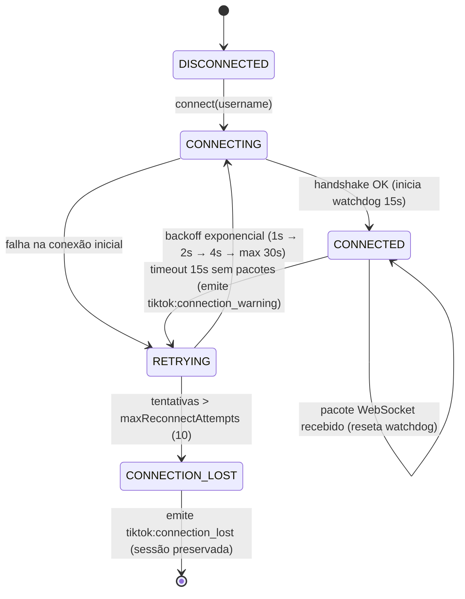
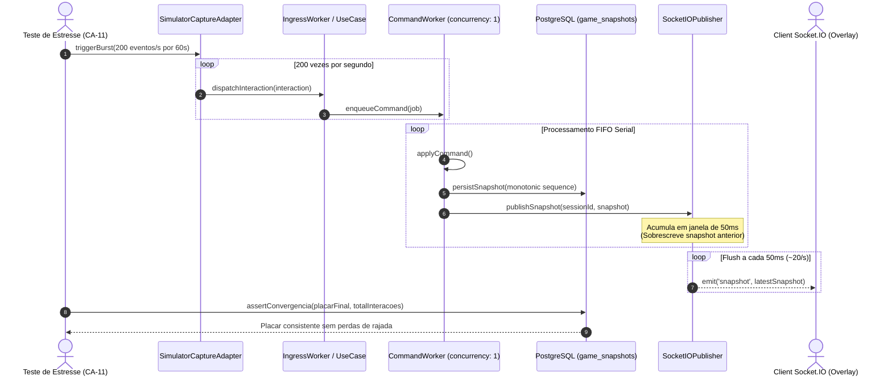

# Plano de Implementação — Fase 5: Adaptadores (TikTok, Simulador), Socket.IO & Rotas Fastify

> **Status**: Proposto (Aguardando Aprovação Gate Humano 1 & 2)  
> **Branch**: `feat/phase-5-adapters-socketio-fastify`  
> **Referências**: [AGENTS.md](../../AGENTS.md) | [docs/spec/architecture.md](../spec/architecture.md) | [docs/plans/mvp-walking-skeleton.md](mvp-walking-skeleton.md)

---

## 1. Visão Geral & Objetivos

A Fase 5 fecha o elo entre a lógica de aplicação/concorrência (desenvolvida na Fase 4) e o mundo externo (ingestão real/simulada, rede HTTP e streaming WebSocket). Ela é responsável por:

1. **Adaptador TikTok Live (`TikTokLiveCaptureAdapter`)**: Ingestão em tempo real de eventos da live do TikTok (`chat`, `gift`, `like`) com watchdog de heartbeat (15s) e reconexão resiliente com backoff exponencial (1s → 2s → 4s → max 30s), emitindo avisos (`tiktok:connection_warning`) e perda de conexão (`tiktok:connection_lost`) ao dashboard.
2. **Adaptador do Simulador de Tráfego (`SimulatorCaptureAdapter`)**: Gerador sintético de interações com modos contínuo e rajada (burst de 200 eventos/s para validação de estresse CA-11), com endpoints dedicados para controle em tempo real.
3. **Gateway Socket.IO & Coalescência Server-Side (`SocketIOPublisher`)**: Streaming de snapshots com janela fixa de 50ms (latest-wins) particionada por sala (`session:${sessionId}`) para reduzir o tráfego de ~200 para ~20 emissões/s, com emissão imediata e sem perda de `contribution_alert`.
4. **Camada HTTP Fastify Modular & OpenAPI**: Endpoints REST para gerenciamento de sessão (`/api/sessions/*`), auditoria JSON (`/api/sessions/:id/audit`), controle do simulador (`/api/simulator/*`) e controle da conexão TikTok (`/api/tiktok/*`), com schemas OpenAPI e documentação Swagger em `/api/docs`.
5. **Composição da Aplicação Fastify (`app.ts` e `index.ts`)**: Integração do servidor Fastify com o servidor Socket.IO na porta 3001, com inicialização graciosa e encerramento limpo de conexões e workers.

---

## 2. Decisões do Gate 0 (Alinhamento Técnico)

- **Branch Base**: `feat/phase-5-adapters-socketio-fastify` ramificada de `feat/phase-4-ingress-bullmq`.
- **Estratégia TikTok**: Encapsular `tiktok-live-connector` com watchdog ativo (timeout de 15s e backoff 1s→30s), suportando injeção de conector mock para testes de integração offline sem necessidade de live ativa.
- **Estratégia Socket.IO**: Coalescência server-side com timer throttle de 50ms (latest-wins) particionada por sala (`session:${sessionId}`), com emissão imediata de alertas de contribuição.
- **Estratégia do Simulador & CA-11**: Gerador de tráfego sintético autônomo com rotas `/api/simulator/start`, `/stop` e `/burst`, suportando rajada de 200 eventos/s para homologação de estresse CA-11 com validação de convergência do placar final.

---

## 3. Diagramas de Arquitetura (Mermaid)

### 3.1. Topologia Hexagonal & Streaming em Tempo Real (`flowchart TD`)

```mermaid
flowchart TD
    subgraph External_Ingress["1. Ingestão Primária (Driving Adapters)"]
        TIKTOK_LIVE["TikTok Webcast"] -->|Eventos Brutos| TIKTOK_ADAPTER["TikTokLiveCaptureAdapter\n(Watchdog 15s)"]
        SIM_BURST["POST /api/simulator/burst\n(Rajada CA-11 200 ev/s)"] --> SIM_ADAPTER["SimulatorCaptureAdapter"]
    end

    subgraph Fastify_HTTP["2. Camada HTTP Fastify"]
        REST_SESSION["/api/sessions/*\n(start, pause, resume, end, audit)"]
        REST_SIM["/api/simulator/*\n(start, stop, burst)"]
        REST_TIKTOK["/api/tiktok/*\n(connect, disconnect, status)"]
        OPENAPI["/api/docs\n(Swagger UI)"]
    end

    subgraph Ingress_Domain["3. Aplicação & Ingress"]
        TIKTOK_ADAPTER -->|GameInteraction| INGRESS_UC["ProcessInteractionUseCase"]
        SIM_ADAPTER -->|GameInteraction| INGRESS_UC
        INGRESS_UC -->|Idempotência O(1)| REDIS_IDEMP[("Redis: Idempotency Key")]
        INGRESS_UC -->|Gravação Relacional| PG_INTERACTIONS[("PostgreSQL: game_interactions")]
        INGRESS_UC -->|Enfileiramento| BULLMQ_CMD["BullMQ: game-commands-queue"]
    end

    subgraph Serial_Core["4. Executor Serial (concurrency: 1)"]
        BULLMQ_CMD --> SERIAL_WORKER["CommandWorker"]
        SERIAL_WORKER --> ENGINE["AxB Game Engine (Pure SPI)"]
        ENGINE -->|Snapshot Monotônico| PG_SNAPSHOTS[("PostgreSQL: game_snapshots")]
    end

    subgraph Realtime_Broadcasting["5. Distribuição Realtime (Socket.IO Gateway)"]
        PG_SNAPSHOTS -->|Snapshot Event| PUBLISHER["SocketIOPublisher"]
        PUBLISHER -->|Buffer Coalescente (50ms latest-wins)| ROOM_SESSION["Room session:sessionId"]
        PUBLISHER -->|Imediato sem janela| ALERT_EVENT["Evento: contribution_alert"]
        ROOM_SESSION -->|~20 snapshots/s| OVERLAY["Web Overlay (OBS Browser Source)"]
        ALERT_EVENT --> DASHBOARD["Painel do Operador (/dashboard)"]
    end
```

### 3.2. Máquina de Estados do Watchdog do TikTok (`stateDiagram-v2`)



### 3.3. Sequência do Teste de Rajada CA-11 & Coalescência (`sequenceDiagram`)



---

## 4. Estrutura de Arquivos a Criar e Modificar

### 4.1. Dependências do Workspace
- `pnpm --filter api add tiktok-live-connector`
- `pnpm --filter api add -D socket.io-client`

### 4.2. Ingress & Adaptadores (`apps/api/src/modules/ingress/`)
- `infrastructure/tiktok/tiktok-connector.interface.ts`: Interface do cliente de webcast para desacoplamento e mocks de teste.
- `infrastructure/tiktok/tiktok-capture.adapter.ts`: Implementação do `TikTokLiveCaptureAdapter` com watchdog (15s), backoff exponencial e emissão de avisos via Socket.IO.
- `infrastructure/tiktok/__tests__/tiktok-capture.adapter.test.ts`: Testes unitários e de integração do adaptador e do watchdog.
- `infrastructure/simulator/simulator-capture.adapter.ts`: Implementação do `SimulatorCaptureAdapter` com suporte a tráfego contínuo e rajada CA-11 (200 eventos/s).
- `infrastructure/simulator/__tests__/simulator-capture.adapter.test.ts`: Testes de geração e disparo de rajada sintética.

### 4.3. Socket.IO & Streaming (`apps/api/src/common/infrastructure/socket/`)
- `socketio-snapshot-publisher.ts`: Publicador de snapshots com buffer coalescente em janela de 50ms particionado por sala de sessão, e alerta imediato de contribuições.
- `__tests__/socketio-snapshot-publisher.test.ts`: Teste de coalescência sob alta frequência (200 eventos em 100ms → emissões reduzidas conforme janela) e preservação do snapshot final.

### 4.4. Rotas HTTP Fastify, DTOs e Controllers
- **Módulo Sessions** (`apps/api/src/modules/sessions/infrastructure/http/`):
  - `dtos/session.dto.ts`: Validações Zod para criação e ações de sessão.
  - `controllers/session.controller.ts`: Orquestração de casos de uso de sessão e exportação de auditoria JSON (`/audit`).
  - `routes/session.routes.ts`: Definição de rotas Fastify para `/api/sessions`.
  - `routes/docs/session.docs.ts`: Schemas OpenAPI para `/api/sessions`.
  - `__tests__/session.routes.test.ts`: Testes de integração HTTP das rotas de sessão.
- **Módulo Ingress** (`apps/api/src/modules/ingress/infrastructure/http/`):
  - `dtos/ingress-http.dto.ts`: Validações Zod para simulator e tiktok endpoints.
  - `controllers/simulator.controller.ts`: Controle de start/stop e burst do simulador.
  - `controllers/tiktok.controller.ts`: Controle de conexão, status e desconexão do TikTok.
  - `routes/simulator.routes.ts`: Rotas Fastify para `/api/simulator`.
  - `routes/tiktok.routes.ts`: Rotas Fastify para `/api/tiktok`.
  - `routes/docs/simulator.docs.ts`: Schemas OpenAPI do simulador.
  - `routes/docs/tiktok.docs.ts`: Schemas OpenAPI do conector TikTok.
  - `__tests__/ingress.routes.test.ts`: Testes de integração HTTP para simulador e TikTok.

### 4.5. Fastify App & Entrypoint
- `apps/api/src/app.ts`: Acoplamento do Socket.IO Server sobre `fastify.server`, registro de plugins CORS, Swagger/OpenAPI docs, rotas de Auth, Sessions e Ingress.
- `apps/api/src/index.ts`: Inicialização na porta 3001 e encerramento gracioso.
- `apps/api/src/__tests__/app.test.ts`: Atualização para cobrir rotas da Fase 5 e documentação OpenAPI.
- `apps/api/src/__tests__/ca11-burst.integration.test.ts`: Teste de integração de ponta a ponta de estresse CA-11 (200 eventos/s, convergência de pontuação no banco e no Socket.IO).

---

## 5. Plano de Execução (Subagentes)

1. **Ativação Obrigatória de Skills**:
   - `backend-builder`: `tdd`, `solid`, `ponytail`, `codebase-design`.
2. **Construção Backend (`backend-builder`)**:
   - Adição das dependências via CLI pnpm.
   - Implementação TDD do `SocketIOPublisher` e coalescência.
   - Implementação TDD do `TikTokLiveCaptureAdapter` e watchdog.
   - Implementação TDD do `SimulatorCaptureAdapter` e rajada CA-11.
   - Implementação dos controllers, DTOs, rotas e docs Fastify.
   - Composição no `app.ts` e `index.ts`.
   - Teste de integração CA-11.
3. **Validação & Auditoria Concorrentes**:
   - `test-verifier`: Execução de `./scripts/verify.sh` completo e validação de cobertura (>= 90% backend).
   - `implementation-validator`: Auditoria de código contra `AGENTS.md`, SOLID e anti-bloat ponytail.
4. **Gate 3 & Finalização**:
   - Apresentação do `walkthrough.md` com resultados dos testes e métricas.
