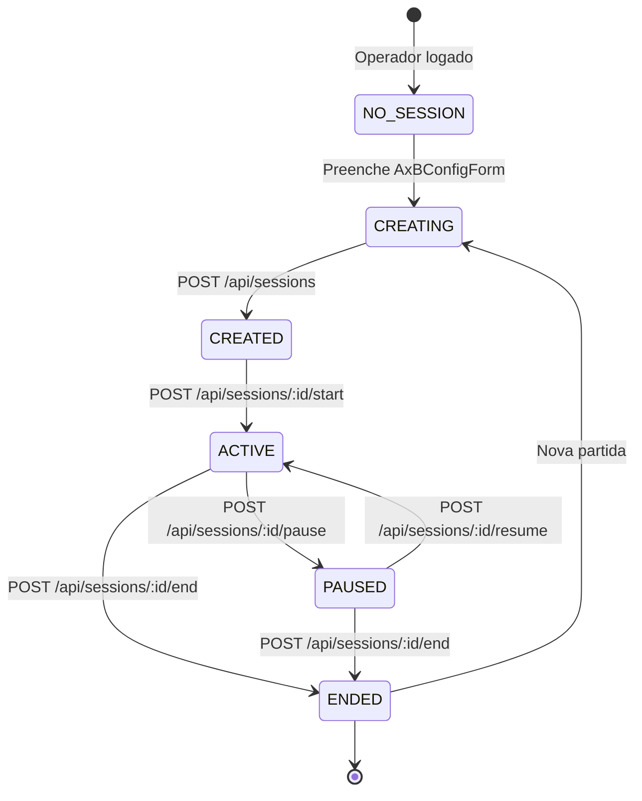
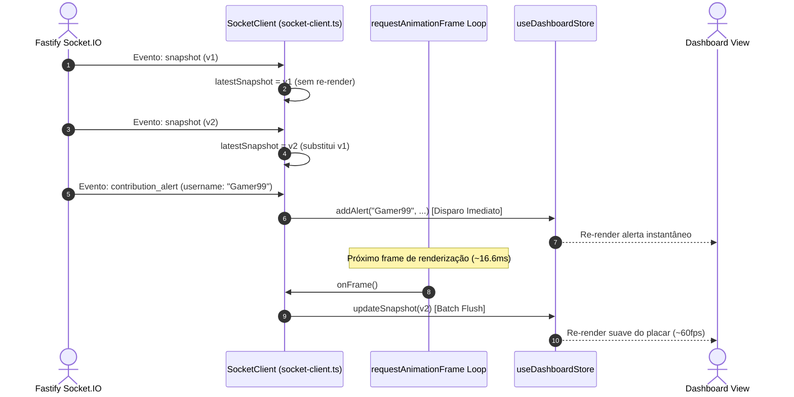

# Plano de Implementação — Fase 6: Frontend — Dashboard do Operador, Base shadcn/ui & Autenticação

> **Status**: Concluído (Validado com 100% de Aprovação no ./scripts/verify.sh)  
> **Branch**: `feat/phase-6-frontend-dashboard-auth`  
> **Referências**: [AGENTS.md](../../AGENTS.md) | [docs/spec/architecture.md](../spec/architecture.md) | [docs/plans/mvp-walking-skeleton.md](mvp-walking-skeleton.md)

---

## 1. Visão Geral & Objetivos

A Fase 6 materializa a camada de apresentação do operador na aplicação `apps/web`, unificando a fundação de interface, autenticação e o painel de comando operacional completo (`/dashboard`).

Conforme aprovado no alinhamento do **Gate 0** e diretrizes de design/nomenclatura shadcn/ui, todos os arquivos de componentes seguirão estritamente o padrão **kebab-case** (`login-form.tsx`, `session-controls.tsx`, etc.) exportando componentes PascalCase:

1. **Fundação e Cliente de Autenticação (`Better Auth`)**:
   - Integração do cliente Better Auth (`better-auth/react`) conectado ao backend Fastify em `/api/auth`.
   - Rota `/login` com formulário de login/registro (e-mail e senha) e feedback via Sonner toast.
   - Proteção estrita de rotas operacionais (`/dashboard`) com guard `beforeLoad` no TanStack Router redirecionando usuários não autenticados para `/login`.
2. **Camada de Comunicação REST Desacoplada (`Zero Shared Package`)**:
   - Declaração de tipos locais em `apps/web/src/api/types.ts` sem qualquer dependência ou import de `apps/api`.
   - Cliente HTTP tipado em `apps/web/src/api/client.ts` para controle de sessões (`/api/sessions/*`), simulador (`/api/simulator/*`), conector TikTok (`/api/tiktok/*`) e auditoria.
3. **Gateway Socket.IO com Acumulador `requestAnimationFrame` (~60fps)**:
   - Cliente Socket.IO em `apps/web/src/lib/socket-client.ts` com batching rAF: acumula snapshots recebidos em variável mutável (*latest-wins*) e faz flush para o store Zustand a no máximo ~60fps, evitando re-renders custosos no React mesmo sob rajadas de 200 eventos/s.
   - Disparo imediato e sem retenção para alertas de contribuição (`contribution_alert`) e eventos de conectividade do TikTok.
4. **Gerenciamento de Estado Reativo Desacoplado (`Zustand`)**:
   - `use-dashboard-store.ts` centralizando estado de sessão ativa, placar em tempo real (A x B), métricas de tráfego/latência, status da live do TikTok e log de histórico de eventos em ring buffer.
5. **Dashboard do Operador (`/dashboard`)**:
   - `session-controls.tsx`: criação, início, pausa, retomada e encerramento de partidas.
   - `axb-config-form.tsx`: configuração de nomes, cores, metas de pontos e mapeamento de presentes TikTok.
   - `tiktok-connector-card.tsx`: conexão à live por `@username`, monitoramento de status e alertas visuais de perda de conexão.
   - `simulator-panel.tsx`: injeção manual de eventos, tráfego sintético contínuo e disparador de rajada CA-11 (200 ev/s).
   - `metrics-card.tsx`: telemetria de eventos/s, snapshots/s, latência estimada e sequência monotônica.
   - `events-history-log.tsx`: stream auditável e em tempo real dos eventos e alertas processados.

---

## 2. Decisões do Gate 0 (Alinhamento Técnico)

- **Escopo Unificado**: Entrega completa da fundação de UI, Better Auth `/login`, Socket rAF e o Dashboard do Operador `/dashboard` com todos os controles interativos.
- **Padrão de Nomenclatura**: Convenção shadcn/ui com arquivos em **kebab-case** (ex: `login-form.tsx`, `session-controls.tsx`, `use-dashboard-store.ts`) e componentes exportados em PascalCase.
- **Proteção de Rota**: Redirecionamento estrito para `/login` via guard de rota (`beforeLoad` do TanStack Router), retornando ao `/dashboard` após login.
- **Arquitetura de Estado**: Zustand Store desacoplado (`useDashboardStore`) alimentado pelo acumulador `requestAnimationFrame` (~60fps) para snapshots e streaming imediato para alertas de contribuição.
- **Qualidade e Cobertura**: Test-Driven Development (TDD) com cobertura mínima de 85% em `apps/web`, isolamento estrito sem pacotes compartilhados.

---

## 3. Diagramas de Arquitetura (Mermaid)

### 3.1. Topologia de Comunicação Frontend ↔ API (`flowchart TD`)

```mermaid
flowchart TD
    subgraph Browser_Web["apps/web (TanStack Router + React 19 + Zustand)"]
        LOGIN_ROUTE["/login\n(login-view.tsx / login-form.tsx)"]
        DASHBOARD_ROUTE["/dashboard\n(dashboard-view.tsx)"]
        STORE["Zustand Store\n(use-dashboard-store.ts)"]
        RAF_ACCUM["Accumulator rAF\n(~60fps Latest-Wins)"]
        SOCKET_CLIENT["SocketClient (socket-client.ts)"]
        API_CLIENT["REST API Client\n(client.ts)"]
        AUTH_CLIENT["Better Auth Client\n(auth-client.ts)"]
    end

    subgraph Backend_API["apps/api (Fastify + Socket.IO :3001)"]
        FASTIFY_AUTH["/api/auth/*\n(Better Auth Engine)"]
        FASTIFY_REST["/api/sessions/*\n/api/simulator/*\n/api/tiktok/*"]
        SOCKET_SERVER["Socket.IO Server\n(session:sessionId)"]
    end

    AUTH_CLIENT <-->|POST /api/auth/*| FASTIFY_AUTH
    API_CLIENT <-->|REST Requests| FASTIFY_REST
    SOCKET_SERVER -->|Snapshot Events\n(~20/s)| SOCKET_CLIENT
    SOCKET_SERVER -->|contribution_alert\n(Imediato)| SOCKET_CLIENT
    SOCKET_CLIENT -->|Snapshots| RAF_ACCUM
    SOCKET_CLIENT -->|Alerts Imediatos| STORE
    RAF_ACCUM -->|Flush 60fps| STORE
    DASHBOARD_ROUTE <--> STORE
    DASHBOARD_ROUTE --> API_CLIENT
```

### 3.2. Ciclo de Vida da Sessão no Dashboard (`stateDiagram-v2`)



### 3.3. Sequência de Ingestão Realtime & Acumulador rAF (`sequenceDiagram`)



---

## 4. Especificação Técnica dos Arquivos a Criar/Modificar

### 4.1. Dependências
- Instalar `better-auth` no workspace `apps/web`:
  `pnpm --filter web add better-auth`

### 4.2. Infraestrutura e Clientes (`src/lib/` & `src/api/`)
- `apps/web/src/lib/auth-client.ts`:
  Cliente de autenticação baseado em `createAuthClient` configurado com `baseURL: '/api/auth'`.
- `apps/web/src/lib/socket-client.ts`:
  Classe `RealtimeClient` encapsulando Socket.IO, ingress de eventos por sala (`session:${sessionId}`), acumulador rAF para snapshots com verificação dirty-state, disparo direto de alertas e tratamento de desconexão/reconexão.
- `apps/web/src/api/types.ts`:
  Contratos de tipos isolados e locais do frontend para sessões, projeções do jogo A x B, eventos Socket.IO, payloads do simulador e respostas do conector TikTok.
- `apps/web/src/api/client.ts`:
  Módulo de funções assíncronas tipadas executando `fetch` para as rotas da API com tratamento padronizado de erros.

### 4.3. Gerenciamento de Estado (`src/features/dashboard/stores/`)
- `apps/web/src/features/dashboard/stores/use-dashboard-store.ts`:
  Store Zustand completo para o Dashboard, expondo ações para carregar sessão, atualizar placar/snapshot, registrar alertas, alternar status do TikTok, registrar histórico de interações e métricas de desempenho.

### 4.4. Autenticação (`src/features/auth/` & `src/routes/`)
- `apps/web/src/features/auth/components/login-form.tsx`:
  Formulário em tabs/switch com inputs de e-mail e senha, botão de submit com estado de carregamento, alternância entre Sign In e Sign Up, chamadas ao `authClient`.
- `apps/web/src/features/auth/views/login-view.tsx`:
  Container estilizado com tema moderno, card centralizado e feedback visual via Sonner.
- `apps/web/src/routes/login.tsx`:
  Definição de rota do TanStack Router para `/login`, redirecionando para `/dashboard` se já autenticado.

### 4.5. Painel do Operador (`src/features/dashboard/` & `src/routes/`)
- `apps/web/src/features/dashboard/components/session-controls.tsx`:
  Barra de ações para Iniciar, Pausar, Retomar e Encerrar a sessão com badges de status visual e confirmação de encerramento.
- `apps/web/src/features/dashboard/components/axb-config-form.tsx`:
  Formulário de configuração de partida: nomes dos competidores (Lado A e Lado B), cores em HEX, meta de pontos (ex: 1000) e mapeamento de presentes TikTok para pontuação.
- `apps/web/src/features/dashboard/components/tiktok-connector-card.tsx`:
  Card de integração TikTok Live: campo de usuário (`@streamer`), botão Conectar/Desconectar, indicador de status online/offline/reconectando e alerta de watchdog.
- `apps/web/src/features/dashboard/components/simulator-panel.tsx`:
  Painel de testes: disparos unitários de likes/gifts/comentários, slider de frequência para tráfego contínuo e gatilho de rajada CA-11 (200 eventos/s).
- `apps/web/src/features/dashboard/components/metrics-card.tsx`:
  Card de telemetria com contadores em tempo real: eventos recebidos, taxa de snapshots/s, latência estimada e sequência monotônica do motor.
- `apps/web/src/features/dashboard/components/events-history-log.tsx`:
  Lista de histórico em tempo real com auto-scroll, diferenciando presentes, likes, comentários e alertas de contribuição.
- `apps/web/src/features/dashboard/views/dashboard-view.tsx`:
  Layout modular consolidando os cards em grid responsivo com barra superior de sessão e navegação rápida para o `/overlay`.
- `apps/web/src/routes/dashboard.tsx`:
  Definição de rota do TanStack Router para `/dashboard`, com guard `beforeLoad` que valida a sessão do Better Auth.

---

## 5. Plano de Execução Sequencial (Subagentes)

1. **Subagente `feature-orchestrator`**:
   - Ativação de skills (`view_file` nos playbooks).
   - Gerenciamento dos blocos de execução e validação.
2. **Bloco 1 — Construção (`frontend-builder`)**:
   - Instalação de `better-auth` via CLI pnpm.
   - Implementação TDD de `auth-client.ts`, `api/types.ts`, `api/client.ts` e `socket-client.ts` com acumulador rAF.
   - Implementação TDD de `use-dashboard-store.ts`.
   - Construção dos componentes de UI de Auth (`login-form.tsx`, `login-view.tsx`) e rotas (`/login`).
   - Construção dos componentes de UI do Dashboard (`session-controls.tsx`, `axb-config-form.tsx`, `tiktok-connector-card.tsx`, `simulator-panel.tsx`, `metrics-card.tsx`, `events-history-log.tsx`, `dashboard-view.tsx`) e rota (`/dashboard`).
3. **Bloco 2 — Validação & Auditoria Concorrentes**:
   - `test-verifier`: Execução dos testes automatizados e suíte de cobertura (`pnpm --filter web test:coverage`), garantindo >= 85% de cobertura.
   - `implementation-validator`: Auditoria de conformidade com `AGENTS.md` (Zero Shared Package, Strict TS, ausência de code smells, convenção kebab-case de nomenclatura shadcn).
4. **Fechamento e Gate 3**:
   - Apresentação dos resultados consolidados e checklist de critérios de aceite.

---

## 6. Critérios de Aceite (Definition of Done)

- [ ] Todos os novos arquivos de componentes e stores em `apps/web` seguem a convenção kebab-case do shadcn/ui.
- [ ] `better-auth` integrado em `apps/web` sem qualquer dependência de workspace para `apps/api`.
- [ ] Rota `/login` funcional com formulário de login e registro por e-mail/senha.
- [ ] Rota `/dashboard` estritamente protegida por `beforeLoad`, redirecionando usuários anônimos para `/login`.
- [ ] `socket-client.ts` com acumulador `requestAnimationFrame` comprovado por testes automatizados (batching ~60fps latest-wins sob rajada de snapshots e disparo imediato de `contribution_alert`).
- [ ] Painel do operador permite configurar regras do A x B, criar e transicionar sessões (iniciar, pausar, retomar, encerrar), conectar TikTok e acionar o simulador.
- [ ] Métricas em tempo real e stream de log atualizados dinamicamente via Socket.IO e Zustand.
- [ ] Cobertura de testes em `apps/web` mantida em ou acima de 85% (`pnpm --filter web test:coverage`).
- [ ] `./scripts/verify.sh --web` aprovado com 0 erros de lint, tipos ou testes.
