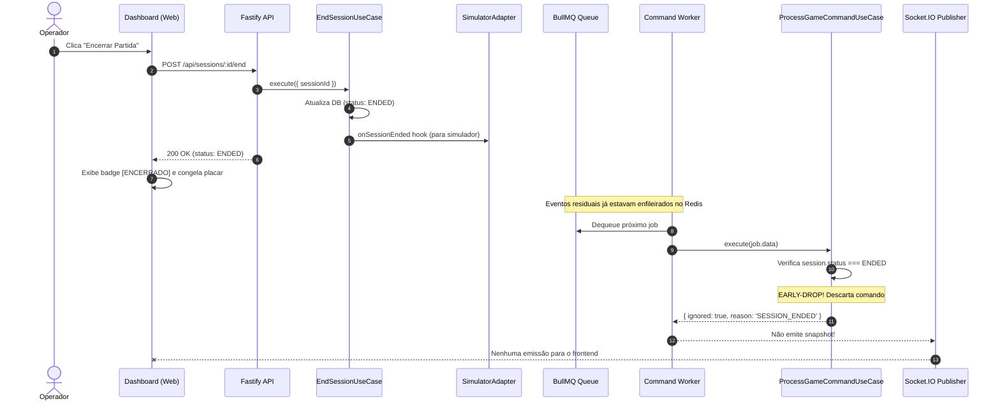
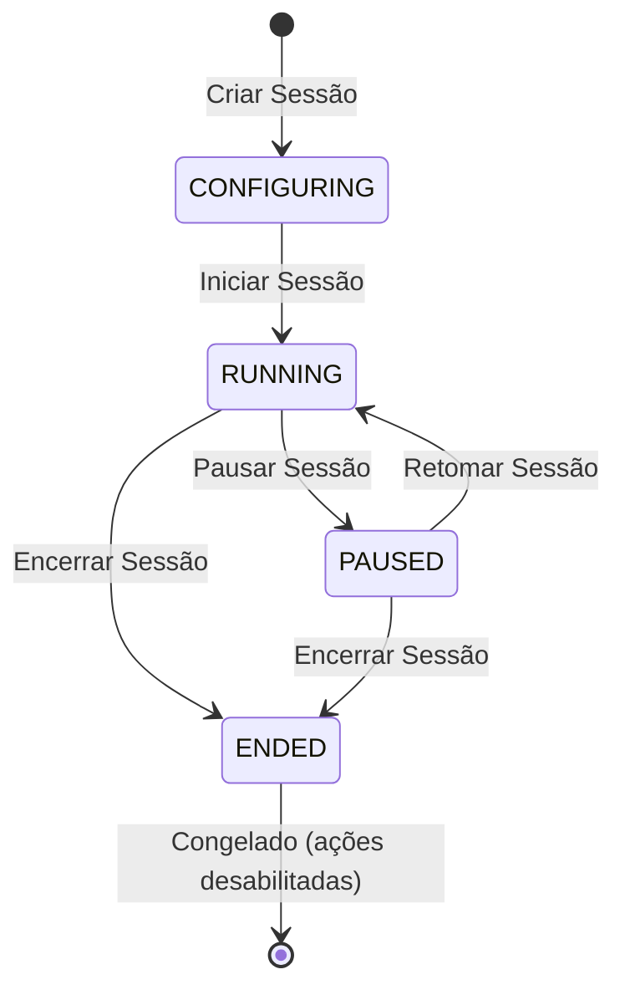

# Plano Técnico — Descarte de Comandos e Congelamento de Partida Encerrada

## 1. Contexto & Problema
Quando uma sessão é encerrada pelo operador (`POST /api/sessions/:id/end`), o status da sessão na tabela `game_sessions` é alterado para `ENDED`. Contudo:
1. **Backlog de Comandos no BullMQ**: A fila do Redis pode conter milhares de comandos enfileirados pelo simulador ou ingress antes do encerramento.
2. **Worker sem Early-Drop**: `ProcessGameCommandUseCase` não verifica se `session.status === SessionStatus.ENDED`. O worker executa a engine, gera novos snapshots, incrementa `sequence` e transmite via Socket.IO.
3. **Simulador Ativo**: O simulador contínuo não é desligado automaticamente se a sessão for encerrada.
4. **UI do Placar**: `MatchScoreboardCard` no frontend exibe `AGUARDANDO INÍCIO` em vez de `ENCERRADO` quando `sessionStatus === 'ENDED'`.

## 2. Diagramas Estruturais

### Sequência — Encerramento e Early-Drop no Worker

### Ciclo de Vida da Sessão

## 3. Filosofia Ponytail (Menor Diff & Root Cause)
- **Root Cause**: Uma única verificação de guarda no use case do worker elimina a geração de snapshots e emissões para sessões encerradas.
- **Hook Simples**: Um callback opcional `onSessionEnded` no `EndSessionUseCase` desliga o simulador sem acoplar camadas ou criar classes desnecessárias.
- **UI Limpa**: Adição da condição `isEnded` no card do placar e desabilitação dos gatilhos de simulação enquanto a sessão estiver encerrada.

## 4. Escopo de Alterações

### Backend (`apps/api`)
1. `apps/api/src/common/executor/application/usecases/process-game-command.usecase.ts`:
   - Se `session.status === SessionStatus.ENDED`, retornar `{ ignored: true, reason: 'SESSION_ENDED' }` sem chamar `engine.applyCommand` nem salvar snapshot.
2. `apps/api/src/common/executor/application/usecases/process-game-command.usecase.ts` (tipos):
   - Atualizar `ProcessGameCommandResult` para permitir `snapshot?: GameSnapshot`.
3. `apps/api/src/app.ts`:
   - No worker de comandos, verificar `if (res?.snapshot) publisher.publishSnapshot(...)`.
   - Passar callback `(sessionId) => simAdapter.stop()` para o `EndSessionUseCase`.
4. `apps/api/src/modules/sessions/application/usecases/end-session.usecase.ts`:
   - Aceitar hook opcional `onSessionEnded?: (sessionId: string) => void | Promise<void>` e invocá-lo após atualizar o status para `ENDED`.
5. Testes unitários atualizados no backend (`process-game-command.usecase.test.ts`, `end-session.usecase.test.ts`).

### Frontend (`apps/web`)
1. `apps/web/src/features/dashboard/components/match-scoreboard-card.tsx`:
   - Suporte a `sessionStatus === 'ENDED'`, exibindo badge `ENCERRADO` (variant `destructive` ou `secondary`).
2. `apps/web/src/features/dashboard/components/simulator-panel.tsx`:
   - Desabilitar botões quando a sessão estiver `ENDED` ou inexistente.
3. Testes unitários atualizados no frontend.

## 5. Plano de Validação
- `./scripts/verify.sh --quick`: 100% dos testes passando em backend e frontend.
- Teste de integração: Simulação de burst seguida de encerramento de sessão comprovando descarte imediato dos comandos e estabilização de snapshots.
