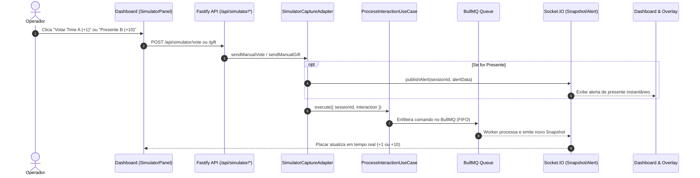
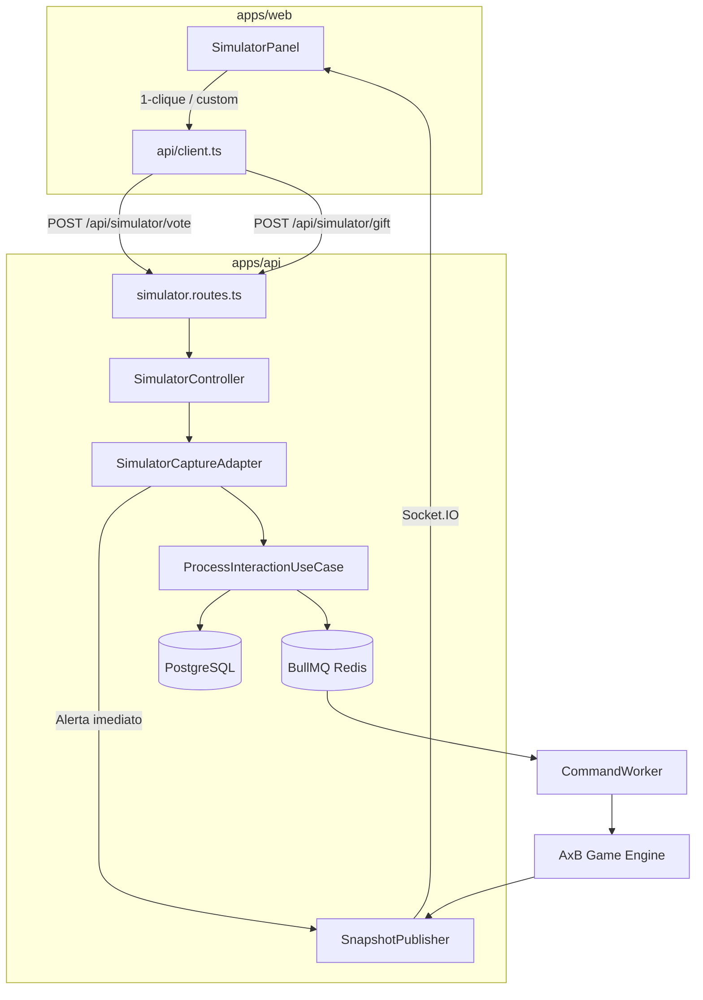

# Plano Técnico — Injeção Manual de Votos e Presentes no Simulador

## 1. Contexto & Objetivo
Permitir que o operador realize testes manuais unitários e controlados do fluxo de jogo A x B (votos +1, presentes +10, combos e validação de cooldown de 5s) sem depender de rajadas cegas de 200 ev/s ou de tráfego contínuo, facilitando a depuração e a demonstração do sistema.

## 2. Diagramas Estruturais

### Fluxo de Disparo Manual

### Arquitetura de Componentes

## 3. Filosofia Ponytail (Simplicidade & Reuso)
- **Reuso Total do Pipeline**: As novas rotas manuais usam exatamente os mesmos use cases (`ProcessInteractionUseCase`) e contratos de eventos (`CommentInteraction`, `RecognizedGiftContribution`) do simulador contínuo e do conector TikTok.
- **Identidade Híbrida**: Se o campo `userId` for omitido, gera identificador único por clique (garantindo pontuação imediata); se preenchido, usa identificador fixo (permitindo testar o bloqueio por cooldown de 5s da regra RG-02).
- **Zero Inchaço**: Sem novas dependências ou abstrações complexas. Apenas novos métodos no adapter e novos botões com shadcn/ui.

## 4. Escopo de Alterações

### Backend (`apps/api`)
1. `apps/api/src/modules/ingress/infrastructure/simulator/simulator-capture.adapter.ts`:
   - Adicionar `sendManualVote(params: { sessionId?: string; team: 'A' | 'B'; userId?: string; userName?: string })`.
   - Adicionar `sendManualGift(params: { sessionId?: string; team: 'A' | 'B'; units?: number; userId?: string; userName?: string; resourceKey?: string })`.
2. `apps/api/src/modules/ingress/infrastructure/http/controllers/simulator.controller.ts`:
   - Adicionar métodos `vote(body)` e `gift(body)`.
3. `apps/api/src/modules/ingress/infrastructure/http/routes/simulator.routes.ts`:
   - Registrar rotas `POST /api/simulator/vote` e `POST /api/simulator/gift`.
   - Documentar schemas no Swagger.
4. Testes unitários para os novos métodos e rotas.

### Frontend (`apps/web`)
1. `apps/web/src/api/client.ts`:
   - Adicionar funções tipadas `sendManualVote` e `sendManualGift`.
2. `apps/web/src/features/dashboard/components/simulator-panel.tsx`:
   - Adicionar seção "Ações Manuais":
     - Grid com 4 botões de 1 clique:
       - `Votar A (+1 pt)`
       - `Votar B (+1 pt)`
       - `Presente A (+10 pts)`
       - `Presente B (+10 pts)`
     - Seção expansível / campos opcionais:
       - Input opcional "Usuário Simulado" (para testar cooldown).
       - Input "Unidades do Presente" (para testar combos: 5x, 10x).
       - Botão de envio com combo personalizado.
   - Feedback via Sonner Toast para cada disparo.
3. Testes unitários em `simulator-panel.test.tsx`.

## 5. Validação
- `./scripts/verify.sh --quick` com 100% de sucesso.
- Teste manual no Dashboard clicando nos botões de votos e presentes.
