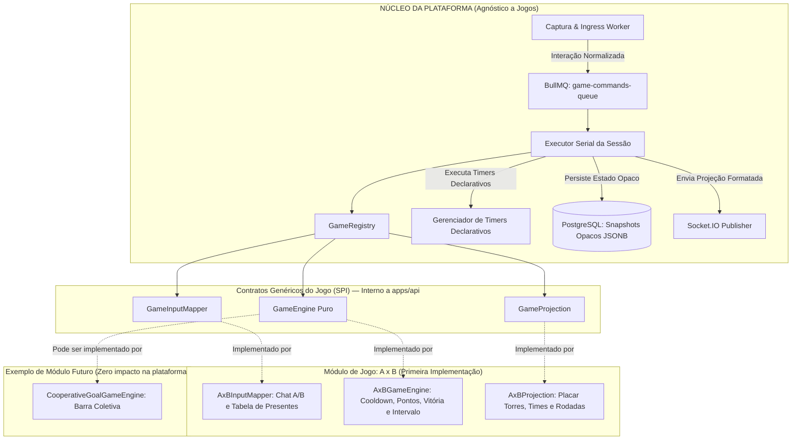
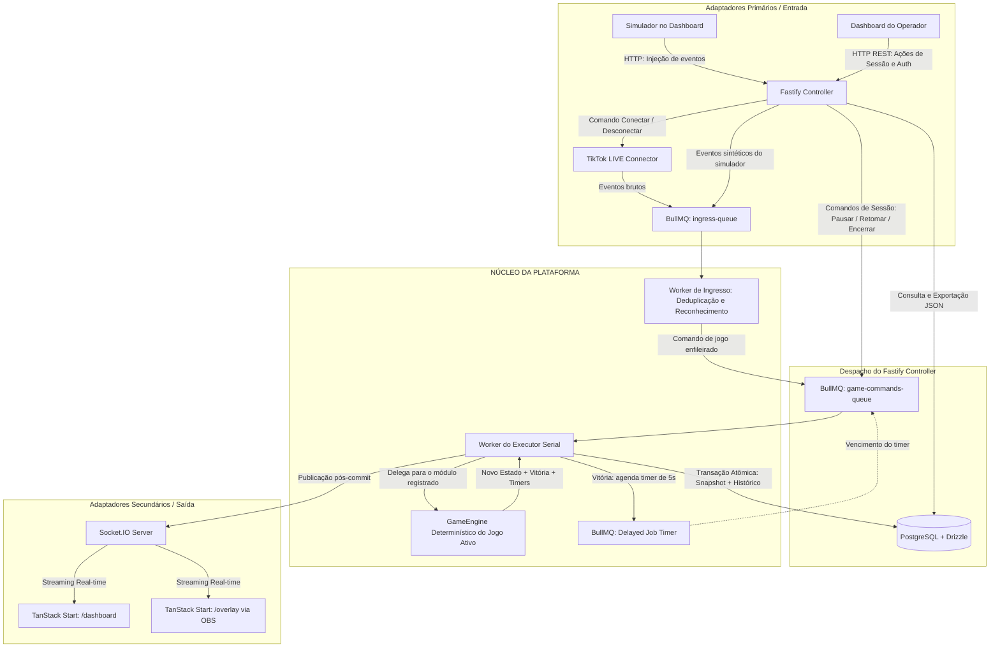
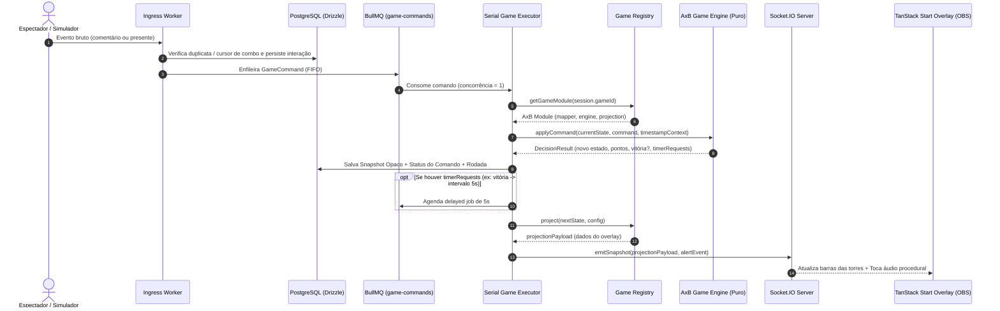
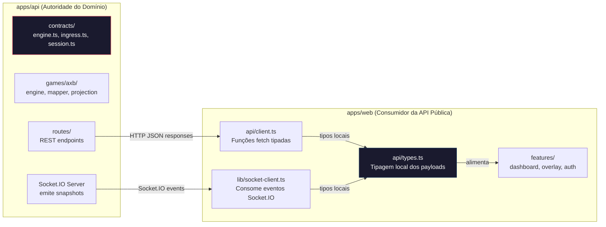

# Plano de Implementação — MVP Plataforma de Lives Interativas (Walking Skeleton com TDD)

> **Persistent Plan File**: [docs/plans/mvp-walking-skeleton.md](file:///home/luis/repositories/tiktok-gamer-lives/docs/plans/mvp-walking-skeleton.md)

Este plano estabelece a implementação do MVP (Walking Skeleton ponta a ponta) da plataforma local de jogos para transmissões ao vivo (TikTok LIVE). A arquitetura adota **Arquitetura Hexagonal**, separando rigorosamente o **Núcleo da Plataforma (Host)** dos **Módulos de Jogo** (sendo **A x B** a primeira implementação plugável no `GameRegistry`). O frontend adota a arquitetura de **`viralforge/web`** com **TanStack Start + Vite + React 19 + Tailwind CSS v4 + TanStack Router/Query + Zustand + shadcn/ui**.

A metodologia de desenvolvimento adota **TDD (Test-Driven Development)** nos módulos que concentram lógica de negócio, regras do jogo, deduplicação de eventos, ordenação serial e transições de estado, garantindo testes nos pontos de contato públicos (seams) sem acoplamento a detalhes de implementação interna.

### Decisão Arquitetural: Sem Pacote Compartilhado

O repositório contém **apenas dois apps** (`apps/api` e `apps/web`), sem `packages/shared`. A costura (seam) real entre backend e frontend é o **protocolo HTTP + Socket.IO** — não uma dependência de workspace.

- **`apps/api`** é a **autoridade do domínio**: contratos genéricos da engine (`GameModule`, `GameEngine`, etc.), schemas Zod, catálogo de presentes e constantes vivem **dentro do backend**.
- **`apps/web`** é um **consumidor da API pública**: define seus próprios tipos locais para os payloads REST e Socket.IO recebidos, exatamente como faria com uma API de terceiros.

Isso elimina acoplamento por conveniência e permite que cada app evolua, builde e faça deploy independentemente.

---

## 1. Decisões Arquiteturais Consolidadas

| Camada | Tecnologia / Padrão | Justificativa / Papel |
| :--- | :--- | :--- |
| **Abordagem de Entrega** | **Walking Skeleton ponta a ponta com TDD** | Dois apps integrados com backend, frontend, mensageria, banco e conector, guiado por TDD nas regras de negócio e concorrência. |
| **Estrutura do Repositório** | **Monorepo com pnpm workspaces — 2 apps, 0 packages** | `apps/api` (backend) e `apps/web` (frontend) completamente desacoplados. Sem `packages/shared`. O contrato entre eles é o protocolo HTTP + Socket.IO. |
| **Arquitetura da Game Engine** | **Host Agnóstico + Módulos de Jogos Plugáveis** | A plataforma **não conhece times, torres ou regras de pontuação**. Ela opera como um orquestrador genérico de comandos, transações atômicas e timers. Os jogos implementam o contrato `GameModule` (`InputMapper`, `GameEngine`, `GameProjection`). **A x B** é o primeiro módulo registrado no `GameRegistry`. |
| **Metodologia de Testes** | **TDD nos Seams Críticos (Red → Green)** | Testes de especificação escritos antes do código no motor de regras A x B (RG-01 a RG-12), no Ingress Worker (deduplicação e combos) e no Serial Executor (concorrência 1 e FIFO). Configuração de infra e componentes visuais utilizam scaffolding direto. |
| **Frontend Framework** | **TanStack Start (`@tanstack/react-start`) + Vite + React 19** | Substituto moderno e veloz ao Next.js, com SSR/SPA tipado de ponta a ponta, Vite HMR instantâneo e integração nativa com TanStack Router e TanStack Query. |
| **Arquitetura Frontend** | **Padrão `viralforge/web` (Feature-Driven)** | Módulos organizados em `features/<feature>/{views,components,hooks,services,stores}`, rotas tipadas em `routes/`, primitivos shadcn/ui em `components/ui`, Tailwind CSS v4 com `@tailwindcss/vite` e Zustand para estado do cliente. |
| **Backend & Comunicação** | **Fastify (Node.js + TypeScript) + Socket.IO** | Endpoints REST para comandos, sessão e exportação de logs + Socket.IO para streaming em tempo real de snapshots e eventos aos clientes. |
| **Camada Assíncrona & Jobs** | **Redis 7 + BullMQ** | `ingress-queue` para eventos brutos, `game-commands-queue` com concorrência estrita de 1 para execução serial determinística FIFO, e delayed jobs para timers de intervalo (5s). |
| **Banco de Dados** | **PostgreSQL 17 + Drizzle ORM** | Persistência relacional para sessões, interações brutas, comandos auditáveis, snapshots e rodadas. Snapshots de jogos são salvos como `JSONB` opaco para a plataforma. |
| **Autenticação** | **Better Auth** | Autenticação com email e senha integrada ao PostgreSQL via Drizzle adapter, protegendo as rotas e controles do `/dashboard`. |
| **Captura & Simulação** | **Adaptador Hexagonal `LiveCapture`** | Implementação real com `tiktok-live-connector` (v2.5.0) e implementação de desenvolvimento com `SimulatorCaptureAdapter` (disparos manuais, tráfego contínuo e rajada CA-11). |
| **Overlay & Templates** | **Desacoplado via Templates Plugáveis** | Renderizado em 1080×1920 transparente no OBS, consumindo projeção agnóstica via Socket.IO, com temas selecionáveis (*Neon Arena*, *Minimal Esport*, etc.). |
| **Motor de Áudio** | **Híbrido Web Audio API + Assets** | Sons procedurais leves nativos com Web Audio API para pontos e combos (zero dependência externa de assets) + áudio para fanfarra de vitória, com controle de volume e mute no painel. |
| **Ambiente de Execução** | **100% Dockerizado com Live-Reload** | `docker-compose.yml` orquestrando Postgres, Redis, Backend (Fastify) e Frontend (TanStack Start/Vite) com volumes montados. |

---

## 2. Diagramas de Arquitetura

### 2.1. Arquitetura da Game Engine: Plataforma vs Módulos de Jogos



### 2.2. Fluxo Hexagonal de Processamento de Eventos e Controle



### 2.3. Sequência Detalhada: Do Evento Bruto à Projeção no Overlay



### 2.4. Desacoplamento Web ↔ API: Contrato por Protocolo



> **Nenhuma dependência de workspace** entre `apps/web` e `apps/api`. O frontend define seus próprios tipos em `api/types.ts` para os payloads HTTP e Socket.IO. Se a API mudar a forma da projeção, o frontend atualiza localmente — como faria com qualquer API externa.

---

## 3. Especificação dos Contratos da Game Engine

Os contratos em `apps/api/src/contracts/engine.ts` garantem que o motor de qualquer jogo seja **puro, determinístico e desacoplado**:

```typescript
// 1. Tradutor de Interações
export interface GameInputMapper<TConfig, TCommand> {
  mapInteraction(interaction: NormalizedInteraction, config: TConfig): TCommand | null;
}

// 2. Motor Determinístico Puro
export interface GameEngine<TState, TCommand, TConfig, TResult> {
  createInitialState(config: TConfig): TState;
  validateConfig(config: unknown): TConfig;
  
  applyCommand(
    currentState: TState,
    command: TCommand,
    context: { timestamp: number; isPaused: boolean }
  ): {
    nextState: TState;
    status: 'APPLIED' | 'DEFERRED' | 'IGNORED';
    reason?: string;
    roundResult?: TResult;
    timerRequests?: Array<{
      id: string;
      durationMs: number;
      commandOnExpire: TCommand;
    }>;
  };
}

// 3. Projeção de Apresentação para Frontend
export interface GameProjection<TState, TConfig, TProjection> {
  project(state: TState, config: TConfig, meta: { isPaused: boolean; pendingCount: number }): TProjection;
}

// 4. Módulo de Jogo Completo
export interface GameModule<TConfig = any, TState = any, TCommand = any, TResult = any, TProjection = any> {
  id: string;
  name: string;
  version: string;
  mapper: GameInputMapper<TConfig, TCommand>;
  engine: GameEngine<TState, TCommand, TConfig, TResult>;
  projection: GameProjection<TState, TConfig, TProjection>;
}
```

---

## 4. Estrutura do Monorepo Proposta

```
tiktok-gamer-lives/
├── docker-compose.yml          # Postgres 17, Redis 7, apps/api, apps/web
├── pnpm-workspace.yaml         # Configuração dos workspaces (sem packages/)
├── package.json                # Scripts globais (dev, build, lint, test)
├── tsconfig.base.json          # Configuração base de TypeScript
├── apps/
│   ├── api/                    # Backend: Autoridade do domínio
│   │   ├── Dockerfile.dev
│   │   ├── package.json
│   │   ├── tsconfig.json
│   │   └── src/
│   │       ├── index.ts        # Ponto de entrada e bootstrap Fastify
│   │       ├── config/
│   │       │   └── env.ts      # Variáveis de ambiente validadas com Zod
│   │       ├── contracts/      # Contratos genéricos da plataforma (INTERNOS ao backend)
│   │       │   ├── engine.ts   # GameModule, GameEngine, GameInputMapper, GameProjection, TimerRequest
│   │       │   ├── ingress.ts  # CommentInteraction, GiftInteraction, ConnectionStatus
│   │       │   └── session.ts  # SessionState, SessionConfig, SnapshotEnvelope
│   │       ├── games/          # Módulos de jogos isolados
│   │       │   └── axb/        # Implementação do jogo A x B
│   │       │       ├── types.ts       # AxBState, AxBCommand, AxBProjection, AxBConfig
│   │       │       ├── schema.ts      # Schemas Zod de configuração do A x B
│   │       │       ├── constants.ts   # Catálogo de presentes TikTok + defaults de meta/cooldown
│   │       │       ├── engine.ts      # Regras A x B (cooldown, pontos, meta, intervalo)
│   │       │       ├── mapper.ts      # Tradutor de chat e presentes para comandos A x B
│   │       │       ├── projection.ts  # Projeção de placares das torres e times
│   │       │       ├── __tests__/     # Testes unitários TDD das regras RG-01 a RG-12
│   │       │       └── index.ts       # Exportação do AxBGameModule
│   │       ├── core/           # Núcleo genérico da plataforma
│   │       │   ├── session/    # Controle de ciclo de vida (preparada, ativa, pausada, encerrada)
│   │       │   ├── executor/   # Executor serial, transações atômicas e timers
│   │       │   └── registry/   # GameRegistry (registro estático de módulos de jogos)
│   │       ├── adapters/       # Adaptadores de infraestrutura (Hexagonal)
│   │       │   ├── tiktok/     # Adaptador tiktok-live-connector
│   │       │   ├── simulator/  # Adaptador de tráfego sintético e rajada CA-11
│   │       │   └── socket/     # Adaptador de publicação Socket.IO
│   │       ├── routes/         # Endpoints Fastify REST
│   │       │   ├── session.ts  # /api/session/* (CRUD, pausar, retomar, encerrar)
│   │       │   ├── simulator.ts # /api/simulator/* (injeção de eventos)
│   │       │   └── tiktok.ts   # /api/tiktok/* (conectar/desconectar live)
│   │       ├── db/             # Drizzle ORM + PostgreSQL
│   │       │   ├── schema.ts   # Tabelas: users, sessions, accounts, game_sessions, interactions, game_commands, game_snapshots, game_rounds
│   │       │   └── index.ts    # Conexão pool e Drizzle client com auto-migração
│   │       ├── queues/         # BullMQ Workers
│   │       │   ├── ingress-worker.ts
│   │       │   ├── index.ts
│   │       │   └── __tests__/
│   │       └── auth/           # Better Auth (email + senha) com Drizzle adapter
│   │           └── index.ts
│   │
│   └── web/                    # Frontend: Consumidor da API pública
│       ├── Dockerfile.dev
│       ├── package.json
│       ├── vite.config.ts
│       ├── components.json     # shadcn/ui (New York, Slate)
│       └── src/
│           ├── api/            # Tipagem local + client HTTP para payloads REST e Socket.IO
│           │   ├── types.ts    # Tipos locais: SessionResponse, AxBProjectionPayload, SnapshotEvent, etc.
│           │   └── client.ts   # Funções fetch tipadas (createSession, startSession, pauseSession, etc.)
│           ├── routes/         # Rotas tipadas do TanStack Router/Start
│           │   ├── __root.tsx
│           │   ├── index.tsx
│           │   ├── login.tsx
│           │   ├── dashboard.tsx
│           │   └── overlay.tsx
│           ├── features/       # Módulos verticais Feature-Driven
│           │   ├── auth/       # LoginForm, RegisterForm, useAuth, LoginView
│           │   │   ├── views/
│           │   │   ├── components/
│           │   │   ├── hooks/
│           │   │   └── services/
│           │   ├── dashboard/  # SessionControls, AxBConfigForm, SimulatorPanel, MetricsCard, DashboardView
│           │   │   ├── views/
│           │   │   ├── components/
│           │   │   ├── hooks/
│           │   │   ├── services/
│           │   │   └── stores/
│           │   └── overlay/    # OverlayView, themes/ (NeonArena, Minimal), AudioEffectPlayer
│           │       ├── views/
│           │       ├── components/
│           │       ├── themes/
│           │       └── stores/
│           ├── components/ui/  # Primitivos shadcn/ui
│           ├── styles/         # Tailwind CSS v4 (index.css, theme.css)
│           └── lib/            # utils, query-client, socket-client, auth-client
│               ├── utils.ts
│               ├── query-client.ts
│               ├── socket-client.ts
│               └── auth-client.ts
```

---

## 5. Fases de Implementação Detalhadas (Com TDD nos Módulos Críticos)

A implementação é dividida em **9 fases sequenciais**, detalhando objetivos, metodologia (TDD vs Scaffolding), costuras sob teste (seams) e critérios de conclusão verificáveis.

---

### Fase 1: Fundação do Monorepo e Docker Compose

- **Objetivo**: Estabelecer o monorepo pnpm com dois apps (`api` e `web`), orquestração de contêineres e bootstrap mínimo de cada app.
- **Metodologia**: Scaffolding e Configuração estrutural (TDD não aplicável para configs e tipos estáticos).
- **Arquivos a Criar**:
  - `docker-compose.yml` (Postgres 17, Redis 7, apps/api Fastify, apps/web TanStack Start com volumes montados e live-reload).
  - `pnpm-workspace.yaml` — apenas `apps/*`, sem `packages/*`.
  - `package.json` (scripts globais: `dev`, `build`, `lint`, `test`).
  - `tsconfig.base.json` (configuração base compartilhada via `extends`).
  - `apps/api/package.json`, `apps/api/tsconfig.json`, `apps/api/Dockerfile.dev`.
  - `apps/api/src/index.ts` (bootstrap Fastify mínimo com health check).
  - `apps/api/src/config/env.ts` (validação de variáveis de ambiente com Zod).
  - `apps/web/package.json`, `apps/web/Dockerfile.dev`.
  - `apps/web/vite.config.ts` (TanStack Router plugin + Tailwind CSS v4 plugin + proxy para API).
  - `apps/web/src/routes/__root.tsx` (shell mínimo com Outlet).
  - `apps/web/src/routes/index.tsx` (página placeholder "Platform is running").
- **Critério de Conclusão**: `pnpm install` executa sem erros; `docker compose up --build` sobe 4 serviços (postgres, redis, api, web) saudáveis; `GET /health` no Fastify retorna `200`; `http://localhost:5176` renderiza a página placeholder.

---

### Fase 2: Motor de Regras A x B & Game Registry (TDD no Domínio Puro)

- **Objetivo**: Implementar o motor de regras determinístico do jogo **A x B** (`RG-01` a `RG-12`) e o catálogo `GameRegistry`, 100% puro e sem I/O, guiado por testes rigorosos. Todos os contratos, tipos e constantes são internos a `apps/api`.
- **Metodologia**: **TDD Rigoroso (Red → Green)** usando Vitest.
- **Costuras sob Teste (Seams)**:
  - `AxBGameEngine.applyCommand(state, command, context)`
  - `AxBInputMapper.mapInteraction(interaction, config)`
  - `AxBProjection.project(state, config, meta)`
  - `GameRegistry.registerGame(module)` e `GameRegistry.getGame(gameId)`
- **Ciclos TDD**:
  1. *Ciclo 1 (Votos e Cooldown)*:
     - **Red**: Teste para `RG-01` (comentários válidos `A`/`B` pontuam +1; textos inválidos como `time A` ou `AAAA` são ignorados) e `RG-02` (cooldown de 5 segundos compartilhado entre A e B por usuário).
     - **Green**: Implementação mínima em `mapper.ts` e `engine.ts`.
  2. *Ciclo 2 (Presentes e Combos)*:
     - **Red**: Teste para `RG-04` e `RG-05` (presente mapeado pontua para o lado correto com base na regra; combos incrementais `1 → 2 → 3 → 3 final` reconhecem apenas novas unidades, evitando soma duplicada).
     - **Green**: Implementação da regra de combo no `engine.ts`.
  3. *Ciclo 3 (Vitória, Excedente e Timer de Intervalo)*:
     - **Red**: Teste para `RG-09` e `RG-10` (primeira contribuição que atinge/ultrapassa a meta define vitória, pontos excedentes ficam no placar da rodada e motor emite `timerRequests` de 5.000 ms para intervalo).
     - **Green**: Lógica de declaração de vitória e emissão declarativa de timer.
  4. *Ciclo 4 (Pausa e Fila de Pendências)*:
     - **Red**: Teste para `RG-03`, `RG-08`, `RG-11` e `RG-12` (em pausa ou intervalo, comentários são descartados; presentes mapeados retornam status `DEFERRED`, sendo enfileirados como pendências que são aplicadas na retomada antes de novos eventos).
     - **Green**: Tratamento de contexto pausado e pendências.
  5. *Ciclo 5 (Game Registry)*:
     - **Red**: Teste para registrar múltiplos módulos de jogo e recuperar por `gameId`.
     - **Green**: Implementação de `apps/api/src/core/registry/game-registry.ts`.
- **Arquivos a Criar**:
  - `apps/api/src/contracts/engine.ts` (`GameModule`, `GameEngine`, `GameInputMapper`, `GameProjection`, `TimerRequest`).
  - `apps/api/src/contracts/ingress.ts` (`CommentInteraction`, `GiftInteraction`, `NormalizedInteraction`, `ConnectionStatus`).
  - `apps/api/src/contracts/session.ts` (`SessionState`, `SessionConfig`, `SnapshotEnvelope`).
  - `apps/api/src/games/axb/types.ts` (`AxBState`, `AxBCommand`, `AxBProjection`, `AxBConfig`).
  - `apps/api/src/games/axb/schema.ts` (schemas Zod de configuração).
  - `apps/api/src/games/axb/constants.ts` (catálogo de presentes TikTok + defaults).
  - `apps/api/src/games/axb/__tests__/engine.test.ts`
  - `apps/api/src/games/axb/__tests__/mapper.test.ts`
  - `apps/api/src/games/axb/engine.ts`
  - `apps/api/src/games/axb/mapper.ts`
  - `apps/api/src/games/axb/projection.ts`
  - `apps/api/src/games/axb/index.ts`
  - `apps/api/src/core/registry/__tests__/game-registry.test.ts`
  - `apps/api/src/core/registry/game-registry.ts`
- **Critério de Conclusão**: 100% dos testes unitários de domínio passando no Vitest (`pnpm --filter api test:unit`). Nenhuma dependência de I/O nos módulos testados.

---

### Fase 3: Persistência (PostgreSQL + Drizzle) & Better Auth

- **Objetivo**: Configurar a camada de dados relacional com Drizzle ORM no PostgreSQL e a autenticação com Better Auth. Tudo dentro de `apps/api`.
- **Metodologia**: Híbrido (Scaffold de schemas relacionais + Teste de integração de persistência e auth).
- **Arquivos a Criar**:
  - `apps/api/src/db/schema.ts` (tabelas: `users`, `sessions`, `accounts`, `game_sessions`, `interactions`, `game_commands`, `game_snapshots`, `game_rounds`).
  - `apps/api/src/db/index.ts` (conexão pool Postgres e Drizzle client com auto-migração).
  - `apps/api/src/auth/index.ts` (Better Auth configurado com Drizzle adapter e plugin email/senha).
- **Critério de Conclusão**: Containers Postgres e Redis sobem via `docker compose up -d postgres redis`; migrações Drizzle rodam com sucesso; script de teste confirma criação e validação de sessão do Better Auth no banco.

---

### Fase 4: Filas BullMQ, Ingress Worker & Serial Executor (TDD na Orquestração)

- **Objetivo**: Construir a infraestrutura assíncrona com BullMQ (`ingress-queue`, `game-commands-queue`), garantindo deduplicação, execução serial estrita (FIFO conc=1) e persistência atômica de snapshots.
- **Metodologia**: **TDD Rigoroso (Red → Green)** com Redis e PostgreSQL.
- **Costuras sob Teste (Seams)**:
  - `IngressWorker.process(rawInteraction)`
  - `SerialExecutor.processCommand(commandJob)`
  - `SessionService.createSession/start/pause/resume/stop`
- **Ciclos TDD**:
  1. *Ciclo 1 (Ingress & Deduplicação)*:
     - **Red**: Teste que envia duas interações com mesma `idempotencyKey` e verifica que apenas uma é persistida e enfileirada no `game-commands-queue`.
     - **Green**: Implementação de `apps/api/src/queues/ingress-worker.ts`.
  2. *Ciclo 2 (Execução Serial FIFO com concorrência 1)*:
     - **Red**: Teste que dispara 20 comandos simultâneos e valida que são processados em ordem sequencial estrita, gerando versões incrementais de snapshots sem race conditions.
     - **Green**: Implementação de `apps/api/src/core/executor/serial-executor.ts`.
  3. *Ciclo 3 (Timers Declarativos e Intervalo de 5s)*:
     - **Red**: Teste que simula vitória e verifica agendamento do delayed job de 5.000 ms no BullMQ, acionando o comando de início da rodada seguinte ao expirar.
     - **Green**: Integração de timers declarativos do motor no `SerialExecutor`.
  4. *Ciclo 4 (Ciclo de Sessão & Pausa)*:
     - **Red**: Teste que pausa a sessão, envia presentes (que viram pendências no Postgres) e na retomada drena as pendências em FIFO antes de aceitar novos eventos.
     - **Green**: Implementação de `apps/api/src/core/session/session-service.ts`.
- **Arquivos a Criar**:
  - `apps/api/src/queues/__tests__/ingress-worker.test.ts`
  - `apps/api/src/queues/__tests__/serial-executor.test.ts`
  - `apps/api/src/queues/index.ts`
  - `apps/api/src/queues/ingress-worker.ts`
  - `apps/api/src/core/executor/serial-executor.ts`
  - `apps/api/src/core/session/session-service.ts`
- **Critério de Conclusão**: Testes de integração de filas e transações passando no Vitest com Docker ativo.

---

### Fase 5: Adaptadores (TikTok, Simulador), Socket.IO & Rotas Fastify

- **Objetivo**: Integrar os adaptadores externos de captura, o gerador de tráfego sintético, o gateway Socket.IO para streaming em tempo real pós-commit e os endpoints REST no Fastify.
- **Metodologia**: Testes de Integração de rotas e adaptadores (incluindo teste de estresse de rajada CA-11).
- **Costuras sob Teste (Seams)**:
  - Endpoints REST Fastify (`/api/session/*`, `/api/simulator/*`, `/api/tiktok/*`).
  - Eventos de broadcast Socket.IO (`snapshot`, `contribution_alert`).
  - Carga sintética do simulador (200 eventos/s por 60s).
- **Resiliência — Heartbeat do Adaptador TikTok**:
  > A biblioteca `tiktok-live-connector` depende de engenharia reversa dos Protobufs do TikTok Web. Conexões podem cair silenciosamente ou o TikTok pode mudar a estrutura dos pacotes.
  - O `TikTokLiveCaptureAdapter` implementa um **watchdog de heartbeat**: se nenhum pacote nativo do WebSocket do TikTok for recebido em `N` segundos (configurável, default 15s), força reconexão agressiva com backoff exponencial (1s → 2s → 4s → max 30s).
  - Em cada falha de heartbeat ou reconexão, emite evento `tiktok:connection_warning` via Socket.IO para o `/dashboard` do operador, com timestamp, motivo e contagem de tentativas.
  - Após `maxReconnectAttempts` (default 10), emite `tiktok:connection_lost` e muda o status da sessão para indicar ingestão parada — sem derrubar a sessão, permitindo reconexão manual pelo operador.
- **Resiliência — Coalescência de Snapshots no Socket.IO**:
  > Sob rajadas de 200 eventos/s, emitir um evento Socket.IO por cada snapshot é desperdício de bandwidth e causa sobrecarga nos clientes.
  - O `SocketIOPublisher` implementa **coalescência server-side**: acumula snapshots em janela configurável (default 50ms) e emite apenas o snapshot mais recente (latest-wins) por janela, reduzindo de ~200 emissões/s para ~20 emissões/s.
  - Eventos `contribution_alert` são emitidos imediatamente (sem coalescência) para garantir feedback visual instantâneo.
- **Arquivos a Criar**:
  - `apps/api/src/adapters/tiktok/client.ts` (`TikTokLiveCaptureAdapter` com heartbeat watchdog, reconexão agressiva com backoff e emissão de alertas ao dashboard).
  - `apps/api/src/adapters/simulator/client.ts` (Simulador de tráfego contínuo e rajada CA-11).
  - `apps/api/src/adapters/socket/publisher.ts` (Servidor Socket.IO com coalescência de snapshots por janela temporal e throttler de segurança).
  - `apps/api/src/routes/session.ts` (endpoints REST de sessão e exportação de auditoria JSON).
  - `apps/api/src/routes/simulator.ts` (endpoints REST de injeção de eventos).
  - `apps/api/src/routes/tiktok.ts` (endpoints REST de conexão TikTok).
  - `apps/api/src/index.ts` (bootstrap Fastify completo na porta 3001 com todas as rotas e Socket.IO).
  - `apps/api/src/adapters/simulator/__tests__/burst-load.test.ts` (Script de estresse CA-11).
  - `apps/api/src/adapters/tiktok/__tests__/heartbeat.test.ts` (Teste de watchdog: simula silêncio do WebSocket e valida reconexão + emissão de alerta).
- **Critério de Conclusão**: Servidor Fastify respondendo com status 200/201 nas rotas; clientes Socket.IO recebendo snapshots coalescidos com projeção correta; teste de rajada CA-11 executado com convergência total do placar; watchdog do TikTok dispara reconexão após timeout simulado.

---

### Fase 6: Frontend — TanStack Start, Base shadcn/ui & Autenticação

- **Objetivo**: Configurar a fundação do frontend `apps/web` baseada em `viralforge/web`, com Vite, React 19, Tailwind CSS v4, componentes primitivos shadcn/ui e tela de login protegida por Better Auth.
- **Metodologia**: Scaffolding e UI Features (primitivos declarativos).
- **Arquivos a Criar**:
  - `apps/web/components.json` (shadcn/ui New York Slate).
  - `apps/web/src/styles/index.css` e `apps/web/src/styles/theme.css`.
  - `apps/web/src/lib/utils.ts`, `query-client.ts`, `auth-client.ts`.
  - `apps/web/src/lib/socket-client.ts` — **Com acumulador de snapshots (batching)**:
    > Sob rajadas, o servidor pode emitir ~20 snapshots/s (após coalescência server-side). Mesmo assim, atualizar o estado do React a cada evento causa re-renders excessivos que bloqueiam o thread principal do browser — especialmente no OBS Browser Source.
    - O `socket-client` implementa um **acumulador `requestAnimationFrame`**: recebe eventos `snapshot` do Socket.IO, guarda apenas o snapshot mais recente em uma variável mutable (latest-wins, sem setState), e a cada frame (`requestAnimationFrame` ~60fps) faz flush para o Zustand store somente se houve mudança desde o último frame.
    - Resultado: independente de quantos snapshots cheguem por segundo, o React re-renderiza no máximo **60 vezes por segundo**, alinhado com a taxa de atualização do display e do OBS.
    - Eventos `contribution_alert` continuam sendo processados imediatamente (sem acumulador) para feedback instantâneo.
  - `apps/web/src/api/types.ts` — **Tipos locais** dos payloads REST e Socket.IO consumidos:
    ```typescript
    // Tipos que o frontend define LOCALMENTE para consumir a API
    export interface SessionResponse { id: string; status: string; gameId: string; /* ... */ }
    export interface AxBProjectionPayload { scoreA: number; scoreB: number; round: number; /* ... */ }
    export interface SnapshotEvent { type: 'snapshot'; payload: AxBProjectionPayload; version: number; }
    export interface ContributionAlertEvent { type: 'contribution_alert'; username: string; /* ... */ }
    ```
  - `apps/web/src/api/client.ts` — Funções fetch tipadas para os endpoints REST:
    ```typescript
    export async function createSession(config: CreateSessionInput): Promise<SessionResponse> { /* ... */ }
    export async function startSession(sessionId: string): Promise<void> { /* ... */ }
    export async function pauseSession(sessionId: string): Promise<void> { /* ... */ }
    ```
  - `apps/web/src/components/ui/` (`button.tsx`, `card.tsx`, `input.tsx`, `slider.tsx`, `switch.tsx`, `badge.tsx`, `progress.tsx`, `tabs.tsx`, `select.tsx`, `tooltip.tsx`, `sonner.tsx`).
  - `apps/web/src/routes/__root.tsx` (QueryClient, Tooltip, Toaster, Devtools).
  - `apps/web/src/routes/index.tsx`, `apps/web/src/routes/login.tsx`.
  - `apps/web/src/features/auth/views/LoginView.tsx`, `components/LoginForm.tsx`.
- **Critério de Conclusão**: Aplicação web inicia na porta 5176 sem erros; tela de login renderiza; fluxo de registro e login com Better Auth funciona gravando sessão; `apps/web` não tem nenhuma dependência de workspace para `apps/api`.

---

### Fase 7: Frontend — Dashboard do Operador (`/dashboard`)

- **Objetivo**: Implementar o painel completo do streamer em `features/dashboard/`, permitindo configurar regras, operar a sessão, acionar o simulador e monitorar métricas em tempo real.
- **Metodologia**: Desenvolvimento Feature-Driven & Integração de Estado com Zustand e TanStack Query.
- **Arquivos a Criar**:
  - `apps/web/src/routes/dashboard.tsx`.
  - `apps/web/src/features/dashboard/views/DashboardView.tsx`.
  - `apps/web/src/features/dashboard/components/SessionControls.tsx` (Iniciar, Pausar, Retomar, Encerrar).
  - `apps/web/src/features/dashboard/components/AxBConfigForm.tsx` (Nomes, cores, meta, tabela de presentes).
  - `apps/web/src/features/dashboard/components/TikTokConnectorCard.tsx` (Status e conexão @username).
  - `apps/web/src/features/dashboard/components/SimulatorPanel.tsx` (Disparos manuais, slider de tráfego contínuo, disparador de rajada).
  - `apps/web/src/features/dashboard/components/MetricsCard.tsx` (Latência p95/p99, taxa de eventos/s, profundidade da fila).
  - `apps/web/src/features/dashboard/components/EventsHistoryLog.tsx`.
  - `apps/web/src/features/dashboard/services/session-api.ts`.
  - `apps/web/src/features/dashboard/stores/useDashboardStore.ts`.
- **Critério de Conclusão**: Operador consegue configurar regras do A x B, iniciar uma sessão de simulação, disparar eventos manuais e tráfego contínuo, visualizar logs e métricas atualizadas em tempo real.

---

### Fase 8: Frontend — Overlay OBS (`/overlay`), Templates & Efeitos de Áudio

- **Objetivo**: Desenvolver a tela transparente 1080×1920 para o OBS Browser Source, com sistema desacoplado de templates plugáveis e sintetizador procedural de áudio com Web Audio API.
- **Metodologia**: Visual, Animações CSS & Áudio Web API.
- **Arquivos a Criar**:
  - `apps/web/src/routes/overlay.tsx`.
  - `apps/web/src/features/overlay/views/OverlayView.tsx` (Layout 1080×1920, fundo transparente, distintivo permanente de simulação).
  - `apps/web/src/features/overlay/themes/NeonArenaTheme.tsx` (Torres neon com barras de energia, partículas e altura proporcional aos pontos).
  - `apps/web/src/features/overlay/themes/MinimalTheme.tsx` (Layout minimalista esport de alto contraste).
  - `apps/web/src/features/overlay/components/ContributionAlertBadge.tsx` (Badge com nome do espectador, presente e pontos).
  - `apps/web/src/features/overlay/components/RoundCelebrationBanner.tsx` (Banner de vitória e contagem regressiva de 5s).
  - `apps/web/src/features/overlay/components/AudioEffectPlayer.tsx` — **Com limitador de polifonia**:
    > 50 presentes disparados no mesmo segundo criam 50 instâncias de som sobrepostas, resultando em distorção digital (clipping) e saturação da CPU do OBS.
    - Implementa um **cooldown por tipo de som** (configurável, default 80ms): se o mesmo tipo de efeito (ex: "rosa") é disparado dentro da janela de cooldown, não cria nova instância de `OscillatorNode`.
    - Em vez de tocar novamente, aplica **pitch escalation**: incrementa levemente a frequência do oscilador ativo (+20Hz por evento agrupado) e aumenta o gain em +1dB (com teto de segurança), dando sensação de escala e urgência sem multiplicar instâncias.
    - Limite máximo de **4 vozes simultâneas** (`maxPolyphony`): se 4 sons diferentes estão tocando, o mais antigo é terminado (FIFO) antes de iniciar o novo.
    - Sons de vitória/fanfarra são exceção: sempre tocam imediatamente com prioridade, cancelando efeitos de contribuição ativos.
  - `apps/web/src/features/overlay/stores/useOverlayStore.ts`.
- **Critério de Conclusão**: Overlay renderiza no OBS a 60 FPS com fundo transparente; torres sobem proporcionalmente às pontuações recebidas via Socket.IO; áudio toca sincronizado; ao bater a meta, a celebração e a contagem de 5s são exibidas perfeitamente.

---

### Fase 9: Verificação Integrada de Ponta a Ponta no Docker Compose

- **Objetivo**: Subir a stack inteira em contêineres Docker e validar o fluxo completo do MVP.
- **Metodologia**: E2E Smoke Testing e validação dos Critérios de Aceite (CA-01 a CA-15).
- **Passos de Verificação**:
  1. Executar `docker compose up --build -d` e verificar todos os serviços com status `healthy`.
  2. Acessar `http://localhost:5176/login`, registrar operador e entrar no `/dashboard`.
  3. Iniciar sessão em Modo Simulação com meta de 1.000 pontos.
  4. Abrir `/overlay` no OBS ou navegador (1080×1920).
  5. Testar comentários e presentes via simulador: validar placar, torres subindo, sons tocando.
  6. Disparar presentes até bater a meta: validar vitória, intervalo de 5s e início automático da rodada 2.
  7. Testar pausa: validar descarte de comentários e retenção de presentes como pendências, drenadas na retomada.
  8. Testar conexão com live real pública do TikTok e validar sincronização do catálogo.
  9. Exportar histórico JSON da sessão e validar auditoria completa sem vazamento de credenciais.
- **Critério de Conclusão**: Stack 100% funcional no Docker Compose atendendo a todos os critérios de aceite.

---

## 6. Plano de Verificação

### 6.1. Resumo dos Testes por Camada e Fase
| Tipo de Teste | Fase | Seam / Módulo Testado | Ferramenta |
| :--- | :--- | :--- | :--- |
| **Unitário (TDD)** | Fase 2 | Regras RG-01 a RG-12 do motor A x B | Vitest |
| **Unitário (TDD)** | Fase 2 | Isolamento e registro no `GameRegistry` | Vitest |
| **Integração (TDD)** | Fase 4 | Deduplicação de ingress e chave de idempotência | Vitest + Redis + Postgres |
| **Integração (TDD)** | Fase 4 | Execução serial FIFO conc=1 e transações | Vitest + BullMQ |
| **Integração (TDD)** | Fase 4 | Timers declarativos e intervalos de rodada | Vitest + BullMQ |
| **Carga / Estresse** | Fase 5 | Rajada sintética 200 eventos/s por 60s (CA-11) | Script Node / Vitest |
| **E2E / Visual** | Fase 9 | Fluxo completo Dashboard + Overlay no OBS (CA-01 a CA-15) | Docker Compose |
