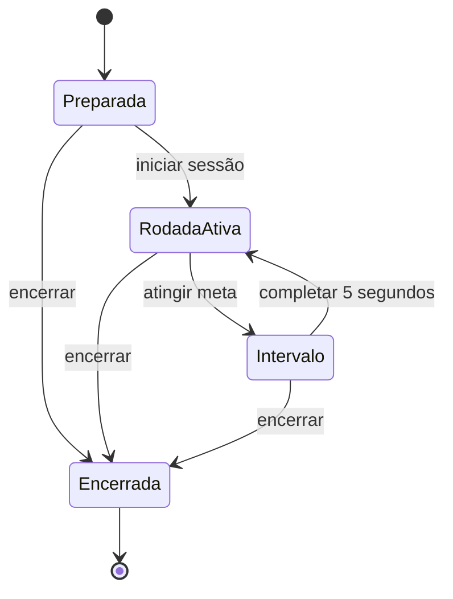
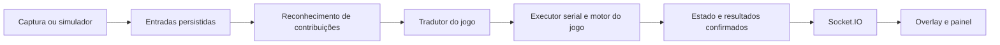
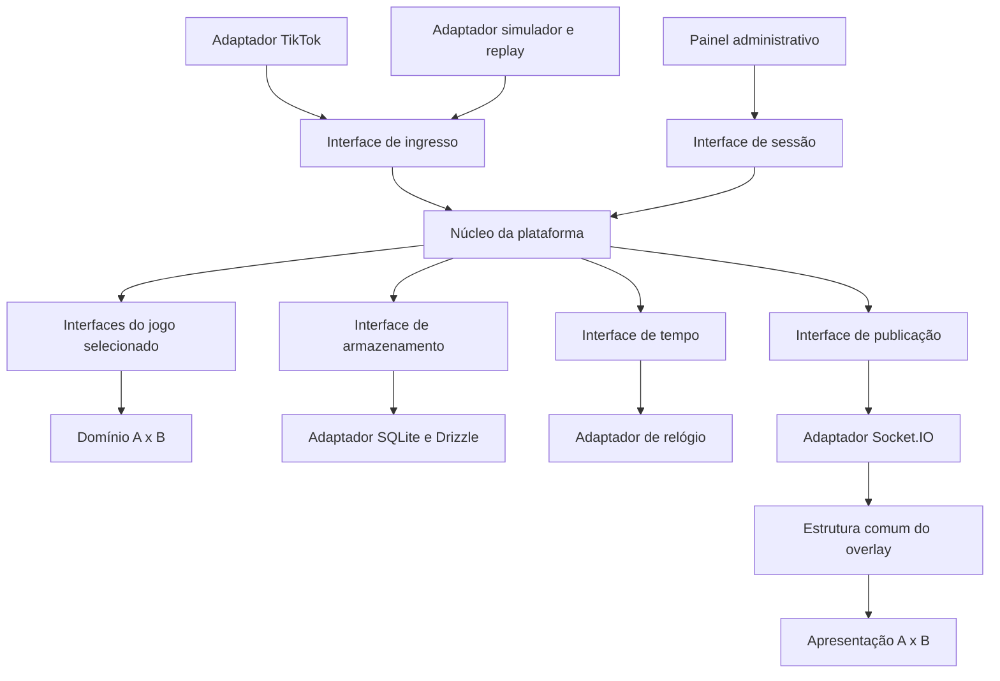

# PRD — MVP de plataforma extensível de jogos para lives

**Versão:** 1.1 — arquitetura da plataforma e primeiro jogo A x B  
**Data:** 29 de setembro de 2026  
**Status:** especificação para implementação e validação  
**Base:** [Pesquisa de viabilidade](/home/luis/Documents/Codex/2026-09-29/re/outputs/pesquisa-plataforma-live-interativa.md)

Este PRD define uma plataforma local de jogos interativos para transmissões ao vivo, começando por TikTok LIVE e pelo jogo A x B. A x B é a primeira implementação de jogo, com duas torres, e não o modelo de dados ou a máquina de estados obrigatória da plataforma. A arquitetura permite substituir captura, jogo, persistência e comunicação por suas interfaces, mantendo um único canal, uma sessão ativa e um jogo entregue no MVP.

Esta revisão substitui a versão 1.0. Preserva regras, operação acompanhada e critérios de confiabilidade, e explicita a responsabilidade de cada módulo. Descreve contratos e decisões; não contém implementação de código. A integração real e as metas de desempenho permanecem condições de validação.

## 1. Objetivo do produto

Transformar interações recebidas em uma live em ações de um jogo, com regras compreensíveis, contabilização auditável e continuidade após falhas locais. No primeiro jogo, essas ações concedem pontos a dois times.

O MVP deve permitir que o criador configure uma sessão, coloque o jogo no OBS e acompanhe a execução. O módulo A x B automatiza encerramento e reinício de suas rodadas; a plataforma oferece o suporte operacional para executar essas decisões. A operação permanece acompanhada pelo criador.

**Hipótese a validar:** espectadores conseguem entender como participar, observar o efeito de suas contribuições e acompanhar a disputa sem o operador atualizar o placar manualmente.

**Objetivo de evolução:** adicionar um jogo que use os tipos de interação e os contratos existentes deve exigir seu módulo de domínio, suas apresentações e seu registro na composição da aplicação. Não deve exigir alteração das regras de A x B, do adaptador TikTok, da lógica de combos, do armazenamento genérico ou do transporte Socket.IO.

## 2. Público e cenário de uso

| Pessoa | Necessidade |
| --- | --- |
| Criador/operador | Configurar o jogo, acompanhar a captura, pausar e recuperar a sessão |
| Espectador | Saber como ajudar um time e ver o resultado da participação |

Cenário principal: um computador executa backend, frontend e OBS; uma única conta TikTok está transmitindo; uma única sessão de jogo está ativa. O operador usa `/dashboard`, e o OBS carrega `/overlay` em uma fonte de navegador.

O aplicativo não inicia nem publica a transmissão. O acesso da conta aos recursos de LIVE e o envio de vídeo são condições externas ao MVP.

## 3. Escopo fechado

### Incluído

- Uma plataforma de captura: TikTok LIVE.
- Um canal e uma sessão ativos por instalação.
- Um jogo entregue: A x B, com duas torres, lados A e B e nomes/cores configuráveis.
- Interfaces de captura, execução de jogo, armazenamento, tempo e publicação; registro estático do único jogo na aplicação.
- Comentários `A`/`B` e presentes mapeados para pontos.
- Vitória por meta de pontos e intervalo automático entre rodadas.
- Contadores de vitórias da sessão, preservados após reinício.
- Painel de configuração e operação, overlay transparente e aviso de contribuição.
- Simulador e reprodução de cenários de eventos para desenvolvimento e testes.
- Registro local de interações, pendências, resultados e diagnósticos.
- Reconexão da captura, recuperação do estado e pausa manual.
- Distribuição local com Docker Compose, instruções de instalação e volume persistente.

### Fora desta versão

- Curtidas e seguidores alterando a pontuação.
- Ranking semanal, receita estimada ou pagamentos.
- Meteoros, dano ao adversário, multiplicadores e poderes especiais.
- Spawn de avatares e área de torcida individual.
- Cronômetro de duração da rodada e regras de empate por tempo.
- Desafios automáticos de ociosidade ou pontuação em dobro.
- Operação AFK, envio automático de mensagens ao chat ou moderação do TikTok pelo aplicativo.
- Segundo jogo disponível ao criador, canais simultâneos, contas de usuários, assinatura ou hospedagem SaaS.
- Instalação dinâmica de jogos, marketplace, carregamento de código externo, troca de jogo no meio da sessão, DSL de regras ou isolamento de plugins de terceiros.
- Editor de temas, uso obrigatório de personagens reais e integração específica com LIVE Studio.

## 4. Jornada principal

1. O operador inicia os serviços e abre o painel.
2. Escolhe **Simulação** ou **Live**, informa o canal quando aplicável e configura o jogo A x B. O MVP oferece apenas esse jogo; seu identificador e versões ficam vinculados à sessão.
3. No modo Live, conecta à transmissão e verifica o status da captura e os presentes disponíveis.
4. Coloca a URL do overlay no OBS, verifica enquadramento e áudio e inicia a sessão de jogo.
5. O adaptador traduz mensagens da origem em interações normalizadas. O núcleo registra entradas, remove duplicatas e reconhece incrementos de presentes, sem decidir lados ou pontos.
6. O tradutor do módulo A x B converte comentários e contribuições em comandos desse jogo. Seu motor decide a transição; o núcleo confirma estado, situação dos comandos e resultados em uma transação.
7. A plataforma publica um snapshot completo após commit. A apresentação A x B atualiza placares, torres e avisos, sem recalcular pontuação.
8. Quando o módulo A x B declara vitória, solicita um timer de cinco segundos. A plataforma executa o timer e entrega seu vencimento ao mesmo motor, que inicia a rodada seguinte.
9. O operador pode pausar, retomar ou encerrar a sessão pelo painel.

Simulação e Live usam o mesmo motor de regras, mas sessões e históricos distintos. Trocar de modo exige encerrar a sessão atual e iniciar outra. Uma simulação deve estar identificada no painel e no overlay.

Na fase `Preparada`, antes do início efetivo da sessão, e após `Encerrada`, eventos recebidos servem somente ao diagnóstico. Eles não pontuam nem se tornam pendências. O início estabelece a fronteira de elegibilidade; uma mensagem recebida antes dessa fronteira não ganha elegibilidade por ser processada depois.

## 5. Regras específicas do primeiro jogo: A x B

Toda esta seção pertence ao módulo A x B. A plataforma não possui lados obrigatórios, meta de pontos, número de rodadas ou conceito obrigatório de vencedor. No A x B, a rodada termina apenas por meta; os cinco segundos são o cooldown de comentário e o intervalo após vitória, não a duração da rodada.

### Configuração inicial

| Parâmetro | Definição do MVP |
| --- | --- |
| Times | A e B; nomes até 24 caracteres e uma cor por time |
| Meta | Padrão de 1.000 pontos; inteiro configurável entre 100 e 100.000 |
| Comentário válido | +1 ponto para o lado indicado |
| Cooldown de comentário | Cinco segundos por usuário, compartilhados entre A e B |
| Intervalo após vitória | Cinco segundos totais, incluindo celebração |
| Presente | Pontos inteiros positivos por unidade e um lado fixo |
| Tabela de presentes | Até seis regras, com ao menos uma regra para cada lado no modo Live |
| Alteração de regras | Configuração congelada durante toda a sessão |

Nomes, cores, meta e tabela podem ser preparados antes da sessão. Mudanças durante a sessão exigem encerrá-la e iniciar outra. Não existem IDs de presentes fictícios pré-configurados: o operador seleciona itens observados no catálogo ou na captura validada.

### Comentários

**RG-01.** Aceitar apenas uma mensagem cujo texto completo, após remover espaços das extremidades e normalizar caixa, seja `A` ou `B`. Exemplos: `a`, ` B ` são válidos; `time A`, `AB` e `AAAA` não pontuam.

**RG-02.** O primeiro comentário elegível concede +1. Outro comentário do mesmo identificador de usuário só pontua quando tiverem transcorrido pelo menos cinco segundos desde o último comentário que pontuou. Mudar de lado não reinicia esse limite; o limite permanece entre rodadas da mesma sessão.

**RG-03.** Comentários durante pausa ou intervalo não pontuam e não são recuperados posteriormente. A mensagem deve ter sido recebida em um período elegível e continuar elegível na aplicação serial; um comentário atrasado não pode atravessar uma pausa/intervalo para receber pontos na retomada.

### Presentes e combos

**RG-04.** Cada regra associa uma referência opaca de presente do catálogo (`resourceKey`) a um lado e a um valor por unidade. No adaptador TikTok, essa referência preserva o `giftId` com namespace da origem. O tradutor A x B usa a referência sem importar tipos do conector. O presente determina o destino dos pontos, independentemente dos comentários anteriores do doador; nome e imagem são informações de apresentação.

**RG-05.** O núcleo reconhece somente a diferença positiva entre a contagem cumulativa recebida e a maior contagem já reconhecida da sequência. O A x B recebe essas unidades já reconhecidas e converte-as em pontos. Contagens `1 → 2 → 3 → final 3`, a 10 pontos por unidade, representam 30 pontos no total. O jogo não recalcula combos a partir do payload TikTok.

**RG-06.** A identidade normalizada de uma sequência precisa distinguir dois combos consecutivos do mesmo usuário e presente. O adaptador extrai essa identidade, e o núcleo persiste contadores e unidades reconhecidas atomicamente. A validação na versão instalada do adaptador é condição para habilitar presentes reais em qualquer jogo.

**RG-07.** Presente desconhecido ou mensagem sem identidade suficiente para contabilização confiável deve aparecer no diagnóstico, sem pontuação inventada. Um presente desconhecido não fica aguardando uma configuração futura. O painel diferencia “sem regra” de “identidade inconclusiva”.

**RG-08.** Presentes mapeados recebidos durante pausa ou intervalo ficam registrados como contribuições pendentes. Cada unidade é reconhecida apenas uma vez, mesmo se o combo terminar ou for repetido enquanto estiver pendente. Aplicar as pendências em ordem, antes de novas contribuições, quando uma rodada puder receber pontos.

### Vitória e fronteira de rodada

**RG-09.** Aplicar cada contribuição como uma unidade indivisível de processamento. A primeira contribuição na ordem persistida que leva um lado à meta define o vencedor. Registrar a vitória uma única vez e iniciar o intervalo.

**RG-10.** Pontos excedentes ficam no placar final dessa rodada e não passam para a seguinte. Exemplo: 990 pontos mais uma contribuição de 50 resultam em vitória com 1.040 pontos.

**RG-11.** Durante o intervalo, novas contribuições de presentes aguardam a próxima rodada. Incrementos de um mesmo combo podem beneficiar rodadas diferentes; cada incremento recebe sua rodada uma única vez durante a aplicação. A configuração de pontos permanece igual porque está congelada na sessão.

**RG-12.** Pendências podem encerrar uma rodada imediatamente ao serem aplicadas. Nesse caso, as restantes aguardam a rodada seguinte, obedecendo novamente ao intervalo. Nenhum lote de processamento pode ignorar a condição de vitória entre duas contribuições.

## 6. Estados da plataforma, do jogo e recuperação

O núcleo administra o ciclo de sessão `Preparada → Em execução → Encerrada`, com pausa operacional independente e modo de recuperação transitório. A captura tem estados próprios de conexão. O jogo A x B administra `Rodada ativa → Intervalo → Rodada ativa`; seu estado inicial é criado ao iniciar a sessão. Outros jogos podem ter uma única meta coletiva, etapas ou conclusão definitiva, sem adotar rodadas.

A pausa da plataforma é uma condição separada da fase do jogo. Ela congela o tempo de execução do jogo e impede transições de progresso; a captura e o reconhecimento de presentes podem continuar. O módulo de jogo define a política de seus comandos durante pausa. No A x B, preservar placar, rodada e tempo restante do intervalo, adiar presentes e ignorar comentários. O overlay comum mostra “Jogo pausado”; a apresentação A x B acrescenta “Pontos de presentes em espera”, quando houver.

O núcleo executa pedidos de agendamento do jogo sem interpretar o significado do timer. Cada pedido possui identidade, geração e comando de vencimento. Pausas preservam o tempo restante; callbacks antigos ou cancelados não produzem transições. O motor também valida a referência do timer frente ao seu estado atual. O relógio de teste substitui o relógio real pela mesma interface.

| Ocorrência | Comportamento obrigatório |
| --- | --- |
| Pausa manual | Congelar a progressão e aguardar comando de retomada |
| Perda da captura | Pausar a partida, indicar possível lacuna e tentar reconectar |
| Mesma sala reconectada | Recuperar captura; liberar retomada manual quando não houver outra causa de pausa |
| Nova sala no mesmo canal | Manter a sessão anterior pausada; exigir nova sessão para essa sala |
| Live encerrada | Pausar e informar encerramento; não iniciar novas rodadas automaticamente |
| Overlay desconectado/recarregado | Backend continua; a tela recupera o estado ao reconectar |
| Backend reiniciado | Restaurar registros confirmados e comandos pendentes; recuperar a fase e terminar a recuperação pausado |
| Falha de armazenamento | Pausar, indicar falha e não apresentar contribuições não confirmadas como contabilizadas |

**RF-01.** Uma reconexão não remove uma pausa manual ou de armazenamento. Retomar exige captura válida no modo Live, armazenamento operacional e fim da recuperação.

**RF-02.** Encerrar uma sessão não apaga o histórico. O núcleo apresenta unidades de presentes e comandos pendentes; a projeção do A x B acrescenta pontos correspondentes. O encerramento marca pendências como não aplicadas por encerramento. Elas não são transferidas para outra sessão nem apresentadas como pontos concedidos.

**RF-03.** O aplicativo registra a interrupção da captura e informa que não pode garantir a recuperação de eventos que a plataforma não entregou durante esse período.

## 7. Requisitos de captura

**RF-04.** Receber username com ou sem `@`, normalizar e mostrar o canal conectado. Distinguir canal offline, conexão em andamento, conectado, reconectando, live encerrada e erro de autenticação/limite do fornecedor quando identificável.

**RF-05.** Manter somente uma tentativa de conexão em andamento. Usar atraso progressivo entre tentativas, com limite inicial proposto de 30 segundos e respeito a `Retry-After` ou instrução equivalente do fornecedor. Desconexão manual interrompe novas tentativas.

**RF-06.** Registrar identidade da origem/sala, horário de recepção e dados necessários à deduplicação no contrato normalizado. IDs externos são strings com namespace e não podem perder precisão. Payloads, enums e exceções do conector ficam no adaptador; o núcleo recebe erros e fatos normalizados.

**RF-07.** Definir a fronteira de início da captura e tratar dados iniciais/repetidos sem atribuir histórico anterior como contribuição nova. O simulador também deve produzir duplicatas, combos e interrupções para testar esse comportamento.

**RF-08.** Antes de habilitar Live no piloto, validar eventos reais de comentário, presente isolado, combo, dois combos consecutivos iguais, encerramento e reconexão. Registrar versão instalada, campos usados e limitações observadas.

## 8. Painel e overlay

### Painel do operador — `/dashboard`

**RF-09.** Disponibilizar configuração da sessão, conexão/desconexão, iniciar, pausar, retomar e encerrar. Mostrar placar, vitórias, fase, estado da captura e quantidade de contribuições pendentes.

**RF-10.** Mostrar tabela de presentes com identificador, nome disponível, lado e pontos por unidade. Impedir início no modo Live se faltar mapeamento para um dos lados ou se a captura não estiver validada/conectada.

**RF-11.** Oferecer simulação de comentário, presente simples, combo e rajada, exclusivamente no modo Simulação. Não permitir injetar eventos sintéticos em uma sessão Live.

**RF-12.** Exibir diagnóstico de eventos desconhecidos/inconclusivos, atrasos de processamento, falhas e última conexão. Permitir exportar o histórico da sessão em JSON, com contribuições aplicadas, pendentes/não aplicadas e resultados.

### Overlay — `/overlay`

**RF-13.** Renderizar em 1080 × 1920, com fundo transparente, duas torres, nomes dos times, placares, meta, vitórias, número da rodada, instruções `Comente A ou B` e tabela de presentes.

**RF-14.** Mostrar celebração e contagem do intervalo; pausa e desconexão devem ser compreensíveis. Não exibir chamadas para participar de uma rodada ativa quando o jogo estiver pausado. Apresentar distintivo permanente no modo Simulação.

**RF-15.** Reservar inicialmente os 20% inferiores para elementos da plataforma, ajustando o enquadramento no ensaio mobile. Essa margem é um ponto de partida de layout, não uma área segura universal.

**RF-16.** Mostrar nome do contribuinte como texto e aviso de pontos. Usar animação simples de crescimento, contribuição e vitória, com áudio opcional e volume controlado no painel. Avatares individuais ficam fora do MVP.

**RF-17.** Limitar elementos das torres e efeitos simultâneos. Avisos podem ser agrupados ou expirar durante rajadas; pontuação e registros não dependem de todos os avisos serem exibidos individualmente.

A estrutura comum do painel cuida de sessão, captura, pausa, diagnóstico e histórico. Formulário de configuração, placar e avisos de pontos pertencem à apresentação A x B. O overlay possui uma estrutura comum para transparência, conexão, simulação e pausa, e um renderizador registrado para cada jogo. Os requisitos de duas torres e lados A/B aplicam-se apenas a esse renderizador.

## 9. Autoridade, persistência e sincronização

O backend é a autoridade da sessão e da execução do jogo. O frontend apresenta estado e envia apenas comandos autorizados do operador; o overlay não pode fabricar ações nem decidir resultados. O domínio de cada jogo é determinístico: recebe estado, comando e contexto de tempo explícito e devolve uma decisão, sem acessar banco, rede ou relógio real.

**RT-01.** Persistir entradas antes de tratá-las como confirmadas. Usar uma sequência durável por sessão, incluindo interações, comandos operacionais e vencimentos de timer. Reconhecimento de combo e criação de contribuição/comando têm confirmação atômica; aplicação do comando confirma estado do jogo, situação da contribuição, resultados e pedidos de timer em outra transação atômica. Nenhum jogo escreve no banco por conta própria.

**RT-02.** Separar reconhecimento de unidades do presente de sua aplicação ao estado do jogo: uma unidade pendente já reconhecida não reaparece como nova quando o evento final do combo chega. Um comando tem identificador estável, referência à contribuição, versões e situação persistida. Ao reproduzir entradas, reutilizar o comando já criado; não remapear silenciosamente fatos antigos com uma configuração nova.

**RT-03.** Cada evento válido confirmado localmente deve ter estado auditável: aplicado, pendente, ignorado por regra com motivo ou não aplicado por encerramento. Presentes mapeados reconhecidos com identidade suficiente são aplicados uma única vez, ou permanecem pendentes até a aplicação/encerramento; comentários podem ser ignorados conforme elegibilidade e cooldown. O contrato não promete entrega integral pela plataforma nem durabilidade contra qualquer falha física.

**RT-04.** Publicar estado após commit, com identificador de sessão, jogo, versões e versão crescente de atualização. O envelope comum não exige `roundId`, placares ou vencedor; esses dados ficam no payload da projeção A x B. Enviar estado completo ao conectar/reconectar, até 20 vezes/s durante mudanças e ao menos uma vez/s para reconciliação. Ignorar versões antigas na tela; efeitos visuais expirados não precisam ser reexibidos.

**RT-05.** Restaurar estado e reproduzir entradas confirmadas e comandos pendentes na ordem durável, com efeitos idempotentes. Durante recuperação, não aceitar comandos que iniciem outra sessão, publicar efeitos antigos ou disparar timers novos. Ao concluir, impor uma pausa de recuperação que nenhum comando antigo de retomada pode remover. Contribuições ainda pendentes aguardam uma nova retomada manual.

**RT-06.** Persistir sessão, interações, unidades reconhecidas, comandos/pendências, cursores de combo, timers, resultados e snapshots versionados do jogo. A configuração é congelada na sessão. Rodadas e vitórias são conceitos do estado/resultados A x B; o armazenamento comum não exige colunas de lados ou placares. Proteger armazenamento e memória contra crescimento ilimitado dos caches e logs de diagnóstico.

**RT-07.** Um comando adiado deixa a fila de processamento imediato e entra em uma fila durável de pendências, conservando sua ordem original. Ele não impede processar retomada, encerramento ou timer que possa liberá-lo. Quando o jogo permitir progresso, reaplicar pendências elegíveis em FIFO antes de novas contribuições, verificando a decisão do motor após cada aplicação. Um novo intervalo interrompe a aplicação das restantes; um comando não pode ser registrado como aplicado duas vezes.

**RT-08.** A sessão fixa `gameId`, `gameVersion`, versão de configuração/estado e versão da projeção. Restaurar apenas com implementação compatível. Caso contrário, manter a sessão bloqueada com diagnóstico e conservar os dados; não reiniciar silenciosamente. Migrations da plataforma são distintas de futuras migrations de estado do jogo. Migração automática de versões de jogos fica fora do MVP.

**RT-09.** Preservar o contexto de elegibilidade observado na recepção e o contexto de aplicação. O módulo pode fornecer uma referência opaca de fase/época; o núcleo a transporta e persiste, sem interpretar seu conteúdo. A x B usa essa referência e a situação de pausa para impedir que comentários antigos atravessem intervalo ou retomada. A atribuição definitiva da rodada para presentes ocorre na transição serial, não consultando uma fase possivelmente atrasada na captura.

**RT-10.** O tempo do jogo avança apenas enquanto a sessão estiver operacional. O núcleo persiste timers solicitados pelo módulo, com identidade, geração e duração restante; o vencimento vira um comando durável. Não executar callbacks de timers ou efeitos externos durante recuperação. A regra A x B valida o timer do intervalo e invalida pedidos de rodadas antigas. A duração do cooldown é política A x B, calculada com o contexto de tempo explícito e preservada entre rodadas.

## 10. Arquitetura hexagonal e pontos de extensão

### 10.1. Decisão e direção das dependências

Adotar um **monólito modular** no backend, com interfaces pequenas de entrada e saída. Arquitetura hexagonal separa as interações externas da aplicação por portas e adaptadores; possibilita exercitar o comportamento sem depender da interface visual ou do banco concreto. Essa é a separação aplicada aqui. [Artigo original de Alistair Cockburn](https://alistair.cockburn.us/hexagonal-architecture)

O núcleo da plataforma e os módulos de jogo dependem de contratos de domínio, não de TikTok, Drizzle, SQLite, Socket.IO, Next.js ou React. Os adaptadores implementam interfaces declaradas pela aplicação. A composição de inicialização é o único lugar que escolhe implementações concretas e registra o jogo disponível. Dependência de compilação não é a mesma coisa que direção do fluxo de eventos.

Um módulo de jogo possui domínio no backend e apresentação própria no frontend. Seu domínio não importa sua apresentação. A plataforma não inclui condicionais do tipo “se o jogo for A x B” no executor, na captura, nos combos, no armazenamento ou na publicação. Condições específicas permanecem dentro do módulo correspondente; seleção por identificador ocorre apenas no registro/composição.

As setas mostram chamadas/fluxo em execução; as interfaces pertencem à aplicação. Acrescentar outro jogo não troca o núcleo por outra cópia nem cria outro processo.

### 10.2. Responsabilidades dos módulos

| Módulo | Responsabilidades | Conhecimento específico que permanece fora dele |
| --- | --- | --- |
| Sessões e operação | Um canal/sessão ativos, modos, configuração congelada, início/fim, causas de pausa, recuperação e autorização de comandos | Lados, metas, duração de rodadas e regras de vitória |
| Ingresso e reconhecimento | Validar envelopes, ordenar entradas, remover duplicatas, reconhecer incrementos de combo e manter diagnóstico | Pontos por presente, destino A/B e interpretação do texto do chat |
| Executor de jogo | Chamar o módulo registrado, confirmar decisões, manter pendências e pedidos de timer, publicar após commit | Regras para considerar uma ação válida ou vencer |
| Domínio A x B | Traduzir interações, validar configuração, decidir transições e projetar estado; meta, lados, pontos, cooldown, rodadas e intervalo | Conector TikTok, banco e transporte |
| Captura TikTok | Conexão externa, catálogo, interpretação de payloads, extração de identidades, normalização de erros e status | Qual presente beneficia qual time |
| Simulador/replay | Produzir os mesmos contratos de ingresso, incluindo duplicatas e falhas | Alterações especiais no motor para simulação |
| Armazenamento | Cumprir atomicidade, unicidade, recuperação e persistência dos documentos versionados | Interpretação de placares ou criação de vitória |
| Publicação | Entregar envelope/projeção sem recomputar regras; reconciliação e transporte | Conhecimento de torres, pontos ou eventos de vitória |
| Apresentação comum | Transparência, conexão, pausa, modo, sessão, diagnóstico e seleção do renderizador | Layout específico e balanceamento |
| Apresentação A x B | Formulário de regras, duas torres, tabela de presentes, placares e efeitos | Estado autoritativo ou captura direta de eventos externos |

### 10.3. Interfaces principais — contratos conceituais

Os nomes abaixo identificam interfaces, não classes ou código já implementado. Cada contrato inclui ordenação, falhas e invariantes, além dos dados de entrada/saída.

| Interface | Conversação | Entrada e saída principais | Invariantes/falhas |
| --- | --- | --- | --- |
| `SessionControl` | Painel/teste → aplicação | Preparar, iniciar, pausar, retomar, encerrar e consultar uma sessão | Comandos autorizados e idempotentes; nenhuma troca de jogo/mode em sessão ativa |
| `InteractionIngress` | Captura/simulador → aplicação | Interação observada ou mudança de status, normalizada | Não confirmar antes de persistir; preservar origem, ordem local e identidade; sinalizar armazenamento indisponível |
| `LiveCapture` | Aplicação ↔ adaptador da transmissão | Conectar/desconectar, observar status/interações e obter catálogo normalizado | Uma conexão/tentativa ativa; erro de fornecedor não vaza como tipo do conector para o núcleo |
| `GameInputMapper` | Executor → tradutor do jogo | Interação reconhecida + configuração/contexto → comando válido ou motivo de ignorar | Não recebe combo bruto; zero ou um comando por interação no MVP; resultado determinístico |
| `GameEngine` | Executor → domínio do jogo | Criar/validar estado; decidir a partir de estado, comando e contexto → decisão | Sem I/O; retorna novo estado, situação aplicado/adiado/ignorado, resultados e pedidos de timer; mesmas entradas geram mesma decisão |
| `GameProjection` | Aplicação → projeção do jogo | Estado/configuração/pendências → documento de apresentação versionado e avisos | Não altera estado; não produz decisão de pontuação; o payload não obriga lados, rodadas ou vencedor |
| `SessionStore` | Aplicação → armazenamento | Registrar entradas/reconhecimento, carregar sessão e confirmar transição/resultado/timer/status; consultar/exportar | Confirmação atômica, unicidade por identidade e controle de versão; falha não equivale a aplicação confirmada |
| `GameTime` | Aplicação ↔ relógio/agendamento | Ler contexto de tempo, agendar/cancelar pedido e receber vencimento | Persistência do pedido no store; pausa congela tempo; geração evita timer antigo; relógio controlável em testes |
| `OverlayPublisher` | Aplicação → comunicação | Envelope de snapshot + projeção, e avisos transitórios | Somente pós-commit; falha de envio não desfaz pontos; snapshot periódico/reconexão garante convergência |

`GameInputMapper`, `GameEngine` e `GameProjection` formam a interface do módulo de jogo, com responsabilidades separadas. O registro estático associa essas implementações, versões, validação de configuração/estado e apresentações ao `gameId`. Isso não requer herança de uma classe-base com placares ou uma plataforma de plugins.

No frontend, a interface de apresentação recebe o envelope e o payload de projeção compatível e devolve a visualização/configuração daquele jogo. A apresentação pode importar React; o domínio do jogo não pode. Adicionar um renderizador implica registrá-lo na composição do frontend, sem mudar o transporte.

### 10.4. Vocabulário e documentos que atravessam interfaces

| Termo/documento | Significado e propriedade |
| --- | --- |
| Sessão da plataforma | Vincula canal/sala, modo, jogo/versões, configuração e ciclo operacional. Não é uma rodada |
| Interação observada | Fato externo normalizado: comentário ou progresso de presente; contém origem, identidade, usuário, horário e referência de contexto, sem pontos |
| Contribuição reconhecida | Novas unidades de um presente após deduplicação/controle de sequência; pode ainda não ter sido aplicada ao jogo |
| Comando de jogo | Intenção interpretada pelo módulo escolhido, com identidade estável, origem, tipo/payload versionados e situação persistida |
| Decisão do jogo | Transição determinística e resultado aplicado, adiado ou ignorado, com justificativa e pedidos declarativos |
| Resultado de jogo | Registro com identidade estável e payload do jogo; no A x B inclui rodada e vencedor, sem torná-los campos obrigatórios da plataforma |
| Snapshot persistido | Envelope de sessão/jogo/versão e estado interno serializável, validado pelo módulo. O núcleo não interpreta os campos do estado |
| Snapshot do overlay | Envelope operacional comum e payload da projeção do jogo. Não é um acesso direto ao documento interno salvo |

O envelope comum identifica sessão, jogo, versões, status operacional e versão crescente do snapshot. `scoreA`, `scoreB`, `wins`, `roundId`, `targetSide` e `winner` pertencem a comandos, estados ou projeções A x B. Identificadores de usuários e recursos são opacos, preservando namespace da origem; o módulo não precisa saber como obtê-los de um protobuf.

Armazenar documentos serializáveis não significa aceitar dados sem contrato: configuração, comandos, estado e projeção têm schemas e validação do módulo registrado. O núcleo conserva os dados e versões; o jogo compreende seu conteúdo. O MVP usa documentos de tamanho limitado para jogos baseados em comandos; física contínua ou mundos de grande escala podem exigir novos contratos em uma versão futura.

### 10.5. Conversão de TikTok para comandos — exemplo concreto

| Etapa | Exemplo de comentário | Exemplo de presente |
| --- | --- | --- |
| Adaptador da origem | Extrai texto ` B ` e identidade do usuário/mensagem | Extrai recurso do catálogo, sequência, contagem cumulativa e término |
| Ingresso normalizado | `Comentário recebido`, texto e contexto, sem presumir voto | `Progresso de presente`, recurso/contagem/identidade, sem presumir pontos |
| Reconhecimento no núcleo | Remove duplicata; conserva contexto de recepção | Contagem vai de 2 para 3: reconhece uma nova unidade e persiste o cursor |
| Tradutor A x B | Texto completo vira comando `Votar em B` | Regra congelada do recurso vira `Contribuir com unidades para A`, a 10 pontos/unidade |
| Motor A x B | Verifica fase/pausa/época e cooldown; pode conceder +1 | Aplica +10 ou adia conforme fase/pausa; pode declarar vitória |
| Confirmação/publicação | Núcleo confirma decisão e publica projeção | Núcleo confirma aplicação/pendência, estado e eventual resultado; publica após commit |

Os nomes de comandos são do vocabulário de cada jogo. O núcleo reconhece unidades, não executa uma tabela universal de pontos. Curtidas/seguidores que um adaptador observe ficam fora da tradução pontuável do MVP; acrescentar esses fatos a um contrato futuro não implica implementá-los como poder universal.

O mapeamento do presente para ação faz parte da configuração A x B, congelada na sessão. Um recurso pode, em outro jogo, gerar progresso coletivo sem qualquer lado. Falta de identidade confiável impede reconhecimento; falta de regra do jogo produz diagnóstico e motivo de ignorar. Esses problemas têm tratamento separado.

### 10.6. Decisões e aplicação de SOLID

| Princípio | Decisão neste produto | Por que ajuda a evoluir |
| --- | --- | --- |
| Responsabilidade única — SRP | Separar normalização, confiabilidade, decisão do jogo, armazenamento e apresentação | Mudança de payload TikTok não exige editar regras de vitória |
| Aberto/fechado — OCP | Registrar outro módulo e sua apresentação por interfaces existentes | Jogo novo não cria condicionais no executor ou nos adaptadores comuns |
| Substituição — LSP | Implementações respeitam determinismo, schemas, decisões, pausas e confirmação definidos pelo contrato | Simulador e captura real alimentam os mesmos casos de uso; jogos podem não ter lados ou rodadas |
| Segregação de interfaces — ISP | Separar tradução, decisão e projeção; captura não exige envio de mensagens ao chat | Cada módulo conhece apenas a conversação que utiliza |
| Inversão de dependências — DIP | Contratos declarados pela aplicação; adaptadores concretos conectados na inicialização | Banco, transporte, relógio e conector não entram nas regras de domínio |

Esta tabela é uma aplicação proposta dos princípios ao produto, apoiada na discussão do autor sobre organização de módulos e direção de dependências. [Robert C. Martin: Solid Relevance](https://blog.cleancoder.com/uncle-bob/2020/10/18/Solid-Relevance.html)

Manter um processo e um escritor reduz coordenação sem comprometer os pontos de extensão. Concentrar a transação no núcleo impede que um jogo confirme pontos e esqueça o ledger. Tornar o estado específico opaco evita que tabelas e transporte sejam definidos pelo A x B. Separar reconhecimento de combo e aplicação torna a proteção contra duplicatas reutilizável. Usar pedidos de timer, em vez de timers dentro dos jogos, permite pausar e reproduzir transições com controle.

As interfaces não são uma promessa de que qualquer funcionalidade futura será gratuita. Um jogo que use as interações e capacidades já existentes muda apenas os módulos que dependem dele. Uma nova capacidade externa pode exigir evoluir a interface relacionada e seus adaptadores, com versionamento; isso não autoriza espalhar a regra desse jogo pelo núcleo. Não criar microserviços, barramento distribuído ou interface por classe para cumprir uma nomenclatura.

### 10.7. Exemplo futuro: jogo cooperativo “Meta da Comunidade”

O segundo jogo hipotético possui progresso coletivo, meta de 500 unidades e conclusão definitiva. Comentários `FORÇA` acrescentam uma unidade com cooldown próprio de três segundos; um recurso de presente configurado acrescenta cinco unidades por unidade reconhecida. Após alcançar a meta, publica “Meta alcançada” e termina, sem lado vencedor, rodadas ou reinício automático. Sua política declara como ignoradas as contribuições posteriores à conclusão, com motivo registrado.

Para adicioná-lo:

1. Criar o módulo de domínio com configuração, tradução (`Apoiar comunidade`/`Contribuir progresso`), estado de progresso e transições, resultado e projeção próprios.
2. Criar seu formulário e renderizador: barra coletiva e tela de conclusão, usando a estrutura comum de pausa/conexão.
3. Registrar módulo e apresentações com outro `gameId` na composição; ampliar a seleção de jogo antes de iniciar sessão. A sessão fixa esse identificador e suas versões.
4. Executar contratos e cenários de replay com as mesmas interfaces de captura, armazenamento, tempo e publicação.

Exemplo: o mesmo progresso de presente `1 → 2 → 3 → final 3` gera três unidades reconhecidas no núcleo. A x B transforma-as em 30 pontos para A, segundo sua regra de 10; Meta da Comunidade transforma-as em 15 unidades de progresso coletivo, segundo sua regra de cinco. Nenhum dos dois recebe a contagem bruta ou conhece o outro jogo.

Alterações esperadas: novo módulo, apresentações, configuração de seleção e registros na composição, testes e documentação. Permanecem iguais: regras A x B, captura TikTok, normalização de combo, executor/transações, schema comum, Socket.IO e estrutura comum do overlay. Uma nova sessão usa o jogo escolhido; não há troca em uma sessão ativa.

Esse segundo jogo é somente exemplo de extensão neste PRD. Uma implementação mínima de teste sem lados pode validar o contrato no desenvolvimento; ela não constitui um segundo produto entregue no MVP. Plugins externos, catálogo público e execução simultânea ficam para versões futuras.

### 10.8. Stack e composição do MVP

| Módulo/adaptador | Decisão |
| --- | --- |
| Backend | Node.js + TypeScript; monólito modular, uma sessão e um executor serial |
| Captura | Adaptador `tiktok-live-connector`; simulador/replay pela mesma interface |
| Domínio de jogo | A x B, implementando tradução, decisão e projeção versionadas |
| Frontend | Next.js App Router + React; Tailwind; shadcn/ui no painel |
| Animações | CSS inicialmente; avisos limitados no renderizador do jogo |
| Comunicação | Adaptador Socket.IO para snapshots completos |
| Persistência | Adaptador SQLite + Drizzle; um escritor, WAL e `synchronous=FULL` inicialmente |
| Tempo e testes | Relógio real/controlado; Vitest, replay e integração com banco real |
| Empacotamento | Docker Compose: backend, web e volume persistente |

Publicar portas no loopback do host. Usar `http://127.0.0.1:3000/overlay` no OBS. Manter credenciais do fornecedor no backend e proteger os comandos administrativos contra acesso indevido, inclusive de páginas externas abertas no navegador. Nenhum segredo deve aparecer no bundle do frontend ou no histórico exportado.

Fixar a versão publicada do conector e conferir tipos, dependências e licença. A pesquisa consultou a tag GitHub v2.5.0, cuja licença declarada é AGPL-3.0-only; o dist-tag `latest` do npm não foi confirmado. A compatibilidade do runtime deve ser verificada com o pacote efetivamente instalado.

## 11. Critérios de aceite

Todos os critérios são condições de entrega a verificar. Este documento não registra testes já realizados.

| ID | Critério verificável |
| --- | --- |
| CA-01 | Em simulação, comentários válidos pontuam exatamente conforme RG-01 a RG-03; mensagens inválidas e cooldown não alteram o placar |
| CA-02 | Replay de presente simples, combo crescente, repetição, atualização antiga e dois combos consecutivos gera o total esperado sem duplicatas |
| CA-03 | Uma contribuição que cruza a meta registra uma vitória, conserva excedente e inicia intervalo de cinco segundos |
| CA-04 | Presentes na pausa/intervalo ficam pendentes; retomada aplica a ordem correta; comentários desses períodos permanecem sem pontos |
| CA-05 | Encerrar sessão preserva histórico e marca pendências sem transferi-las ou apresentá-las como aplicadas |
| CA-06 | Recarregar ou trocar a cena do OBS recupera placar, fase e vitórias; não reinicia a partida |
| CA-07 | Após rede interrompida e reconexão à mesma sala, estado permanece preservado e retomada é manual; outra sala exige nova sessão |
| CA-08 | Reinício após commit e antes da publicação recupera o resultado; vitória e combo não são reaplicados |
| CA-09 | Falha do banco pausa o jogo, apresenta diagnóstico e não transforma recebimento não confirmado em ponto concedido |
| CA-10 | No hardware de referência, p95 da recepção no backend até o primeiro frame com placar atualizado é ≤300 ms para contribuições elegíveis em rodada ativa; registrar p99 |
| CA-11 | Rajada sintética de 200 eventos/s durante 60 s, com 80% comentários e 20% mensagens de presentes/combos, converge para o resultado esperado; usar meta de 100.000 e valores que não encerrem a rodada nessa janela, para medir processamento sem espera de intervalo; publicar composição, duplicatas e atraso máximo observado |
| CA-12 | Overlay configurado em 60 FPS mantém média ≥58 FPS em janelas de 60 s durante teste de carga com OBS codificando vídeo; registrar quedas e configuração do equipamento |
| CA-13 | Ensaio de 12 h em simulação, com rodadas, rajadas e falhas programadas, termina sem travamento ou perda de contribuições confirmadas; filas/caches são comparados após escoamento das pendências previstas pelo jogo; memória da última hora ≤20% acima da primeira hora completa após 10 min de aquecimento |
| CA-14 | Piloto supervisionado em live real por ao menos 30 min confirma regras, combos, áudio, enquadramento mobile e operação de pausa/retomada |
| CA-15 | Instalação a partir das instruções inicia os serviços; recriar contêineres preserva dados do volume; exportação contém histórico consistente e nenhum segredo |

Para CA-10, espera intencional de contribuições pendentes durante pausa/intervalo não entra na latência da rodada ativa. CA-11 deve usar entradas pontuáveis e um resultado de referência calculado pelas regras; contar mensagens recebidas não equivale a contar unidades de presentes. O tempo até o espectador receber o vídeo não integra a meta de 300 ms.

Para CA-13, usar meta padrão de 1.000, fluxo base de dois eventos/s e rajadas de 200 eventos/s por dez segundos a cada 30 min, com a mistura de CA-11 e presentes de 10 pontos por unidade. Inserir pausas e falhas em momentos registrados; oferecer tempo de escoamento antes de comparar filas. Medir separadamente o atraso técnico de processamento e a espera intencional para aplicar pontos. Rajadas que provocam várias vitórias são verificadas adicionalmente com resultado de referência e intervalos de cinco segundos.

O hardware de referência, as versões, o driver do banco, a resolução e as configurações do OBS devem constar no relatório de validação. O desempenho só fica aceito para a configuração registrada.

## 12. Métricas do piloto

Registrar localmente, sem serviço externo de analytics obrigatório:

- Tempo de configuração até a primeira rodada.
- Quantidade de participantes únicos com comentário pontuado.
- Unidades de presentes reconhecidas, aplicadas e não aplicadas.
- Rodadas concluídas e duração observada de cada uma.
- Latência local p95/p99, pendências e atraso máximo de processamento.
- Interrupções de captura, duração das lacunas e falhas de armazenamento.
- Eventos sem regra ou identidade conclusiva.

O piloto valida compreensão e operação. Não estabelece aumento de receita ou retenção sem comparação com dados anteriores do criador.

## 13. Etapas e condições de avanço

| Etapa | Entrega | Condição de conclusão |
| --- | --- | --- |
| M0 — Captura | Protótipo de leitura, versão fixada e amostras minimizadas | Validar identidade de eventos/combos, catálogo, encerramento e reconexão; registrar limites do fornecedor |
| M1 — Motor | Regras, simulador, persistência, pendências e rodadas | CA-01 a CA-05 e casos de replay aprovados |
| M2 — Experiência | Painel, overlay, áudio e comunicação | Fluxo completo no OBS; CA-06 e controle de operação verificados |
| M3 — Recuperação | Adaptador real e recuperação de falhas | CA-07 a CA-09; regra de início/histórico validada |
| M4 — Piloto | Empacotamento, ensaios e live supervisionada | CA-10 a CA-15 documentados |

Motor, simulador e layout podem avançar enquanto a captura é validada. O piloto com presentes reais só avança após M0 confirmar identidade suficiente para contabilização. Se o adaptador não atender essa condição, registrar o bloqueio e avaliar outro fornecedor antes de habilitar pontuação paga.

## 14. Dependências e limites conhecidos

| Dependência | Consequência para este MVP |
| --- | --- |
| Captura não oficial e assinatura externa | Mudanças, disponibilidade e limites do fornecedor podem interromper a captura |
| Identidade real de mensagens/combos | Necessária para demonstrar prevenção de duplicatas |
| Elegibilidade da conta TikTok | Deve ser confirmada pelo criador antes do piloto |
| Licença da versão instalada | Deve ser conferida antes da distribuição comercial |
| Hardware compartilhado com OBS | Metas de renderização dependem do ensaio na máquina registrada |
| Operação acompanhada | Criador monitora a live e pode interromper o jogo |

A pesquisa identificou orientação oficial para monitorar ferramentas usadas na live. Este MVP mantém pausa manual, regras visíveis e acompanhamento. A contagem automática de rodadas não representa autorização da plataforma para operar sem supervisão.

## 15. Base documental

Este PRD transforma os achados da [pesquisa de viabilidade](/home/luis/Documents/Codex/2026-09-29/re/outputs/pesquisa-plataforma-live-interativa.md) em decisões de produto. As fontes técnicas e seus limites estão registrados naquele documento. Referências centrais:

- [Conector: documentação da tag consultada](https://github.com/zerodytrash/TikTok-Live-Connector/blob/v2.5.0/README.md).
- [Conector: manifesto e licença declarada](https://github.com/zerodytrash/TikTok-Live-Connector/blob/v2.5.0/package.json).
- [Socket.IO: garantias de entrega](https://socket.io/docs/v4/delivery-guarantees/).
- [OBS: Browser Source](https://obsproject.com/kb/browser-source).
- [TikTok: regras de LIVE e ferramentas de terceiros](https://www.tiktok.com/community-guidelines/en/accounts-features/).

Os valores de meta, cooldown, limite de regras e condições numéricas dos ensaios são decisões deste PRD. Eles devem ser avaliados no piloto; não são limites ou garantias publicados pelas plataformas.
