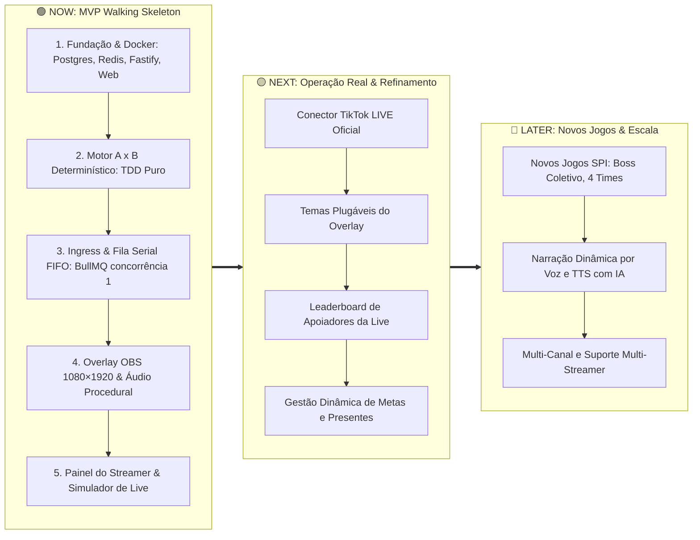
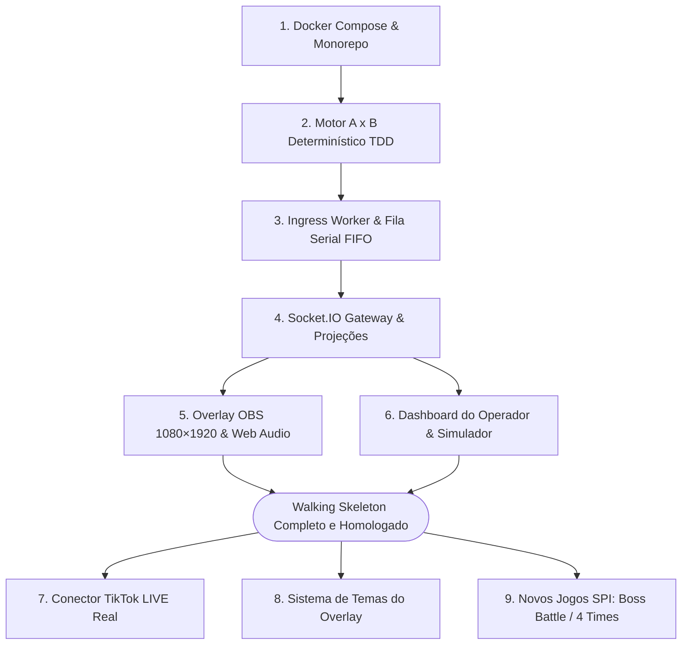

# Roadmap Estratégico — Plataforma de Lives Interativas

> **Metodologia**: Baseado no framework *Now / Next / Later* (Dean Peters & *Product Roadmaps Relaunched*).  
> **Status**: Ativo & Evolutivo  
> **Referências**: [AGENTS.md](../AGENTS.md) | [docs/spec/architecture.md](spec/architecture.md) | [docs/plans/mvp-walking-skeleton.md](plans/mvp-walking-skeleton.md)

---

## 1. Contexto Estratégico & Objetivos de Produto

- **Visão de Produto**: Uma plataforma local, autônoma e de alto desempenho para transmissões interativas (TikTok LIVE), transformando comentários e presentes em mecânicas de jogo em tempo real no OBS.
- **Resultados-Chave (OKRs do MVP)**:
  1. **Latência Sub-segundo**: Projeção de pontuações e animações refletidas no OBS em menos de 100ms após a captura.
  2. **Concorrência e Resiliência**: Zero *race conditions* ou duplicação de pontos em rajadas de 50+ presentes/segundo (garantia FIFO via BullMQ com `concurrency: 1`).
  3. **Zero Fricção de Setup**: O streamer inicia a transmissão localmente com um único comando (`docker compose up` ou `pnpm dev`).
  4. **Qualidade Contínua**: 90% de cobertura no backend e 85% no frontend fiscalizados pelo `./scripts/verify.sh`.

---

## 2. Visão do Roadmap (Now / Next / Later)

---

## 3. Detalhamento das Iniciativas

### 🟢 NOW: MVP Walking Skeleton (Compromisso Ativo)
*Foco: Entrega de ponta a ponta da primeira experiência jogável de A x B com simulação total e OBS.*

| Iniciativa | Hipótese / Objetivo de Negócio | Métrica de Sucesso | Status |
| :--- | :--- | :--- | :--- |
| **1. Fundação & Docker** | Garantir ambiente reproduzível e isolado com live-reload. | 4 serviços saudáveis no compose; `GET /health` 200. | ⏳ Em Andamento |
| **2. Motor A x B com TDD** | Lógica determinística e pura (`RG-01` a `RG-12`) sem acoplamento a banco ou rede. | 100% dos testes unitários passando em <10ms; zero bugs de combo. | 📋 Na Fila |
| **3. Ingress & Fila Serial** | Ingestão resiliente e execução FIFO concorrência 1. | 100 eventos processados sem perda ou race condition. | 📋 Na Fila |
| **4. Gateway Socket.IO & Overlay** | Feedback visual instantâneo para a audiência da live. | Taxa de atualização a 60 FPS no OBS; latência <100ms. | 📋 Na Fila |
| **5. Motor de Áudio Procedural** | Imersão sonora dinâmica sem dependência de assets pesados. | Sons de ponto, combo e vitória disparados via Web Audio API. | 📋 Na Fila |
| **6. Painel & Simulador** | Permitir que o operador controle a live e teste cenários sem depender de live ativa. | Login seguro e injeção de rajadas com 1 clique no simulador. | 📋 Na Fila |

---

### 🟡 NEXT: Operação Real & Refinamento (Alta Confiança)
*Foco: Transição para lives reais no TikTok e ferramentas avançadas para o streamer.*

| Iniciativa | Hipótese / Objetivo de Negócio | Métrica de Sucesso | Dependência |
| :--- | :--- | :--- | :--- |
| **Conector TikTok LIVE Oficial** | Capturar tráfego real com `tiktok-live-connector`. | Reconexão transparente em <3s após instabilidade de rede. | Conclusão do MVP |
| **Temas Plugáveis de Overlay** | Streamers com identidades visuais distintas precisam de overlays personalizados. | 3 templates visuais com troca em tempo real pelo painel. | Overlay MVP |
| **Leaderboard da Live** | Reconhecer maiores apoiadores estimula mais doações e presentes. | Top 5 doadores exibidos no overlay e painel. | Ingress Worker |
| **Configuração Dinâmica de Metas** | Ajustar dificuldade (vidas das torres, cooldown) sem parar a transmissão. | Mudança de parâmetros aplicada na próxima rodada automaticamente. | Fastify API |

---

### 🔵 LATER: Novos Jogos & Escala da Plataforma (Visão Futura)
*Foco: Alavancar a arquitetura Hexagonal e os contratos SPI para novos formatos.*

| Iniciativa | Hipótese / Objetivo de Negócio | Métrica de Sucesso | Dependência |
| :--- | :--- | :--- | :--- |
| **Novos Módulos de Jogos (SPI)** | Provar a extensibilidade do Host com jogos cooperativos (*Boss Battle*) e 4 times. | Novo jogo plugado criando apenas 3 arquivos no backend, sem alterar o Host. | GameRegistry SPI |
| **TTS Dinâmico & Efeitos com IA** | Comentários destacados lidos por vozes neurais aumentam interação. | Narração automática em tempo real com Edge-TTS / ElevenLabs. | Fastify Worker |
| **Multi-Canal / Plataformas Cruzadas** | Suportar YouTube Live e Twitch com a mesma infraestrutura de engine. | Adaptadores de entrada intercambiáveis mantendo a mesma engine. | LiveCaptureAdapter |

---

## 4. Grafo de Dependências Técnicas (Caminho Crítico)

---

## 5. Rituais de Atualização do Roadmap

- **Frequência**: O roadmap é revisado ao final de cada fase da [**`feature-factory`**](plans/mvp-walking-skeleton.md), durante o ritual do **`/learn`**.
- **Regra de Transição**: Nenhuma iniciativa move de *NEXT* para *NOW* antes que os critérios de aceite e thresholds de cobertura da iniciativa atual sejam homologados no Gate 3.
