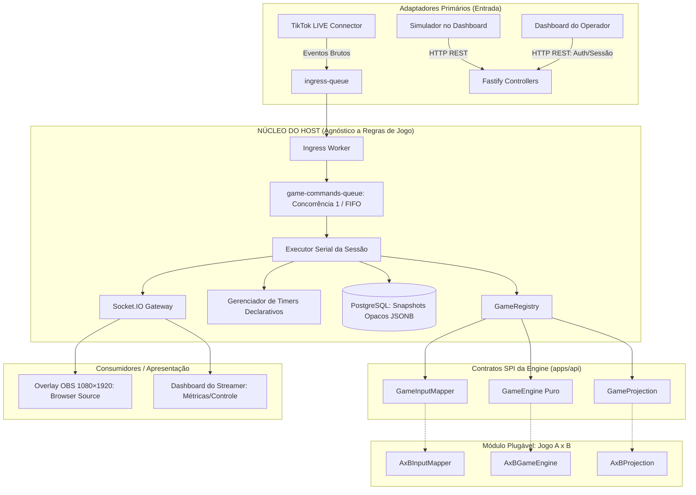

# Especificação Técnica de Arquitetura — Plataforma de Lives Interativas

> **Status**: Ativo  
> **Referência Principal**: [GEMINI.md](../../GEMINI.md)

---

## 1. Visão Geral da Arquitetura

A plataforma adota **Arquitetura Hexagonal (Ports & Adapters)** estrita, separando o **Núcleo da Plataforma (Host)** dos **Módulos de Jogo Plugáveis**.

---

## 2. Componentes e Invariantes da Arquitetura

### 2.1. Host Agnóstico
- O Host **não possui conhecimento** sobre regras de jogos, times, vidas, pontuações ou torres.
- O Host é estritamente responsável por:
  1. Capturar e enfileirar interações na `ingress-queue`.
  2. Normalizar e deduplicar eventos (por `interactionId` e janela temporal).
  3. Garantir ordem serial e estrita de execução via BullMQ com `concurrency: 1`.
  4. Executar transações de persistência de estado opaco (`JSONB`) no PostgreSQL.
  5. Agendar e disparar timers declarativos (ex: intervalo de 5s entre rodadas).
  6. Transmitir projeções calculadas pelo jogo para os clientes Socket.IO.

### 2.2. Contratos da Game Engine (SPI)
Cada jogo registrado no `GameRegistry` implementa 3 contratos puros:
1. **`GameInputMapper`**: Transforma interações normalizadas da live em comandos tipados do jogo específico.
2. **`GameEngine`**: Função pura e determinística:
   $$\text{GameEngine}(S_t, C) \rightarrow (S_{t+1}, \text{SideEffects})$$
   Onde $S$ é o estado interno do jogo, $C$ é o comando e $\text{SideEffects}$ são ações solicitadas ao Host (ex: agendar timer).
3. **`GameProjection`**: Mapeia o estado interno do jogo em uma representação pública otimizada para o Overlay OBS e Painel do Operador.

### 2.3. Desacoplamento Monorepo: Zero Pacote Compartilhado
- O repositório contém exatamente **dois apps**: `apps/api` (Backend) e `apps/web` (Frontend).
- **Sem `packages/shared`**: A fronteira entre backend e frontend é exclusivamente a rede (protocolos HTTP REST e eventos Socket.IO).
- `apps/web` declara suas próprias tipagens de consumo localmente, mantendo total independência de build e evolução.
