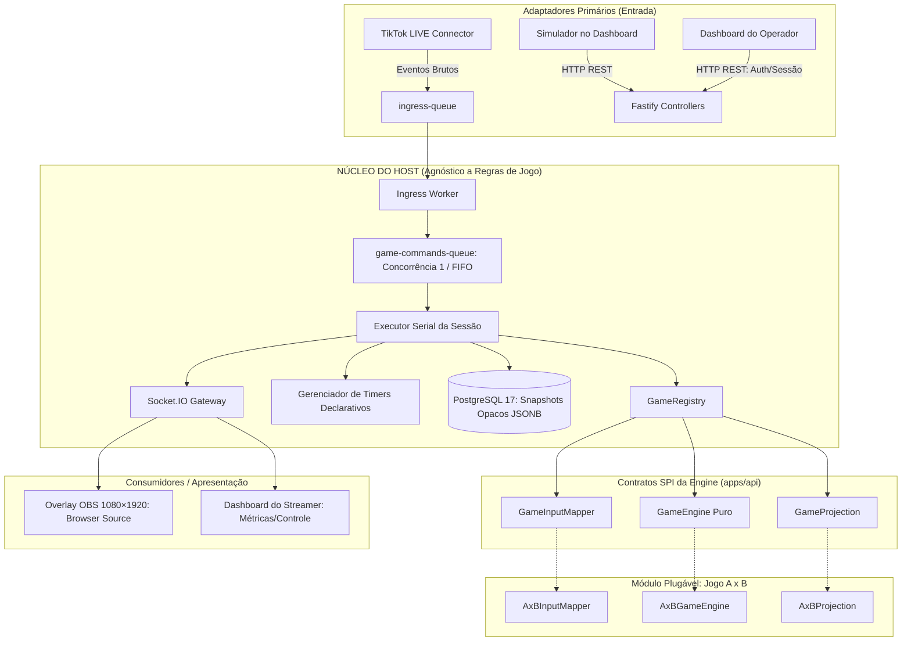
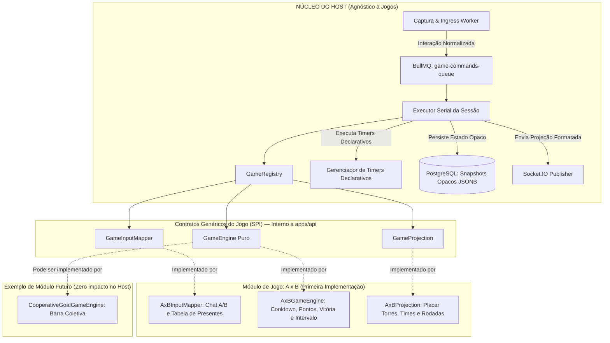
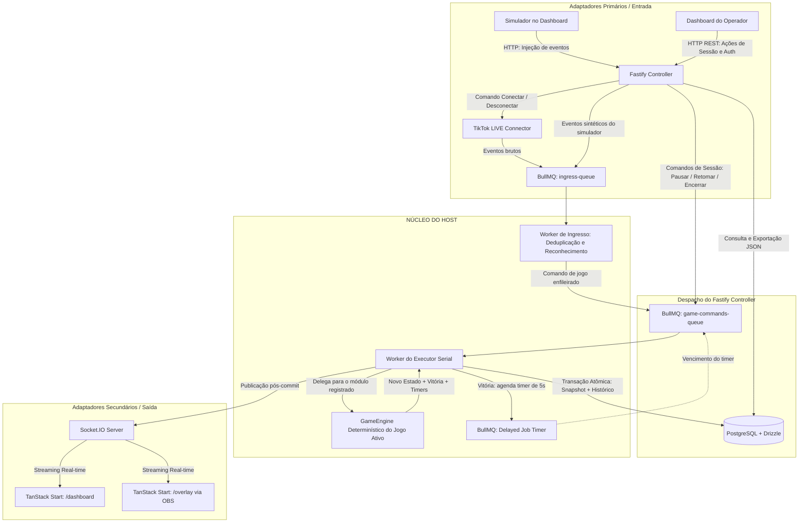
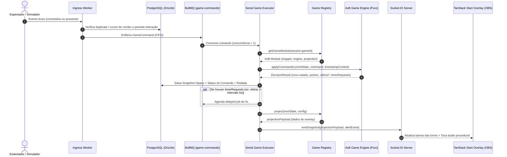
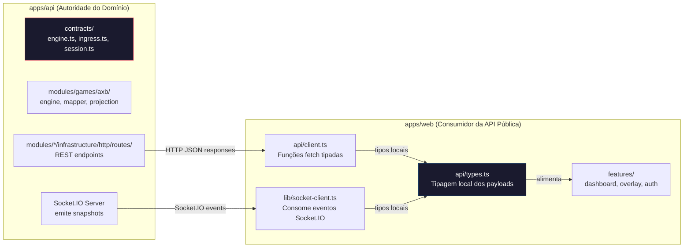

# Especificação Técnica de Arquitetura — Plataforma de Lives Interativas

> **Status**: Ativo & Autoritativo  
> **Referência Principal no Repositório**: [AGENTS.md](../../AGENTS.md)

---

## 1. Visão Geral e Filosofia Arquitetural

A plataforma adota **Arquitetura Hexagonal (Ports & Adapters)** estrita, separando com rigor o **Núcleo da Plataforma (Host)** dos **Módulos de Jogo Plugáveis** e dos **Consumidores Externos** (Overlay OBS e Painel do Operador).



### Invariantes Essenciais da Arquitetura
1. **Host Agnóstico**: A plataforma desconhece regras de jogos (torres, vidas, pontuações ou times). Ela atua apenas como orquestrador genérico de comandos, mensageria serial, concorrência, timers e persistência de snapshots opacos.
2. **Zero Pacote Compartilhado (`packages/shared` Proibido)**: `apps/api` e `apps/web` são completamente isolados. O contrato entre eles é estritamente o protocolo de rede (REST + Socket.IO). O frontend define seus tipos de consumo localmente.
3. **Concorrência Determinística Serial (FIFO 1)**: Todas as transições de estado de uma sessão passam por uma fila BullMQ com `concurrency: 1`, eliminando race conditions sem locks distribuídos pessimistas.
4. **Persistência de Snapshots Opacos em JSONB**: O estado do jogo é persistido no PostgreSQL como `jsonb` sem que o schema relacional precise conhecer as variáveis internas do jogo.

### Organização modular do backend

Esta é a **estrutura alvo** de `apps/api/src/`. As pastas previstas para fases futuras são criadas quando sua implementação começar; a existência nesta árvore não indica funcionalidade concluída. Hoje `common/config`, `common/domain/errors` e o HTTP de health já seguem o padrão. O jogo A x B e o registro ainda estão nos caminhos históricos `games/axb/` e `core/registry/`, respectivamente, até sua migração estrutural.

```text
apps/api/src/
├── index.ts                         # Inicialização do processo
├── app.ts                           # Composição Fastify, erros, CORS e OpenAPI
├── contracts/                      # SPI e tipos genéricos internos da API
│   ├── engine.ts
│   ├── ingress.ts
│   └── session.ts
├── common/                         # Configuração e Host genérico a todos os jogos
│   ├── config/env.ts
│   ├── domain/errors/              # AppError e erros HTTP de aplicação
│   ├── infrastructure/
│   │   ├── http/                   # Handler global, health e documentação
│   │   │   ├── controllers/
│   │   │   ├── dtos/
│   │   │   └── routes/docs/
│   │   ├── database/drizzle/       # Cliente, schema e migrações compartilhados
│   │   ├── queue/                  # Conexão Redis e filas BullMQ
│   │   └── socket/                 # Publicação de snapshots e alertas
│   ├── registry/                   # GameRegistry
│   ├── executor/
│   │   ├── application/
│   │   │   ├── usecases/           # Processamento serial de comandos
│   │   │   └── repositories/       # Interfaces de comandos e snapshots
│   │   └── infrastructure/         # Worker e repositórios Drizzle
│   └── timers/                     # Agendamento de timers declarativos
└── modules/
    ├── games/axb/                 # Engine, mapper, projection e testes puros
    ├── sessions/
    │   ├── domain/                # Estado e regras do ciclo de vida
    │   ├── application/
    │   │   ├── usecases/          # Criar, iniciar, pausar, retomar, encerrar
    │   │   └── repositories/      # Interface SessionRepository
    │   └── infrastructure/
    │       ├── database/drizzle/  # DrizzleSessionRepository
    │       └── http/              # controllers, dtos, routes e routes/docs
    ├── ingress/
    │   ├── application/
    │   │   ├── usecases/          # Processar e deduplicar interações
    │   │   └── repositories/      # Interface InteractionRepository
    │   └── infrastructure/
    │       ├── database/drizzle/  # DrizzleInteractionRepository
    │       ├── queue/             # Ingress Worker
    │       ├── tiktok/            # Captura real
    │       ├── simulator/         # Captura sintética
    │       └── http/              # controllers, dtos, routes e routes/docs
    └── auth/
        └── infrastructure/        # Better Auth e montagem das rotas
```

**Direção das dependências:** um controller Fastify valida DTOs e chama um caso de uso; o caso de uso depende de uma interface em `application/repositories/`; um adaptador em `infrastructure/database/drizzle/` implementa essa interface. O caso de uso não importa Fastify, DTO HTTP ou Drizzle. A composição em `app.ts` e no bootstrap fornece as implementações. O worker de ingresso segue o mesmo contrato de aplicação que a entrada HTTP.

O executor em `common/` coordena fila, transação, snapshots, timers e publicação. Ele acessa o jogo ativo somente pelo `GameModule` do registro e mantém o estado do jogo opaco. O módulo `games/axb` contém regras puras e não ganha repositórios ou endpoints próprios sem necessidade real. Better Auth possui os fluxos padrão de registro, login e sessão; casos de uso próprios são reservados para regras adicionais do produto.

Os adaptadores HTTP de cada módulo usam `infrastructure/http/{controllers,dtos,routes}` e colocam schemas OpenAPI em `routes/docs/`. O handler global em `common/infrastructure/http/` traduz erros de aplicação e validação para respostas HTTP; erros inesperados retornam 500 sem expor detalhes. A documentação da API é servida em `/api/docs/`, e o documento OpenAPI em `/api/docs/json`.

---

## 2. Decisões Arquiteturais Consolidadas

| Camada / Dimensão | Tecnologia / Padrão | Justificativa / Papel Arquitetural |
| :--- | :--- | :--- |
| **Estrutura do Repositório** | **Monorepo pnpm — 2 apps, 0 packages** | `apps/api` (backend) e `apps/web` (frontend) desacoplados. Sem `packages/shared`. Comunicação exclusivamente via HTTP REST e Socket.IO. |
| **Backend & Comunicação** | **Fastify (Node.js + TypeScript) + Socket.IO** | Roteamento REST de alta performance, validação com Zod e Socket.IO para streaming em tempo real de snapshots para OBS e painel. |
| **Arquitetura da Engine** | **Host Agnóstico + Contratos SPI** | O Host orquestra timers e filas. O jogo implementa os contratos SPI (`GameInputMapper`, `GameEngine`, `GameProjection`). **A x B** é o primeiro jogo registrado. |
| **Camada Assíncrona & Filas** | **Redis 7 + BullMQ** | `ingress-queue` para eventos brutos, `game-commands-queue` com concorrência estrita 1 para serialização FIFO, e delayed jobs para timers declarativos. |
| **Banco de Dados & ORM** | **PostgreSQL 17 + Drizzle ORM** | Persistência relacional para usuários, sessões, rodadas e logs de interação. Snapshots de jogos gravados em coluna `JSONB` opaca para a plataforma. |
| **Frontend Framework** | **TanStack Start (`@tanstack/react-start`) + Vite + React 19** | SSR/SPA unificado com TypeScript ponta a ponta, Vite HMR ultrarrápido, TanStack Router e TanStack Query integrados. |
| **Arquitetura Frontend** | **Feature-Driven (Padrão `viralforge/web`)** | Módulos em `features/<feature>/{views,components,hooks,services,stores}`, rotas em `routes/`, primitivos shadcn/ui em `components/ui` e Tailwind CSS v4. |
| **Overlay OBS** | **Browser Source Transparente (1080×1920)** | Renderizado em resolução nativa vertical, consumindo projeções públicas via Socket.IO, com áudio procedural e efeitos visuais leves. |
| **Autenticação** | **Better Auth** | Autenticação moderna com email/senha integrada ao PostgreSQL via Drizzle adapter, isolando o `/dashboard` do streamer. |
| **Adaptador de Captura** | **Hexagonal `LiveCaptureAdapter`** | Implementação real com `tiktok-live-connector` e implementação de desenvolvimento/testes com `SimulatorCaptureAdapter`. |

---

## 3. Diagramas de Arquitetura Detalhados

### 3.1. Arquitetura da Game Engine (Host vs. Módulos Plugáveis)



### 3.2. Fluxo Hexagonal de Processamento de Eventos e Controle



### 3.3. Sequência Detalhada: Do Evento Bruto à Projeção no Overlay



### 3.4. Desacoplamento Monorepo: Zero Pacote Compartilhado



> **Regra de Isolamento**: Não existe `packages/shared`. A fronteira entre backend e frontend é exclusivamente a rede. O frontend declara seus próprios tipos locais para payloads de rede. Se o backend alterar um contrato, o frontend ajusta suas interfaces de consumo sem dependências binárias ou compilações acopladas no monorepo.

---

## 4. Contratos SPI da Game Engine (apps/api)

Os contratos vigentes estão em `apps/api/src/contracts/engine.ts` e `apps/api/src/contracts/ingress.ts`. O código TypeScript é a fonte para assinaturas exatas; este quadro descreve as responsabilidades estáveis:

| Contrato | Responsabilidade |
| :--- | :--- |
| `GameInputMapper<TConfig, TCommand>` | Converter uma `NormalizedInteraction` em comando do jogo ou ignorá-la. |
| `GameEngine<TState, TConfig, TCommand>` | Criar estado inicial e aplicar comandos de forma pura, recebendo `ExecutionContext` explícito. |
| `DecisionResult<TState>` | Devolver próximo estado, status, eventos e pedidos declarativos de timer; não executa I/O. |
| `GameProjection<TState, TConfig, TProjection>` | Produzir os dados públicos do overlay a partir do estado e de `ProjectionMeta`. |
| `GameModule<TState, TConfig, TProjection, TCommand>` | Reunir identidade, versão, mapper, engine, projection e validação opcional de configuração. |

`NormalizedInteraction` é definido em `contracts/ingress.ts`, com variantes de comentário e presente. A migração física do A x B para `modules/games/axb/` não altera essas interfaces nem as regras do jogo.

---

## 5. Persistência de Estado e Concorrência

1. **Snapshots Opacos em JSONB**:
   - O PostgreSQL armazena a sessão, as rodadas e os snapshots em `game_rounds` e `game_snapshots`.
   - O campo `state_snapshot` é tipado como `jsonb`. O Host grava e lê esse campo sem inspecionar propriedades internas.
2. **Garantia de Ordem Serial (FIFO)**:
   - A fila BullMQ `game-commands-queue` é processada com `concurrency: 1` por worker.
   - Isso garante que dois presentes recebidos no mesmo milissegundo sejam aplicados um após o outro, produzindo transições de estado $S_0 \rightarrow S_1 \rightarrow S_2$ completamente determinísticas.
3. **Timers Declarativos**:
   - Quando o jogo atinge condição de vitória, a `GameEngine` retorna um `timerRequest` solicitando um intervalo (ex: 5000ms).
   - O Host agenda um *delayed job* no BullMQ. Ao disparar, o job envia o comando `RESET_ROUND` para a fila de comandos, reiniciando o ciclo de forma transparente.
