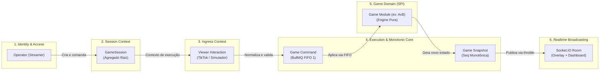
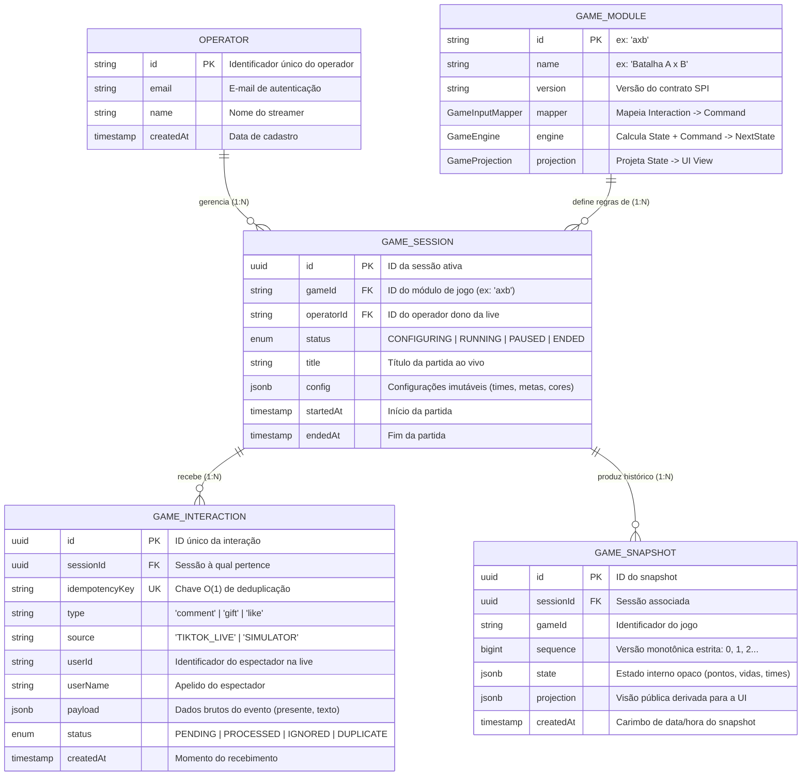
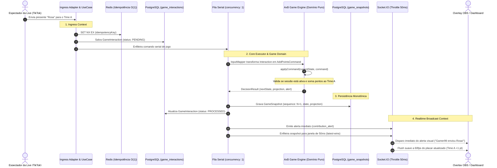

# Modelo de Domínio e Relacionamento de Entidades

> **Referência Canônica**: [CONTEXT.md](../../CONTEXT.md) | [docs/spec/architecture.md](architecture.md)

Este documento esclarece a divisão dos **Bounded Contexts (Domínios)** e o relacionamento entre as **Entidades** da plataforma de lives interativas, respondendo como uma ação de um espectador no TikTok é transformada em estado de jogo persistido e renderizado no OBS.

---

## 1. Mapa de Contextos Delimitados (Context Map)

A plataforma é dividida em 5 contextos autônomos, mantendo o núcleo (*Host*) 100% agnóstico às regras específicas de cada jogo:

---

## 2. Diagrama Entidade-Relacionamento do Domínio (`erDiagram`)

Este diagrama ilustra a estrutura relacional e lógica entre os conceitos e tabelas do sistema:

---

## 3. O Ciclo de Vida: Do Presente na Live ao Placar na Tela

Para entender claramente a fronteira entre os domínios, acompanhe a jornada de um evento:

---

## 4. Matriz de Responsabilidades por Contexto

| Contexto | O que É / Responsabilidade | O que NÃO faz (Anti-Responsabilidade) | Onde vive no código |
|---|---|---|---|
| **Identity & Auth** | Autenticação do operador (login, cookies, tokens). | Não sabe o que é uma partida, pontos ou TikTok. | `apps/api/src/modules/auth/` |
| **Sessions** | Controla o ciclo de vida (`CONFIGURING`, `RUNNING`, `PAUSED`, `ENDED`) e guarda as regras escolhidas. | Não calcula regras de pontuação nem sabe quem é Time A ou Time B. | `apps/api/src/modules/sessions/` |
| **Ingress** | Captura eventos do TikTok e Simulador, garantindo deduplicação determinística em $O(1)$. | Não decide o impacto do evento no jogo nem altera o placar. | `apps/api/src/modules/ingress/` |
| **Execution Core** | Garante execução estritamente sequencial (FIFO 1) sem concorrência e gera snapshots monotônicos. | Não conhece lógica de vitórias ou presentes. | `apps/api/src/common/executor/` |
| **Game Module (SPI)** | Contém a regra de negócio pura (quem ganha, cálculo de pontos, meta atingida). | Não acessa banco de dados, Redis, Fastify ou rede. É uma função pura. | `apps/api/src/modules/games/<game>/` |
| **Broadcasting** | Distribui snapshots via Socket.IO com controle de taxa (*latest-wins*) para não travar o OBS. | Não altera estado nem valida permissões de regras. | `apps/api/src/common/infrastructure/socket/` |

---

## 5. Como o Frontend se Conecta a Tudo Isso (`apps/web`)

Conforme a regra arquitetural **Zero Shared Package**:
- O frontend **não importa** classes ou entidades do backend.
- O frontend define **tipos locais de consumo** (`apps/web/src/api/types.ts`) que espelham apenas os contratos de rede (REST DTOs e eventos Socket.IO).
- O `useDashboardStore` é um repositório reativo no navegador que apenas reflete o último `GameSnapshot` e o status da `GameSession` entregues pela API.
